---

title: Kubernetes Cluster Architecture — Overview
description: Understand the main components of a Kubernetes cluster and how the control plane and worker nodes work together.
order: 4
category: container-orchestration
level: beginner
draft: false
tags: [kubernetes]
language: ar
--------

## 1. Big Picture

قبل ما ندخل في تفاصيل كل Component، خلينا نفهم الأول **Kubernetes Cluster** شكله عامل إزاي.

ببساطة، الـ **Cluster** هو مجموعة Machines بتشتغل مع بعض علشان Kubernetes يقدر يشغّل ويدير الـcontainerized applications.

الـCluster بيتقسم بشكل أساسي إلى جزئين:

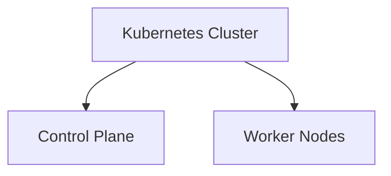

يعني عندنا فكرة بسيطة جدًا:

> **Control Plane = Brain**
> 
> **Worker Nodes = Machines that run the Workloads**

الـControl Plane هو اللي بيدير الـCluster وبيقرر إيه المفروض يحصل.

أما الـWorker Nodes فهي الـMachines اللي عليها الـApplications والـPods بتشتغل فعليًا.

---


## 2. Kubernetes Cluster Architecture

الصورة العامة للـArchitecture ممكن تكون بالشكل ده:

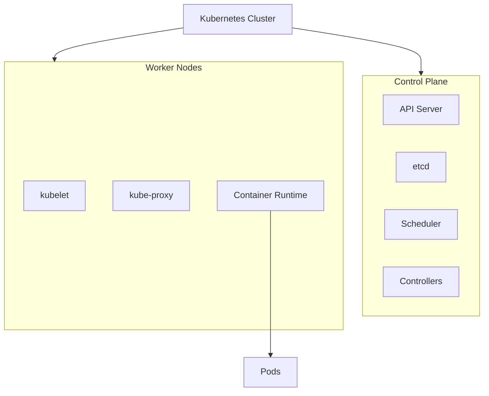

---


## 3. Control Plane

الـ**Control Plane** هو الجزء المسؤول عن **إدارة الـCluster**.

هو اللي بيستقبل الـrequests، بيخزن الـCluster state، بيقرر الـPods هتشتغل على أنهي Node، وبيحاول باستمرار يخلي الـCluster يوصل للـDesired State.

الـControl Plane بشكل أساسي يحتوي على:

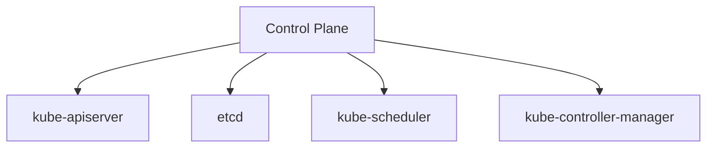

كل Component له وظيفة مختلفة.

---


## 4. kube-apiserver

الـ**kube-apiserver** هو أهم نقطة اتصال في Kubernetes.

تقدر تعتبره **Gateway** للـKubernetes API.

لما تستخدم:

```bash
kubectl get pods
```

أنت مش بتكلم الـPod مباشرة.

الـ`kubectl` بيتكلم مع:

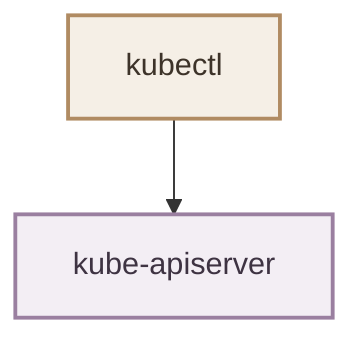

والـAPI Server بعد كده بيتعامل مع باقي الـKubernetes Components.

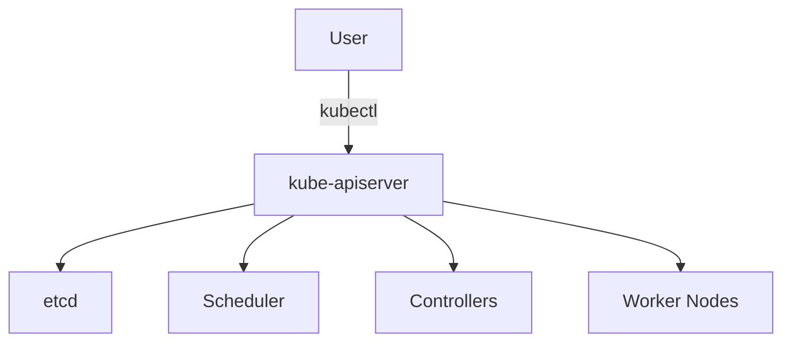

فممكن نقول:

> **kube-apiserver = Main communication gateway of Kubernetes**

هو مش مسؤول عن تشغيل الـContainers.

هو مسؤول عن التعامل مع الـKubernetes API وتنظيم الـcommunication مع باقي الـComponents.

---


## 5. etcd

الـ**etcd** هو الـdatabase الخاصة بالـKubernetes Cluster State.

هو distributed key-value store بيخزن الـinformation اللي Kubernetes محتاجها علشان يعرف حالة الـCluster.

مثلًا Kubernetes محتاج يعرف:

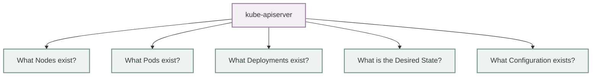

الـetcd بيخزن الـstate دي.

بشكل مبسط:

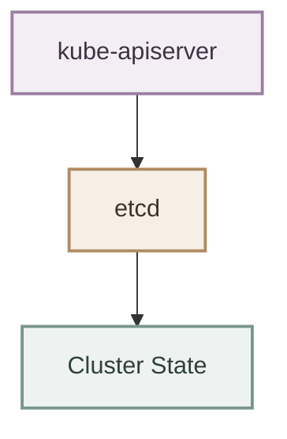

مثال:

لو أنت عايز Deployment يكون عنده:

```yaml
replicas: 3
```

فده جزء من الـDesired State اللي Kubernetes بيحتفظ بيه.

المهم هنا:

> **etcd stores the state — it doesn't run your applications.**

---


## 6. kube-scheduler

الـ**kube-scheduler** مسؤول عن اختيار الـWorker Node المناسبة للـPod.

لما Kubernetes يلاقي Pod محتاج يتشغل ومفيش Node محددة ليه، الـScheduler يبدأ يقرر:

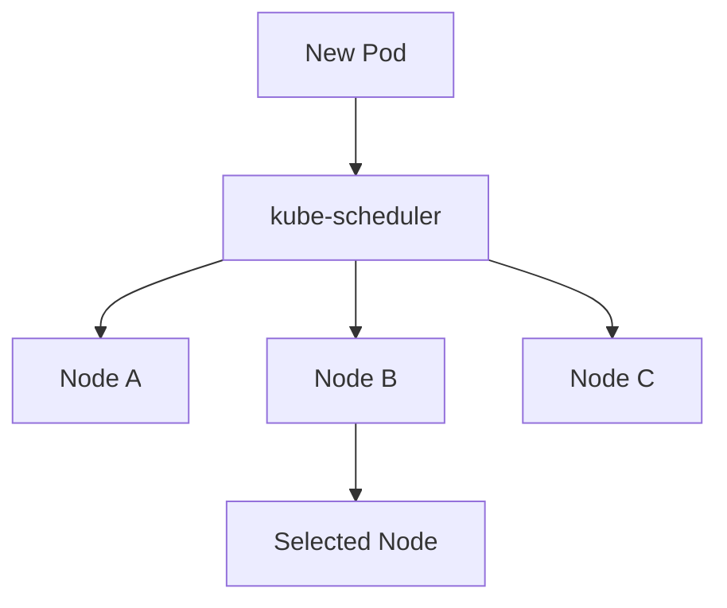

الـScheduler ممكن ياخد في اعتباره حاجات زي:

* CPU / Memory availability
* Resource requests
* Node conditions
* Scheduling constraints
* Policies

لكن خد بالك من نقطة مهمة:

> **Scheduler chooses the Node. It does not run the Pod.**

يعني هو بيقول:

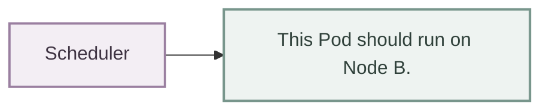

وبعد كده الـWorker Node هي اللي تتولى تشغيله.

---


## 7. Controllers

الـ**Controllers** من أهم الأفكار في Kubernetes.

وظيفتها الأساسية إنها تفضل تقارن بين:

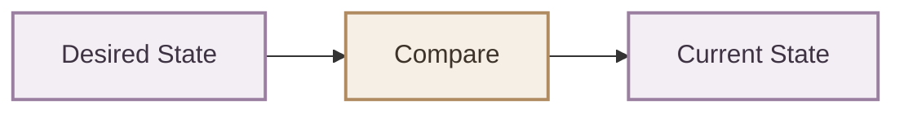

ولو في فرق، تحاول تصلحه.

مثال:

أنت عايز:

```text
3 Pods
```

لكن حاليًا عندك:

```text
2 Pods
```

الـController يلاحظ الفرق:

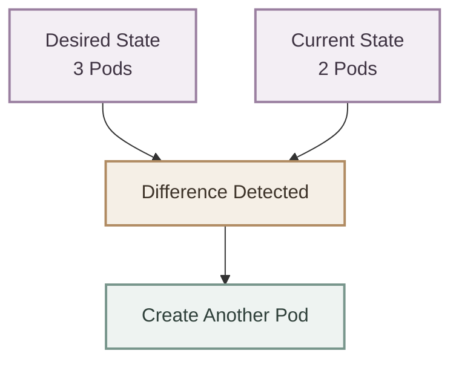

وده جزء أساسي من فكرة **Reconciliation** في Kubernetes.

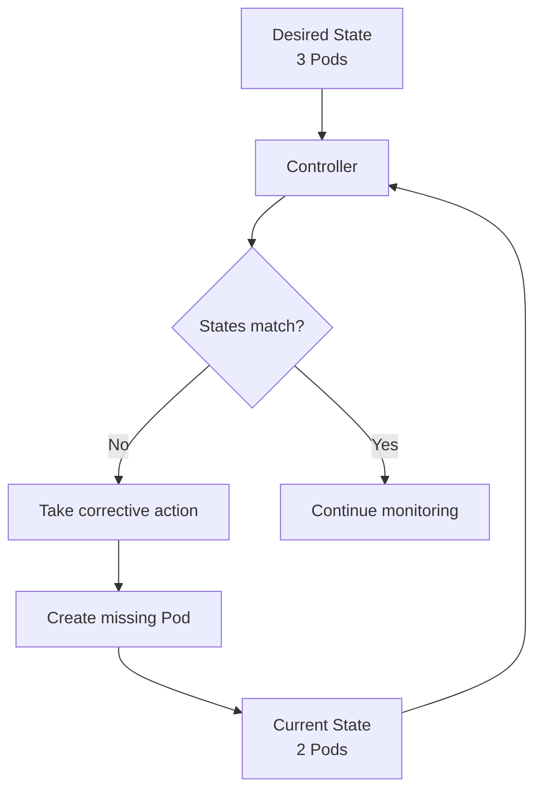

فببساطة:

> **Controllers continuously work to make Current State match Desired State.**

---


## 8. Worker Nodes

الجزء التاني من الـCluster هو **Worker Nodes**.

دي الـMachines اللي الـApplications بتشتغل عليها فعليًا.

الـWorker Node ممكن تكون:

* Physical Machine
* Virtual Machine
* Cloud Instance

وكل Worker Node بيكون عليها Components مسؤولة عن تشغيل وإدارة الـWorkloads.

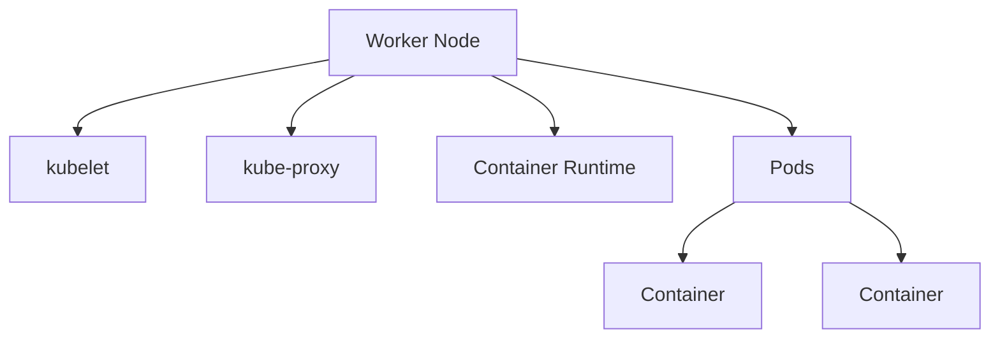

---


## 9. kubelet

الـ**kubelet** هو الـKubernetes Agent اللي بيشتغل على كل Worker Node.

وظيفته الأساسية إنه يتأكد إن الـPods المطلوبة على الـNode شغالة بالشكل المطلوب.

بشكل مبسط:

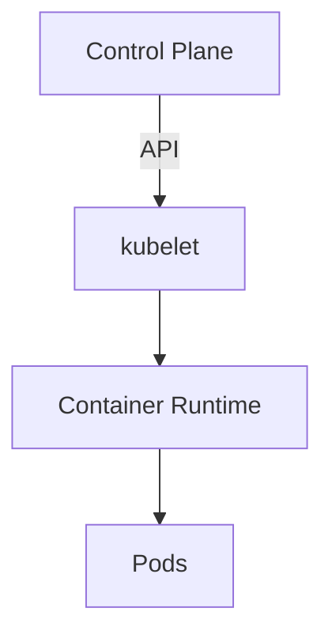

يعني الـkubelet هو حلقة الوصل بين الـKubernetes Control Plane والـWorkloads الموجودة على الـNode.

هو بيتابع الـPods، ويتعامل مع الـContainer Runtime، ويرجع information عن حالة الـNode والـPods للـControl Plane.

---


## 10. Container Runtime

الـ**Container Runtime** هو الـsoftware المسؤول فعليًا عن تشغيل الـContainers.

أمثلة مشهورة:

* `containerd`
* `CRI-O`

ف Kubernetes نفسه مش هو اللي بيعمل `run container`.

بدل كده:

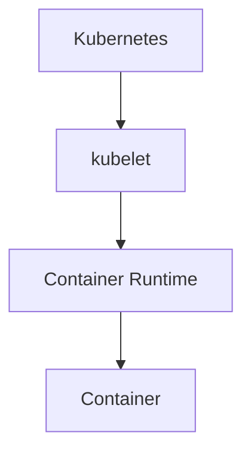

يعني Kubernetes بيدير الـWorkloads، والـContainer Runtime هو اللي بيتولى تشغيل الـContainers فعليًا.

---


## 11. kube-proxy

الـ**kube-proxy** هو Component مرتبط بالـnetworking على الـWorker Node.

وظيفته الأساسية مرتبطة بتطبيق الـnetworking rules المطلوبة للوصول إلى Kubernetes **Services** وتوجيه الـtraffic إلى الـappropriate backend Pods.

بشكل مبسط:

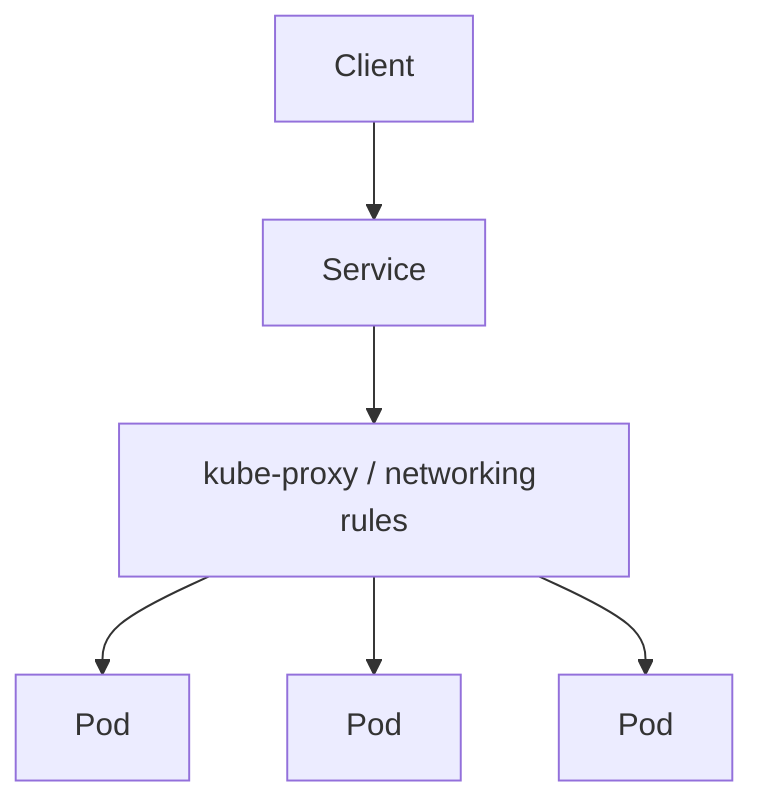

فهو جزء من الصورة الخاصة بالـService networking والـtraffic handling.

---


## 12. The Complete Architecture

دلوقتي نقدر نجمع كل حاجة مع بعض.

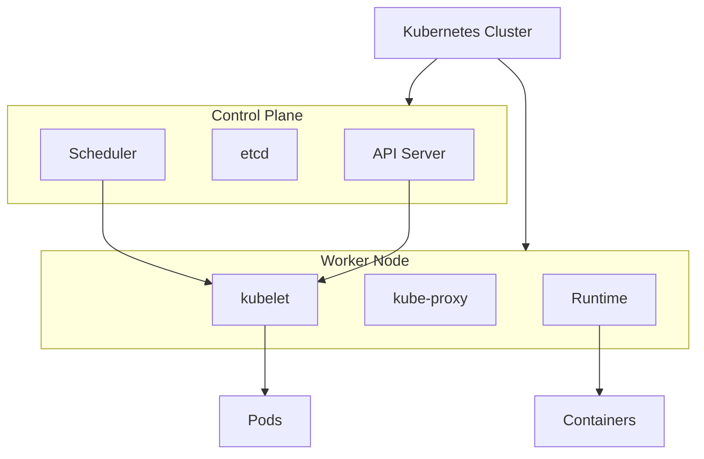

---


## 13. How Everything Works Together

خلينا ناخد مثال بسيط.

أنت عملت:

```bash
kubectl apply -f deployment.yaml
```

الـflow بشكل مبسط:


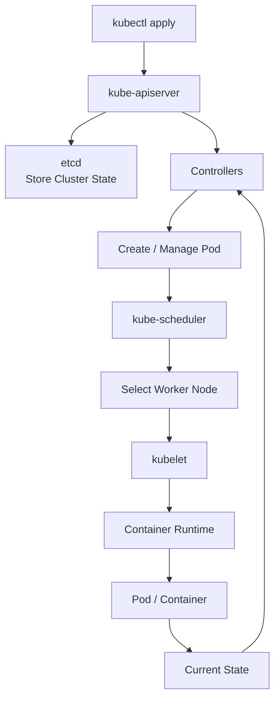

لاحظ إن الـflow مش مجرد:

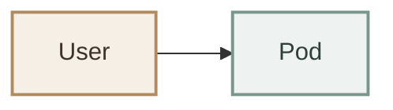

فيه مجموعة Components بتشتغل مع بعض علشان Kubernetes يحافظ على الـDesired State.

---


## 14. The Kubernetes Control Loop

دي من أهم الأفكار اللي لازم تثبت .

عندنا Kubernetes مش مجرد مجموعة Commands بتنفذها مرة وخلاص.

هو **Continuous Control System**.

يعني باستمرار:

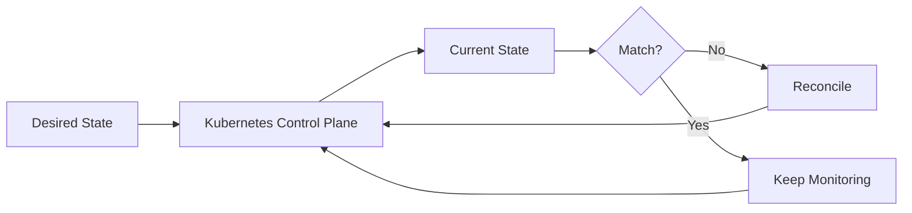

وده السبب إن Kubernetes يقدر يتعامل مع حاجات زي:

* Failed Pods
* Scaling
* Node failures
* Application updates
* Maintaining replicas

لأن الـCluster مش بيبص على الـstate مرة واحدة.

هو باستمرار بيحاول يخلي:

```mermaid
flowchart LR
    C["Current State"] --> M["≈"] --> D["Desired State"]

    classDef state fill:#f3eef4,stroke:#9a7fa0,stroke-width:2px,color:#3e3342;
    classDef relation fill:#f5efe6,stroke:#b08b62,stroke-width:2px,color:#3d3329;

    class C,D state;
    class M relation;
```

---


## 15. The Most Important Mental Model

  اختصار الـCluster Architecture  :

```mermaid
flowchart TD
    A["Control Plane<br/>What should happen?"] --> B[kube-apiserver]
    B --> C[etcd]
    B --> D[Scheduler]
    B --> E[Controllers]

    C --> F["Worker Nodes<br/>Run the work"]
    D --> F
    E --> F

    F --> G[kubelet]
    F --> H[kube-proxy]
    F --> I[Runtime]
    I --> J[Pods]
```

بمعنى:

> **Control Plane manages the Cluster.**

> **Scheduler decides where Pods should run.**

> **Controllers keep the Cluster aligned with the Desired State.**

> **kubelet manages workloads on the Node.**

> **Container Runtime actually runs the Containers.**

> **Pods are where the application workloads run.**

---


## 16. Quick Reference

| Component                 | Main Responsibility                              |
| ------------------------- | ------------------------------------------------ |
| `kube-apiserver`          | Kubernetes API and communication gateway         |
| `etcd`                    | Stores cluster state                             |
| `kube-scheduler`          | Selects Nodes for Pods                           |
| `kube-controller-manager` | Runs controllers and reconciles state            |
| `kubelet`                 | Manages Pods on a Worker Node                    |
| `kube-proxy`              | Supports Service networking and traffic handling |
| Container Runtime         | Runs Containers                                  |
| Pod                       | Runs the application workload                    |

---


## 17. Final Mental Model

```mermaid
flowchart TD
    A[Kubernetes Cluster] --> B[Control Plane]
    A --> C[Worker Nodes]

    B --> D[API Server]
    B --> E[etcd]
    B --> F[Scheduler + Controllers]

    C --> G[kubelet]
    C --> H[kube-proxy]
    C --> I[Runtime]
    C --> J[Pods]
```

والـoverall flow:

```mermaid
flowchart TD
    A[User] --> B[kubectl]
    B --> C[kube-apiserver]
    C --> D[etcd]
    C --> E[Controllers]
    C --> F[Scheduler]
    F --> G[Worker Node]
    G --> H[kubelet]
    H --> I[Container Runtime]
    I --> J[Pod]
```

**The core idea:**

> Kubernetes Cluster = **Control Plane + Worker Nodes**

> Control Plane **decides and manages**.

> Worker Nodes **execute and run workloads**.

> The entire system continuously works to make the **Current State match the Desired State**.
