## Introduction

بعد ما فهمت **What Kubernetes is** وليه بنستخدمه، محتاج دلوقتي أفهم الـ**Core Concepts** اللي Kubernetes مبني عليها.

Kubernetes :

 عنده مجموعة من الـ**objects and abstractions** اللي بستخدمها عشان أعرّف وأدير الـcontainerized workloads.

الصورة العامة:

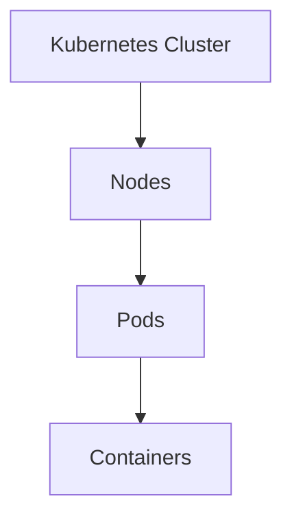

وحول الـPods فيه resources بتساعدني في إدارة الـapplication:

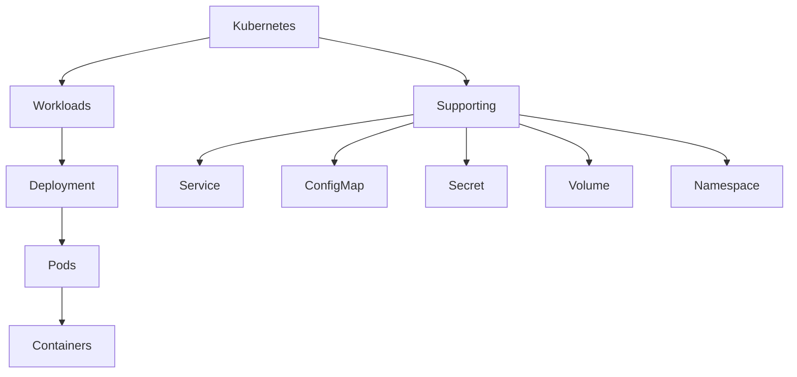


---

## 1. Kubernetes Cluster

الـ**Cluster** هو البيئة الكاملة اللي Kubernetes بيدير من خلالها الـworkloads.

الـCluster بيتكون من مجموعة من الـNodes، بالإضافة إلى الـControl Plane اللي بيدير الـCluster.

بشكل مبسط:

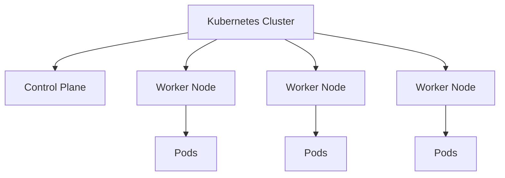

أقدر أعتبر الـCluster هو **the whole Kubernetes environment**.

---

## 2. Node

الـ**Node** هي machine داخل الـCluster.

ممكن تكون:

* Physical machine
* Virtual machine
* Cloud instance

والـNode بتوفر الـcompute resources اللي الـworkloads هتستخدمها.

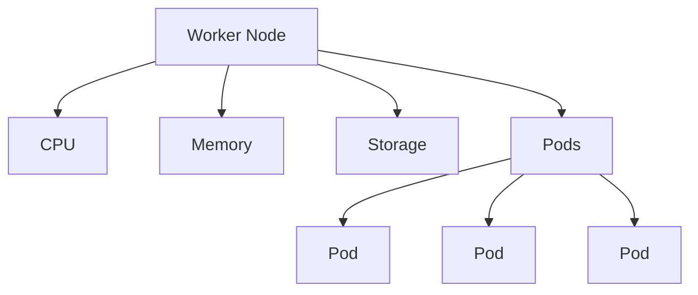

في Kubernetes عندنا نوعين أساسيين من الـNodes من ناحية الـrole:

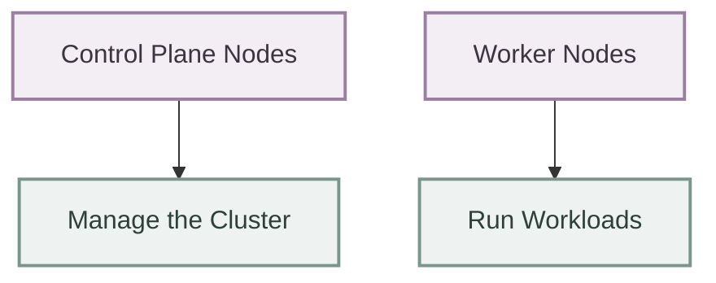

---

## 3. Pod

الـ**Pod** هو أصغر deployable unit في Kubernetes.

ودي نقطة مهمة جدًا:

> **Kubernetes does not deploy containers directly. It deploys Pods.**

الـPod بيحتوي على container واحد أو أكثر.

في أغلب الـapplications البسيطة، الـPod بيكون فيه container واحد:

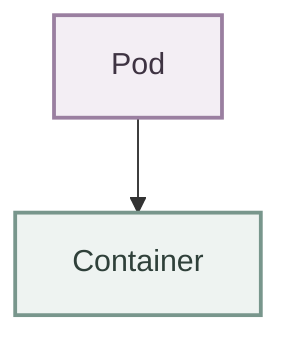

لكن ممكن Pod يحتوي على multiple containers:

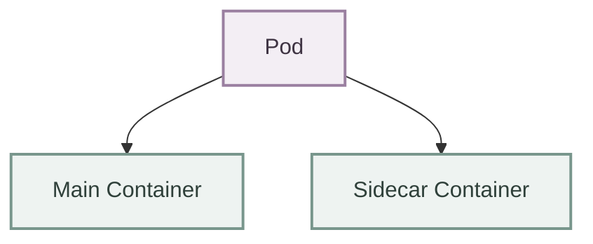

الـcontainers الموجودة داخل نفس الـPod بتشارك نفس الـnetwork context وبعض الـresources زي volumes حسب configuration.

---

## 4. Pod vs Container

لازم أفرق بينهم.

### Container

الـContainer هو package/runtime environment للتطبيق.

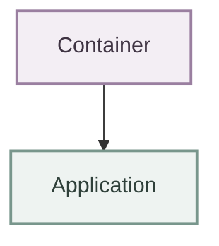

### Pod

الـPod هو Kubernetes abstraction بيجمع container أو مجموعة containers مرتبطة ببعض.

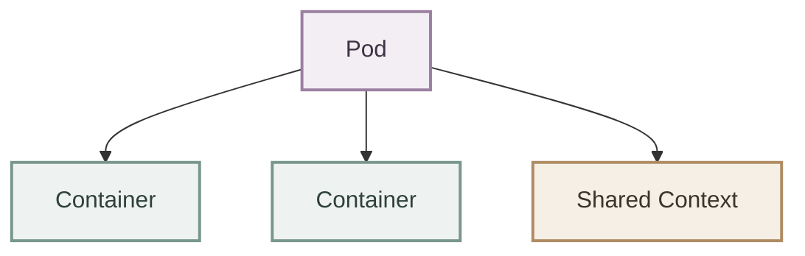

العلاقة:


فلو سألتني:

> What does Kubernetes deploy?

الإجابة الأساسية:

> **Pods.**

مش Containers directly.

---

## 5. One Pod vs Multiple Pods

لو عندي application:

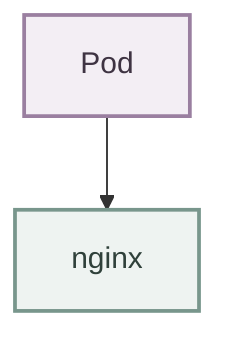

ده instance واحدة من الـapplication.

لو محتاج 3 instances:

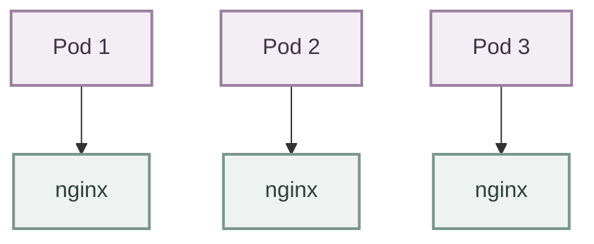

كل Pod يعتبر **independent instance** من الـworkload.

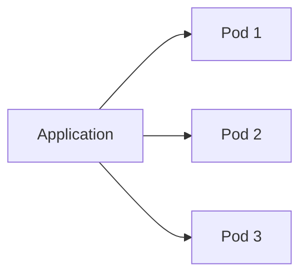

لكن عادةً أنا مش بعمل إدارة الـPods يدويًا في production.

وهنا بيظهر مفهوم مهم جدًا: **Deployment**.

---

## 6. Deployment

الـ**Deployment** هو Kubernetes resource بستخدمه لإدارة application Pods بطريقة declarative.

بدل ما أقول:

> "Create Pod 1, then Pod 2, then Pod 3."

أقول:

> **I want 3 replicas of this application.**

مثلاً:

```yaml
replicas: 3
```

والـDeployment يساعد Kubernetes في الحفاظ على العدد المطلوب من الـPods.

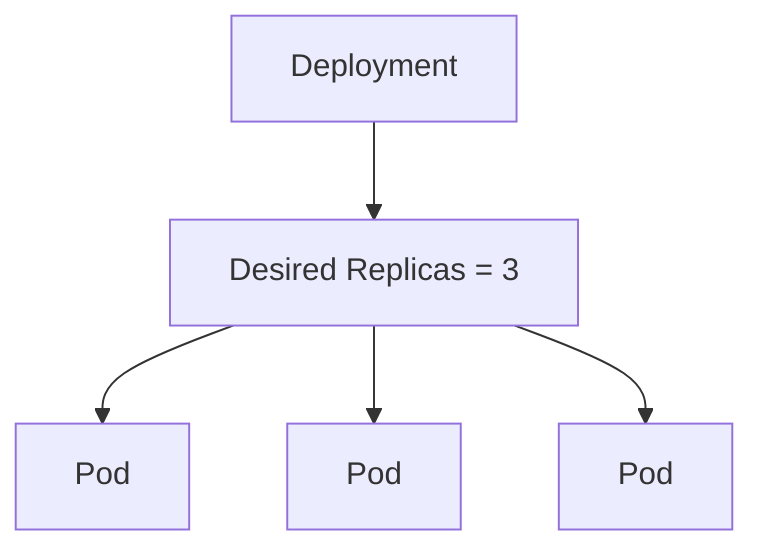

---

## 7. Deployment and ReplicaSet

الـDeployment عادةً بيستخدم **ReplicaSet** لإدارة عدد الـPods.

الصورة المبسطة:

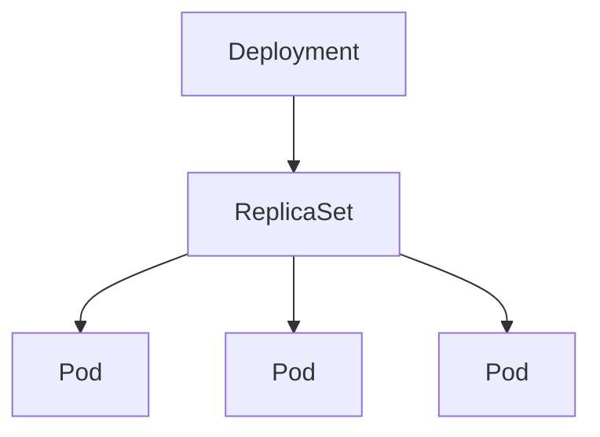

الـDeployment مسؤول عن higher-level application management، والـReplicaSet مسؤول عن maintaining the desired number of Pod replicas.

---

## 8. Service

الـPods بطبيعتها **ephemeral**.

يعني الـPod ممكن:

* يتعمل لها recreate
* تتغير الـIP بتاعتها
* تنتقل إلى Node مختلفة

فلو application تانية عايزة تتواصل مع Pod معينة، الاعتماد على الـPod IP مباشرة مش practical.

هنا بيظهر الـ**Service**.

الـService بيوفر:

> **A stable network endpoint for accessing a group of Pods.**

بشكل مبسط:

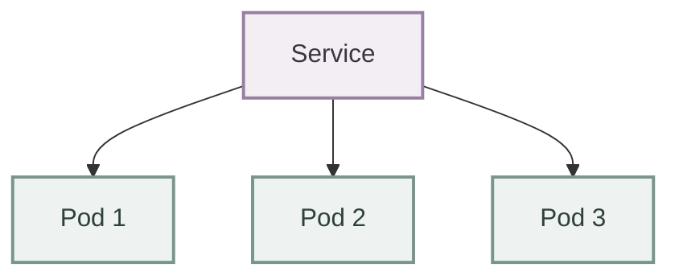

بدل ما الـclient يعرف الـIP بتاع كل Pod، يتعامل مع الـService.

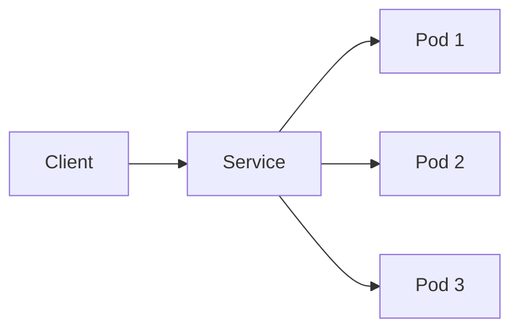

الـService كمان بيساعد في **service discovery** وtraffic distribution بين الـPods حسب نوع الـService والـconfiguration.

---

## 9. Deployment + Service

دول من أهم الـconcepts اللي هستخدمهم مع بعض.

مثلاً عندي:

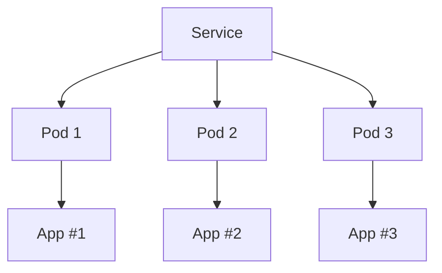

والـDeployment هو اللي بيدير الـPods:

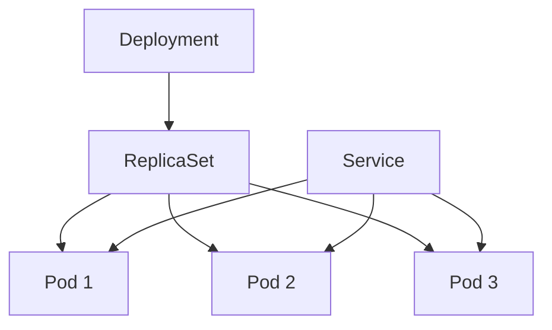

فبشكل مبسط:

> **Deployment manages the Pods.**
> **Service provides stable access to the Pods.**

---

## 10. Labels

الـ**Labels** عبارة عن key-value pairs بستخدمها عشان أعرّف وأصنّف الـKubernetes objects.

مثلاً:

```yaml
labels:
  app: nginx
  environment: production
```

الـLabel هنا بيقول:

```text
app = nginx
environment = production
```

الـLabels مهمة جدًا لأنها بتخليني أقدر أعمل:

* Grouping
* Selection
* Organization
* Resource association

مثلاً الـService ممكن تستخدم label selector عشان تعرف الـPods اللي المفروض تبعتلها traffic.

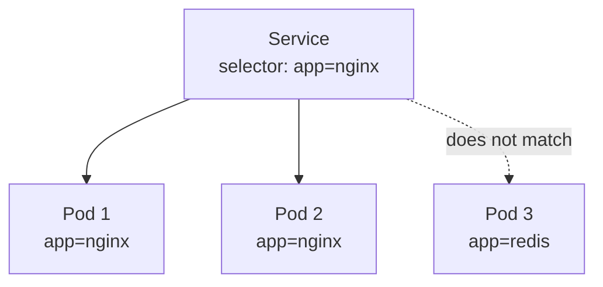

وده concept مهم جدًا لأن الـServices والـDeployments والـcontrollers بيعتمدوا على labels في حالات كتير.

---

## 11. ConfigMap

مش كل configuration لازم تتحط جوه الـcontainer image.

مثلاً application محتاجة:

```text
APP_ENV=production
LOG_LEVEL=info
API_URL=...
```

ممكن أخزن الـnon-sensitive configuration في **ConfigMap**.

```mermaid
flowchart TD
    A["ConfigMap<br/>APP_ENV=production<br/>LOG_LEVEL=info<br/>API_URL=..."] --> B[Pod]
```

الفكرة الأساسية:

> **ConfigMap stores non-confidential configuration data separately from the application image.**

وده بيساعدني أفصل:

```mermaid
flowchart LR
    A["Application + Configuration"]

    classDef app fill:#f3eef4,stroke:#9a7fa0,stroke-width:2px,color:#3e3342;

    class A app;
```

بدل ما أعمل container image مختلفة لكل environment.

---

## 12. Secret

الـ**Secret** بيستخدم لتخزين sensitive data زي:

* Passwords
* API keys
* Tokens
* Credentials

مثلاً:

```mermaid
flowchart TD
    A["Secret<br/>DB_USERNAME<br/>DB_PASSWORD<br/>API_TOKEN"] --> B[Pod]
```

الفكرة:

> **Secret is designed for sensitive configuration data.**

لكن مهم جدًا فهم إن وجود البيانات في Kubernetes Secret **مش معناه تلقائيًا إنها encrypted everywhere** أو إن Secret management أصبح آمنًا بالكامل. طريقة التخزين والـencryption-at-rest والـaccess control مهمة جدًا.

---

## 13. ConfigMap vs Secret

الفرق الأساسي:

| Resource      | Purpose                     |
| ------------- | --------------------------- |
| **ConfigMap** | Non-sensitive configuration |
| **Secret**    | Sensitive configuration     |

مثال:

```text
ConfigMap
APP_ENV=production
LOG_LEVEL=info
```

بينما:

```text
Secret
DB_PASSWORD=********
API_TOKEN=********
```

---

## 14. Volume

الـcontainers بطبيعتها ممكن تكون **ephemeral**.

يعني البيانات اللي جوه container filesystem مش لازم تفضل موجودة بنفس الطريقة لو الـcontainer اتشال واتعمل غيره.

لو عندي application محتاجة persistent data، ممكن أستخدم **Volumes**.

```mermaid
flowchart TD
    A[Pod] --> B[Container]
    A --> C[Volume]
    C --> D[Persistent Storage]
```

مثلاً:

```mermaid
flowchart TB
    D["Database Pod"] --> V["Volume"]
    V --> P["Persistent Data"]

    classDef pod fill:#f3eef4,stroke:#9a7fa0,stroke-width:2px,color:#3e3342;
    classDef volume fill:#f5efe6,stroke:#b08b62,stroke-width:2px,color:#3d3329;
    classDef data fill:#eef3f1,stroke:#78968c,stroke-width:2px,color:#2f403a;

    class D pod;
    class V volume;
    class P data;
```

الـVolume بيفصل الـstorage عن lifecycle بتاع الـcontainer حسب نوع الـvolume.

---

## 15. Namespace

الـ**Namespace** بستخدمه عشان أقسم الـresources داخل نفس الـCluster إلى logical groups.

مثلاً:

```mermaid
flowchart TD
    A[Kubernetes Cluster] --> NS1
    A --> NS2
    A --> NS3

    subgraph NS1 [production]
        P1[Pods]
        P2[Services]
        P3[Deployments]
    end

    subgraph NS2 [staging]
        S1[Pods]
        S2[Services]
        S3[Deployments]
    end

    subgraph NS3 [development]
        D1[Pods]
        D2[Services]
        D3[Deployments]
    end
```

ده بيساعد في:

* Organization
* Isolation boundaries
* Resource management
* Access control

لكن الـNamespace مش معناه إن resources اتحطت على machines منفصلة.

> **Namespace is a logical boundary inside a cluster, not a physical cluster.**

---

## 16. The Core Relationship

دلوقتي نقدر نجمع أهم الـconcepts:

```mermaid
flowchart TB
    A[Kubernetes Cluster]
    B[Worker Node]
    C[Deployment]
    D[ReplicaSet]
    E[Pods]
    F[Containers]
    G[Service]
    H[ConfigMap]
    I[Secret]
    J[Volume]
    K[Namespace]

    A --> B
    B --> E
    C --> D
    D --> E
    E --> F
    G --> E
    H --> E
    I --> E
    J --> E
    K --> C
    K --> G
    K --> H
    K --> I
```

الـdiagram ده مش بيمثل كل العلاقات الممكنة في Kubernetes، لكنه بيديني **high-level mental model**.

---

## 17. A Typical Kubernetes Application

ممكن application بسيطة في Kubernetes تبقى بالشكل ده:

```mermaid
flowchart TD
    A[Namespace] --> B[Deployment]
    A --> C[Service]

    B --> D[ReplicaSet]
    D --> E[Pod]
    D --> F[Pod]
    D --> G[Pod]

    C --> E
    C --> F
    C --> G

    E --> H[Container]
    F --> I[Container]
    G --> J[Container]

    H --> K[ConfigMap]
    H --> L[Secret]
    H --> M[Volume]
```

دي صورة قريبة  من الـpattern اللي هقابله في applications حقيقية.

---

## 18. Declarative Model

كل الـconcepts دي بتشتغل بشكل كبير مع الـ**declarative model** بتاع Kubernetes.

أنا بدل ما أقول:

```mermaid
flowchart TB
    C["Create Pod"] --> S["Start Container"]
    S --> R["Restart if it fails"]
    R --> K["Keep 3 Copies"]
    K --> E["Expose Them"]

    classDef action fill:#eef3f1,stroke:#78968c,stroke-width:2px,color:#2f403a;

    class C,S,R,K,E action;
```

بحدد الـdesired configuration:

```yaml
replicas: 3
```

وأحدد resources زي:

```mermaid
flowchart LR
    D["Deployment"]
    S["Service"]
    C["ConfigMap"]
    SE["Secret"]

    classDef resource fill:#eef3f1,stroke:#78968c,stroke-width:2px,color:#2f403a;

    class D,S,C,SE resource;
```

وبعدين Kubernetes components تتعامل مع الحالة المطلوبة.

```mermaid
flowchart LR
    A[Declarative Configuration] --> B[Kubernetes API]
    B --> C[Desired State]
    C --> D[Controllers / Scheduler]
    D --> E[Running Workloads]
    E --> F[Current State]
    F --> C
```

---

## 19. The Most Important Mental Model

لو لسه جديد في Kubernetes، أهم hierarchy :

```mermaid
flowchart TD
    A[Cluster] --> B[Nodes]
    B --> C[Pods]
    C --> D[Containers]
```

وبعدين أضيف الـmanagement layer:

```mermaid
flowchart TD
    A[Deployment] --> B[ReplicaSet]
    B --> C[Pods]
    C --> D[Containers]
```

والـnetworking layer:

```mermaid
flowchart TB
    S["Service"] --> P["Pods"]

    classDef service fill:#f3eef4,stroke:#9a7fa0,stroke-width:2px,color:#3e3342;
    classDef pod fill:#eef3f1,stroke:#78968c,stroke-width:2px,color:#2f403a;

    class S service;
    class P pod;
```

والـconfiguration/storage:

```mermaid
flowchart TD
    A[ConfigMap] --> D[Pod]
    B[Secret] --> D
    C[Volume] --> D
```

والـorganization:

```mermaid
flowchart TD
    A[Namespace] --> B[Deployments]
    A --> C[Services]
    A --> D[Pods]
    A --> E[ConfigMaps]
    A --> F[Secrets]
```

---

## 20. Quick Reference

| Concept        | What it does                                             |
| -------------- | -------------------------------------------------------- |
| **Cluster**    | The complete Kubernetes environment                      |
| **Node**       | Machine that provides compute resources                  |
| **Pod**        | Smallest deployable unit in Kubernetes                   |
| **Container**  | Runs the application process                             |
| **Deployment** | Manages application Pods declaratively                   |
| **ReplicaSet** | Maintains the desired number of Pod replicas             |
| **Service**    | Provides stable network access to Pods                   |
| **Label**      | Identifies and groups Kubernetes objects                 |
| **ConfigMap**  | Stores non-sensitive configuration                       |
| **Secret**     | Stores sensitive configuration data                      |
| **Volume**     | Provides storage to workloads                            |
| **Namespace**  | Provides logical organization/isolation inside a cluster |

---

## 21. Core Concepts in One Diagram

```mermaid
flowchart TB
    A[Kubernetes Cluster]

    A --> B[Control Plane]
    A --> C[Worker Nodes]

    C --> D[Pods]

    D --> E[Containers]

    F[Deployment] --> G[ReplicaSet]
    G --> D

    H[Service] --> D

    I[ConfigMap] --> D
    J[Secret] --> D
    K[Volume] --> D

    L[Namespace] --> F
    L --> H
    L --> I
    L --> J
```

---

## 22. Final Summary

ان Kubernetes عنده مجموعة من الـ**Core Concepts**، وكل concept له responsibility واضحة.

أهم hierarchy لازم تكون ثابتة عندي:

> **Cluster → Node → Pod → Container**

وأهم management relationship:

> **Deployment → ReplicaSet → Pods**

وأهم networking relationship:

> **Service → Pods**

ومع الـconfiguration والـstorage:

> **ConfigMap / Secret / Volume → Pod**

وأقدر أنظم الـresources داخل:

> **Namespace**

الصورة الكاملة:

```mermaid
flowchart TD
    A[Kubernetes Cluster] --> B[Control Plane]
    A --> C[Nodes]
    C --> D[Pods]
    D --> E[Containers]

    subgraph M [Management & Supporting Layer]
        F[Deployment] --> G[ReplicaSet]
        H[Service]
        I[ConfigMap]
        J[Secret]
        K[Volume]
        L[Namespace]
    end

    G --> D
    H --> D
    I --> D
    J --> D
    K --> D
    L -->|organizes resources| A
```

**الفكرة الأساسية:**

اننا مش بنتعامل مع Kubernetes كـمجموعة commands منفصلة. الهدف اننا نبنى **mental model** للعلاقة بين الـresources، وبعد كده كل concept هننزله في التفاصيل والـYAML والـ`kubectl` commands لما نوصل له قدام ان شاء الله.
