## Introduction

بعد ما فهمنا في **ReplicaSet Fundamentals** إن الـ ReplicaSet مسؤول عن الحفاظ على عدد معين من الـ Pods، هنا هنشوف إزاي نعمل **ReplicaSet configuration** فعلي باستخدام Kubernetes YAML.

الفكرة الأساسية إن الـ ReplicaSet بيتكوّن من 3 أجزاء مهمة:

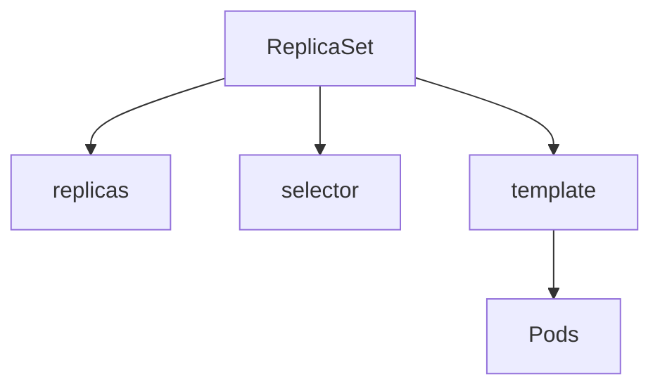

---

## 1. ReplicaSet Manifest

أبسط ReplicaSet ممكن نكتبه بالشكل ده:

```yaml
apiVersion: apps/v1
kind: ReplicaSet

metadata:
  name: nginx-rs

spec:
  replicas: 3

  selector:
    matchLabels:
      app: nginx

  template:
    metadata:
      labels:
        app: nginx

    spec:
      containers:
        - name: nginx
          image: nginx:latest
```

الـ manifest ده بيقول لـ Kubernetes:

> أنا عايز ReplicaSet اسمه `nginx-rs`، ويحافظ على وجود **3 Pods**، وكل Pod لازم يكون عليه label اسمه `app=nginx`.

---

## 2. `apiVersion`

```yaml
apiVersion: apps/v1
```

ده بيحدد الـ Kubernetes API version اللي هنستخدمه لإنشاء الـ resource.

ReplicaSet بيستخدم:

```yaml
apps/v1
```

وده هو الـ stable API version الخاص بالـ ReplicaSet.

---

## 3. `kind`

```yaml
kind: ReplicaSet
```

هنا بنحدد نوع الـ Kubernetes resource اللي عايزين ننشئه.

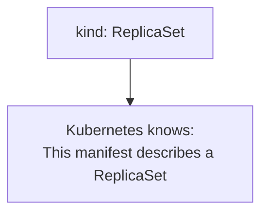

---

## 4. `metadata`

```yaml
metadata:
  name: nginx-rs
```

الـ `metadata` بتحتوي على معلومات تعريف الـ resource.

أهم حاجة هنا هي:

```yaml
name: nginx-rs
```

وده اسم الـ ReplicaSet داخل الـ Namespace.

ممكن كمان نضيف:

```yaml
metadata:
  name: nginx-rs
  labels:
    app: nginx
```

لكن لازم نفرق بين **ReplicaSet labels** وبين **Pod labels**.

الـ labels الموجودة هنا بتوصف الـ ReplicaSet نفسه.

---

## 5. `spec.replicas`

```yaml
spec:
  replicas: 3
```

ده بيحدد الـ **Desired Number of Pod Replicas**.

يعني:

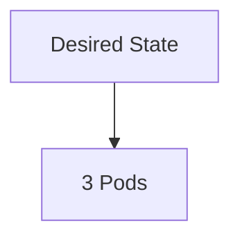

لو عندنا:

```yaml
replicas: 3
```

والـ ReplicaSet اكتشف إن فيه:

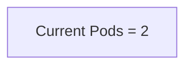

هيحاول يعمل Pod جديد.

ولو:

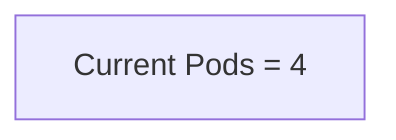

هيحاول يرجع العدد إلى 3.

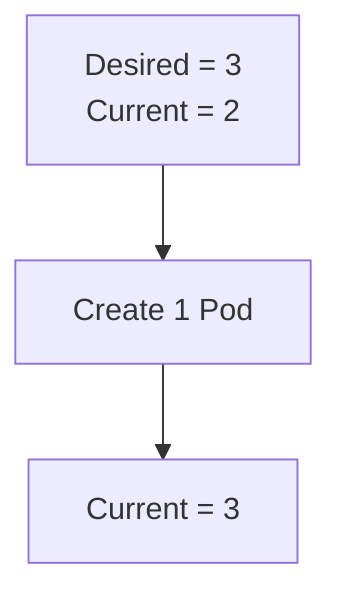

---

## 6. `spec.selector`

واحد من أهم أجزاء الـ ReplicaSet هو:

```yaml
selector:
  matchLabels:
    app: nginx
```

الـ `selector` بيحدد **أنهي Pods الـ ReplicaSet مسؤول عنها**.

هنا بنقول:

> أي Pod عليه `app=nginx` يعتبر Matching Pod بالنسبة للـ ReplicaSet.

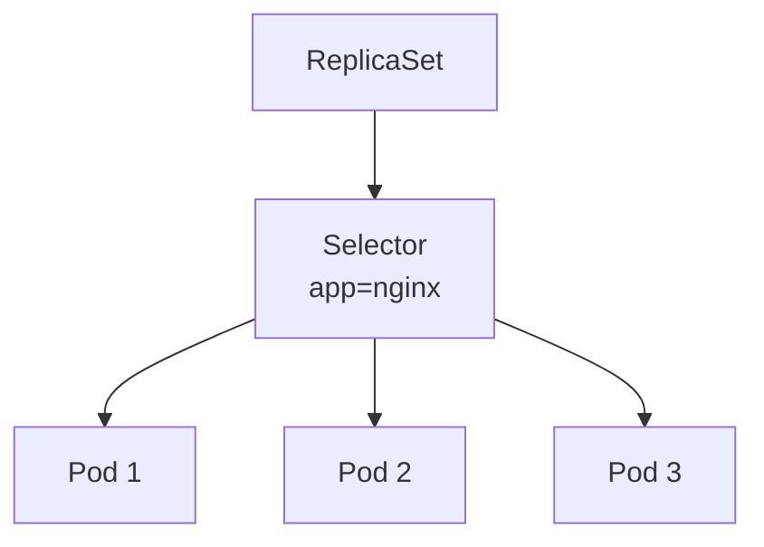

---

## 7. `matchLabels`

```yaml
selector:
  matchLabels:
    app: nginx
```

`matchLabels` معناها إن الـ Pod لازم يحتوي على نفس الـ label.

يعني:

```yaml
app: nginx
```

لازم تتطابق مع:

```yaml
template:
  metadata:
    labels:
      app: nginx
```

وده مهم جدًا.

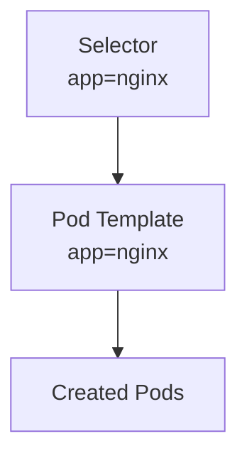

---

## 8. `spec.template`

الـ `template` هو الـ **Pod Template** اللي الـ ReplicaSet بيستخدمه لإنشاء Pods جديدة.

```yaml
template:
  metadata:
    labels:
      app: nginx

  spec:
    containers:
      - name: nginx
        image: nginx:latest
```

فكر فيها كده:

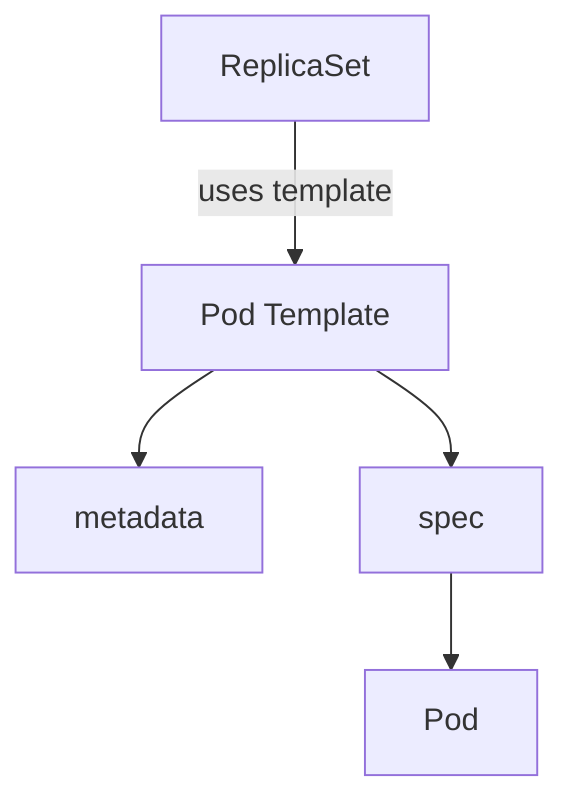

الـ ReplicaSet مش بيكتب Pod جديد من الصفر كل مرة.

هو عنده Template بيقول:

> لما أحتاج Pod جديد، استخدم المواصفات دي.

---

## 9. Pod Template Metadata

جوا الـ template:

```yaml
template:
  metadata:
    labels:
      app: nginx
```

دي الـ labels اللي هتتحط على **الـ Pods نفسها**.

مثلاً لو عندنا:

```yaml
replicas: 3
```

هيتم إنشاء Pods بالشكل ده:

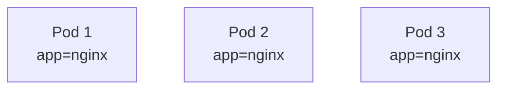

والـ ReplicaSet يقدر يتعرف عليهم باستخدام الـ selector.

---

## 10. Selector and Template Must Match

دي من أهم قواعد الـ ReplicaSet configuration.

عندنا:

```yaml
selector:
  matchLabels:
    app: nginx
```

لازم الـ template يحتوي على:

```yaml
template:
  metadata:
    labels:
      app: nginx
```

يعني:

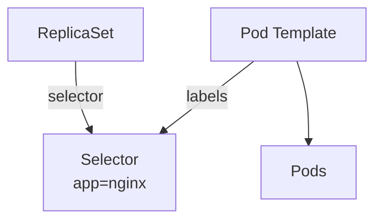

لو الـ selector بيدور على:

```text
app=nginx
```

والـ template بيعمل Pods عليها:

```text
app=web
```

يبقى فيه mismatch.

الـ ReplicaSet هيكون مش قادر يستخدم الـ Pods اللي أنشأها كـ matching replicas بالطريقة المطلوبة.

---

## 11. Container Configuration

جوا الـ Pod Template بنحدد الـ containers:

```yaml
template:
  spec:
    containers:
      - name: nginx
        image: nginx:latest
```

هنا:

```yaml
name: nginx
```

اسم الـ container.

و:

```yaml
image: nginx:latest
```

الـ container image اللي هيتم تشغيلها.

ممكن نستخدم version محدد بدل `latest`:

```yaml
image: nginx:1.29
```

وده أفضل في الـ production لأن الـ image version بتكون واضحة وثابتة.

---

## 12. Complete ReplicaSet Structure

الصورة الكاملة للـ manifest:

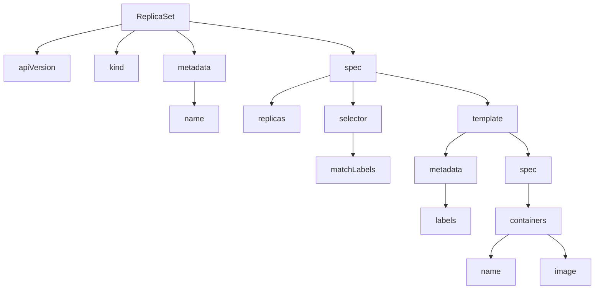

---

## 13. How Selector and Template Work Together

الـ ReplicaSet بيستخدم الـ selector علشان يعرف الـ Pods اللي تخصه.

وفي نفس الوقت، الـ template بيحدد شكل الـ Pods اللي هيعملها.

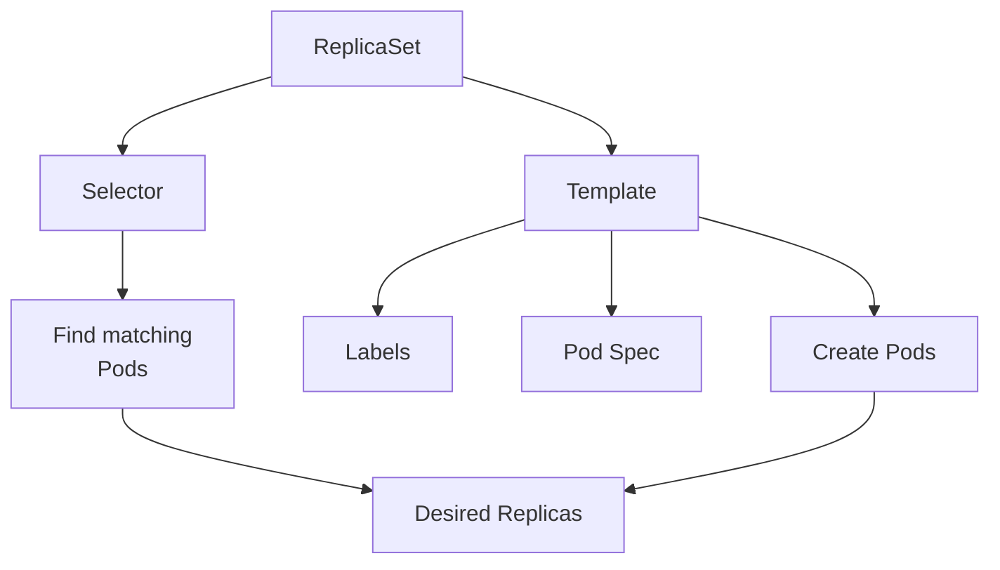

---

## 14. ReplicaSet Example

نعمل file:

```bash
vim nginx-rs.yaml
```

ونضيف:

```yaml
apiVersion: apps/v1
kind: ReplicaSet

metadata:
  name: nginx-rs

spec:
  replicas: 3

  selector:
    matchLabels:
      app: nginx

  template:
    metadata:
      labels:
        app: nginx

    spec:
      containers:
        - name: nginx
          image: nginx:1.29
```

بعدها:

```bash
kubectl apply -f nginx-rs.yaml
```

نشوف الـ ReplicaSet:

```bash
kubectl get replicasets
```

أو:

```bash
kubectl get rs
```

ممكن نشوف:

```text
NAME       DESIRED   CURRENT   READY
nginx-rs   3         3         3
```

---

## 15. Inspect the ReplicaSet

ممكن نشوف تفاصيل الـ ReplicaSet:

```bash
kubectl describe rs nginx-rs
```

هتلاقي معلومات مهمة زي:

```text
Replicas:
  Desired: 3
  Current: 3
  Ready: 3

Selector:
  app=nginx
```

وده بيساعدنا نفهم العلاقة بين الـ ReplicaSet والـ Pods.

---

## 16. Inspect the Pods

نشوف الـ Pods:

```bash
kubectl get pods
```

مثلاً:

```text
NAME             READY   STATUS    AGE
nginx-rs-abc12   1/1     Running   20s
nginx-rs-def34   1/1     Running   20s
nginx-rs-ghi56   1/1     Running   20s
```

ممكن كمان نشوف الـ labels:

```bash
kubectl get pods --show-labels
```

مثلاً:

```text
NAME             LABELS
nginx-rs-abc12   app=nginx
nginx-rs-def34   app=nginx
nginx-rs-ghi56   app=nginx
```

---

## 17. Scaling Configuration

نقدر نغير عدد الـ replicas.

مثلاً:

```bash
kubectl scale rs nginx-rs --replicas=5
```

دلوقتي:

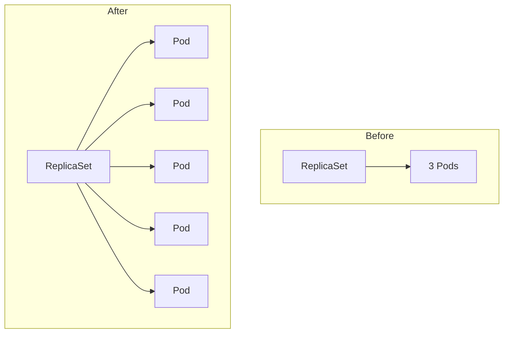

نتأكد:

```bash
kubectl get rs
```

و:

```bash
kubectl get pods
```

---

## 18. Updating the ReplicaSet Manifest

ممكن نعدل:

```yaml
replicas: 5
```

وبعدين:

```bash
kubectl apply -f nginx-rs.yaml
```

الـ ReplicaSet هيعمل reconciliation ويخلي الـ Current State يساوي الـ Desired State.

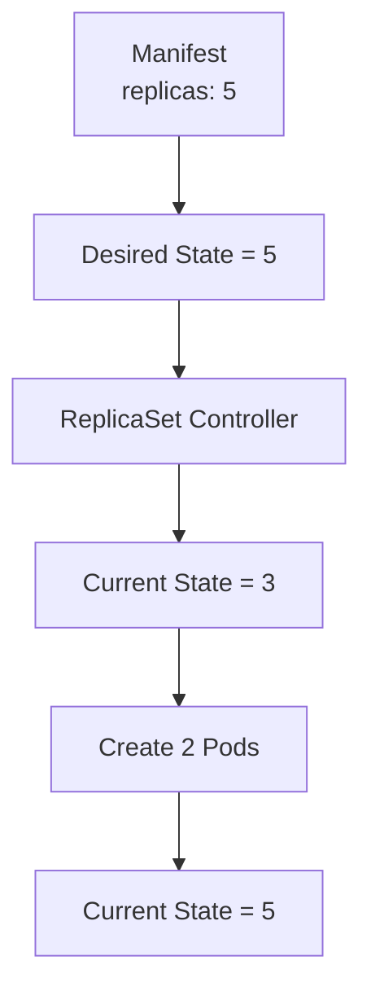

---

## 19. Deleting a Pod

نقدر نختبر الـ self-healing:

```bash
kubectl delete pod <pod-name>
```

قبل الحذف:

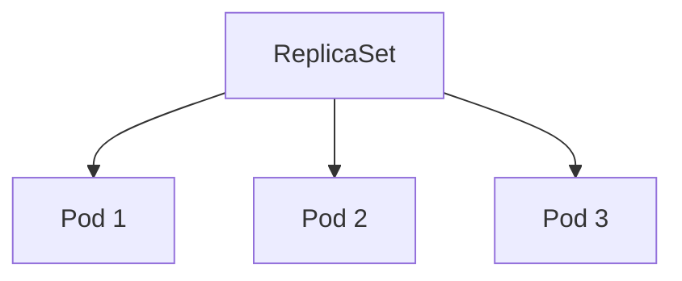

بعد حذف Pod:

```text
Rflowchart TB
    R["ReplicaSet"]

    R --> P1["Pod 1"]
    R --> P2["Pod 2"]
```

الـ ReplicaSet يلاحظ:

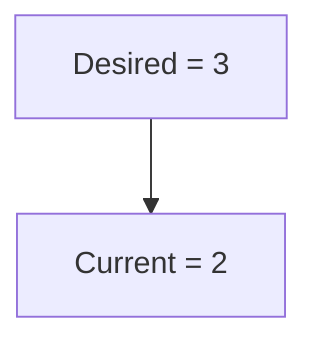

فيعمل Pod جديد:

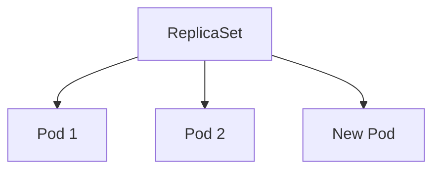

---

## 20. ReplicaSet Configuration Mental Model

أهم حاجة أخرج بيها من الـ configuration إن الـ ReplicaSet عنده 3 معلومات أساسية:

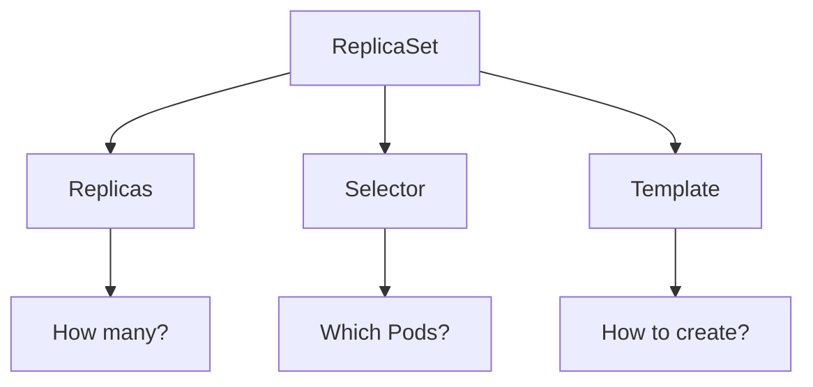

### `replicas`

```text
How many Pods do I want?
```

### `selector`

```text
Which Pods belong to me?
```

### `template`

```text
What should a new Pod look like?
```

---

## 21. The Complete Mental Model

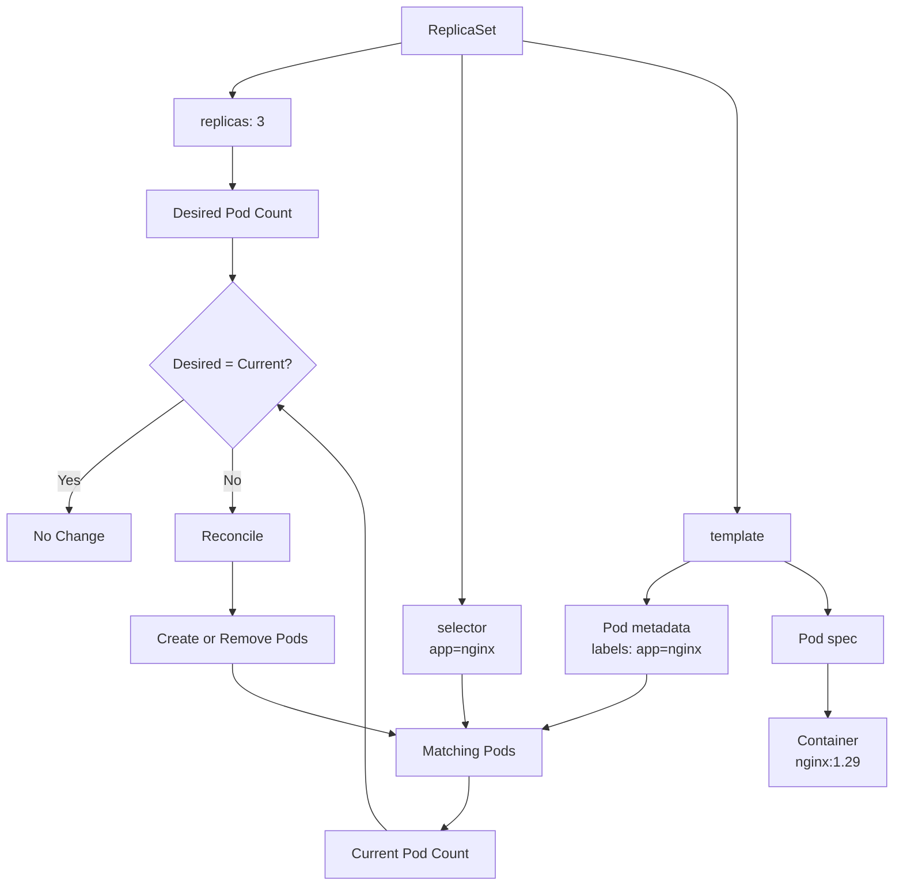

---

## 22. Key Rules

### Rule 1 — ReplicaSet uses `apps/v1`

```yaml
apiVersion: apps/v1
```

### Rule 2 — `kind` must be `ReplicaSet`

```yaml
kind: ReplicaSet
```

### Rule 3 — `replicas` defines the desired Pod count

```yaml
replicas: 3
```

### Rule 4 — `selector` identifies managed Pods

```yaml
selector:
  matchLabels:
    app: nginx
```

### Rule 5 — Template labels must satisfy the selector

```yaml
selector:
  matchLabels:
    app: nginx

template:
  metadata:
    labels:
      app: nginx
```

### Rule 6 — `template.spec` defines the Pod

```yaml
template:
  spec:
    containers:
      - name: nginx
        image: nginx:1.29
```

---

## 23. Summary

ReplicaSet configuration revolves around three main concepts:

```mermaid
flowchart TB
    A["replicas"] --> B["How many Pods?"]
    C["selector"] --> D["Which Pods?"]
    E["template"] --> F["What should those Pods look like?"]
```

والـ structure الأساسي:

```yaml
apiVersion: apps/v1
kind: ReplicaSet

metadata:
  name: nginx-rs

spec:
  replicas: 3

  selector:
    matchLabels:
      app: nginx

  template:
    metadata:
      labels:
        app: nginx

    spec:
      containers:
        - name: nginx
          image: nginx:1.29
```

فالـ mental model النهائي:

```mermaid
               flowchart TB
    R["ReplicaSet"]

    R --> Rep["Replicas"]
    R --> Sel["Selector"]
    R --> Temp["Template"]

    Temp --> Def["Pod Definition"]
    Def --> L["Labels"]

    Sel --> MP["Matching Pods"]
    L --> MP

    Rep --> DC["Desired vs Current"]
    MP --> DC

    DC --> Rec["Reconciliation"]
```

الـ ReplicaSet في النهاية مش مجرد YAML فيه `replicas: 3`؛ هو resource عنده **Desired State + Selector + Pod Template**، والـ Controller بيستخدم التلاتة دول علشان يحافظ على الـ desired number of matching Pods بشكل مستمر.