## 1. What is a ReplicaSet?

الـ**ReplicaSet** هو Kubernetes resource مسؤول عن التأكد إن عدد معين من الـ**Pods** شغالين في أي وقت.

يعني لو أنا قلت:

```text
I want 3 replicas
```

فالـReplicaSet بيحاول يخلي الـCluster دائمًا عنده:

```text
Desired State = 3 Pods
```

لو عندي أقل من 3 Pods، ينشئ Pods جديدة.

ولو عندي أكثر من 3 Pods، يقلل العدد.

الفكرة الأساسية:

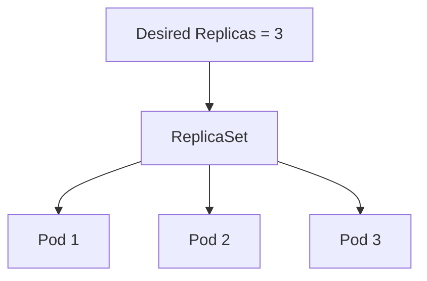

فممكن نلخصه في جملة:

> **ReplicaSet ensures that a specified number of Pod replicas are running.**

---

## 2.Why Do We Need ReplicaSets?

خلينا نرجع خطوة.

لو عندنا Application شغال في Pod واحد:

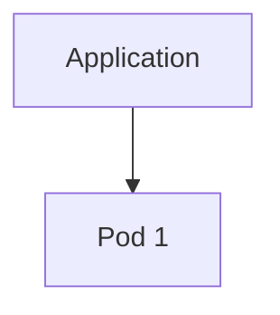

ولو الـPod وقع أو اتعمله delete:

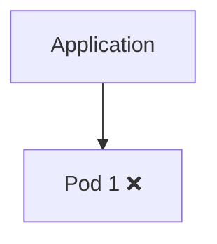

خلاص، الـApplication اختفت من الـCluster.

إحنا محتاجين Kubernetes يلاحظ إن الـPod اختفى ويعمل واحدة جديدة.

هنا يظهر دور الـReplicaSet.

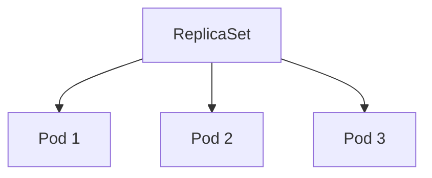

لو Pod مات:

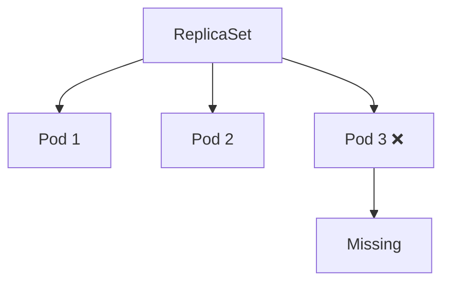

الـReplicaSet يلاحظ إن العدد الحالي بقى:

```text
Current = 2
```

بينما المطلوب:

```text
Desired = 3
```

فيعمل Pod جديدة:

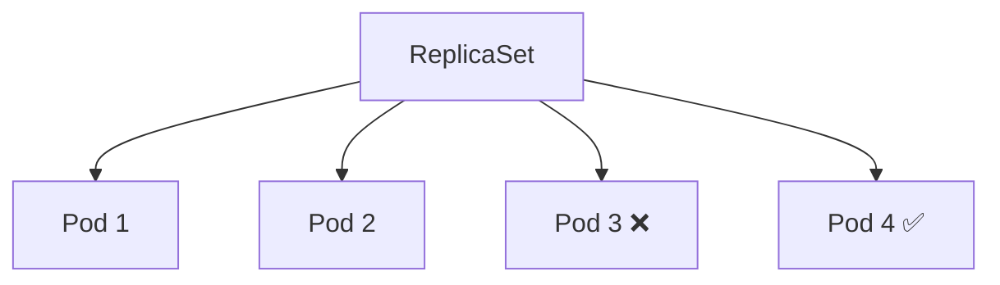

فالنتيجة:

```text
Current = 3
Desired = 3
```

---

## 3. Desired State vs Current State

دي أهم فكرة في ReplicaSet.

أنت بتحدد:

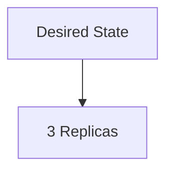

والـReplicaSet بيبص على:

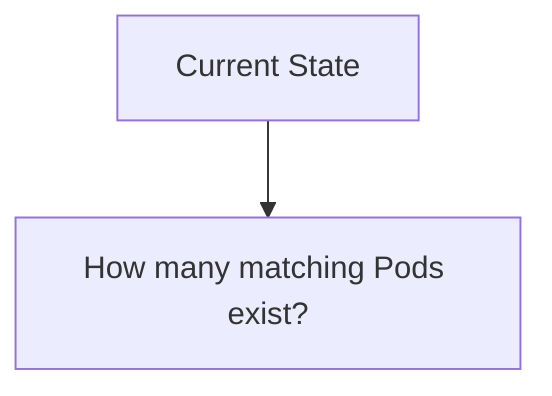

وبعدين يقارن بينهم.

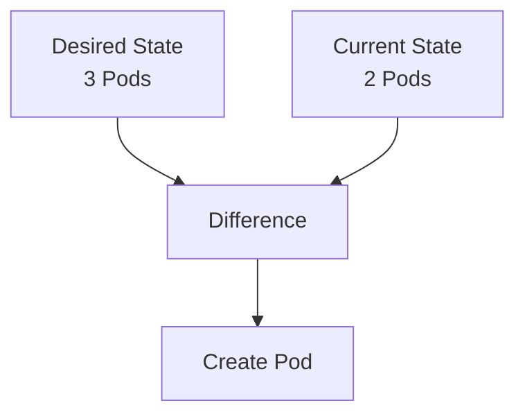

بعد الـreconciliation:

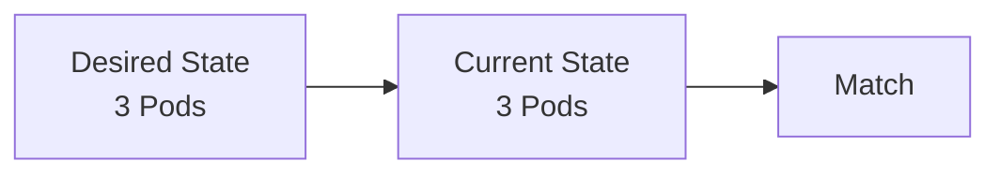

الفكرة دي مش مجرد ReplicaSet.

دي جزء من الـ**Kubernetes control model** بشكل عام.

---

## 4.ReplicaSet as a Controller

الـReplicaSet مش مجرد resource بيخزن رقم `replicas`.

هو كمان بيشتغل كـ**Controller**.

يعني باستمرار بيعمل:

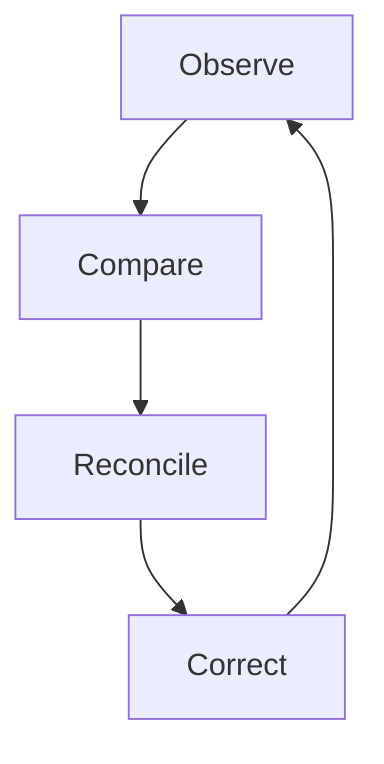

مثلاً:

```text
Desired = 3
Current = 2
```

الـReplicaSet يعمل:

```text
Create 1 Pod
```

ولو:

```text
Desired = 3
Current = 4
```

يعمل:

```text
Remove 1 Pod
```

ولو:

```text
Desired = 3
Current = 3
```

مش محتاج يعمل حاجة.

---

## 5.ReplicaSet Reconciliation

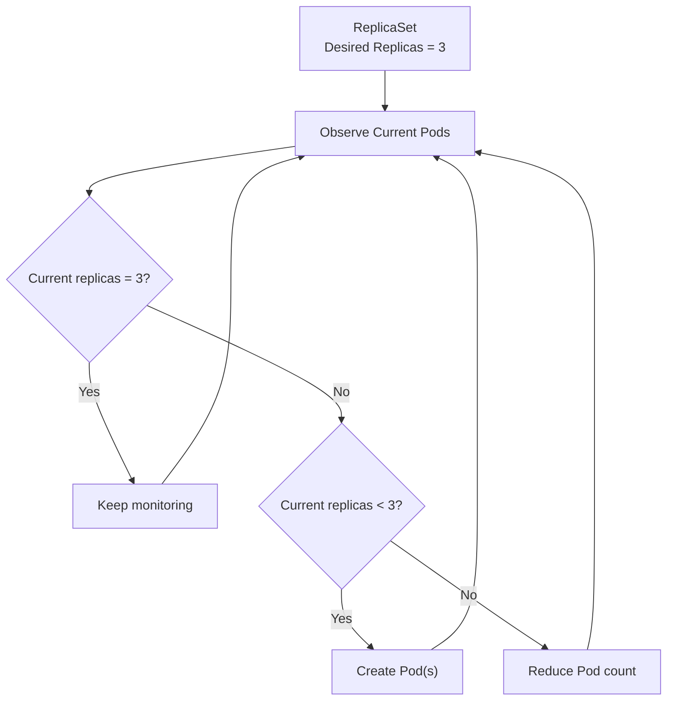

---

## 6. ReplicaSet and Pods

دي نقطة مهمة جدًا.

الـReplicaSet **مش بيشغّل Container بنفسه**.

هو مسؤول عن إدارة الـPods.

والـPod هو اللي بيحتوي على الـContainers.

يعني:

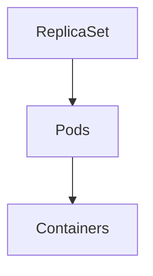

مثلاً:

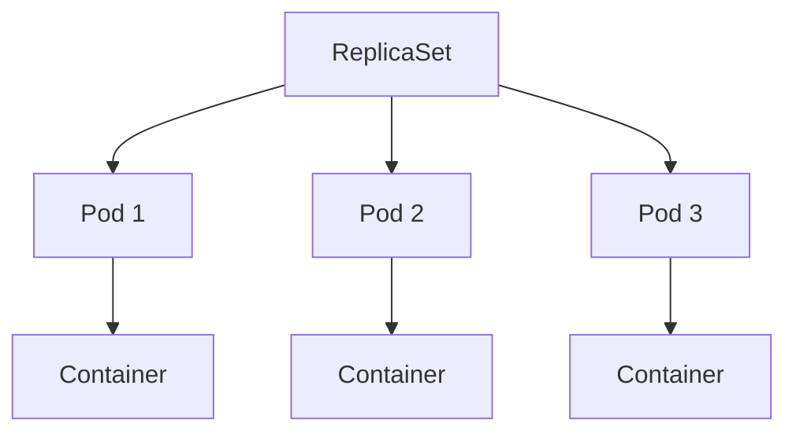

فالعلاقة الأساسية:

> **ReplicaSet manages Pods.**

---

## 7. How ReplicaSet Identifies Pods

دي نقطة مهمة جدًا.

ممكن الـReplicaSet يكون عنده:

```text
3 Pods
```

لكن أسماء الـPods ممكن تكون مختلفة:

```text
nginx-rs-abc12
nginx-rs-x7k91
nginx-rs-p4m32
```

لو واحدة اتمسحت:

```text
nginx-rs-x7k91 ❌
```

الـReplicaSet مش بيقول:

> "لازم أرجع نفس الـPod."

هو بيقول:

> "أنا محتاج 3 matching Pods."

فيعمل Pod جديدة:

```text
nginx-rs-new45
```

فتصبح:

```text
3 matching Pods
```

وده معناه إن ReplicaSet بيهتم بالـ**desired number of matching Pods**، مش بهوية Pod معينة.

---

## 8. ReplicaSet, Labels, and Selectors
هنا بيظهر مفهوم مهم جدًا:

### I. Labels & Selectors

الـReplicaSet بيستخدم **Selector** علشان يحدد الـPods اللي هو مسؤول عنها.

مثلاً:

```text
Selector:
app = nginx
```

والـPods:

```text
Pod 1
app = nginx

Pod 2
app = nginx

Pod 3
app = nginx

Pod 4
app = redis
```

الـReplicaSet هيعتبر:

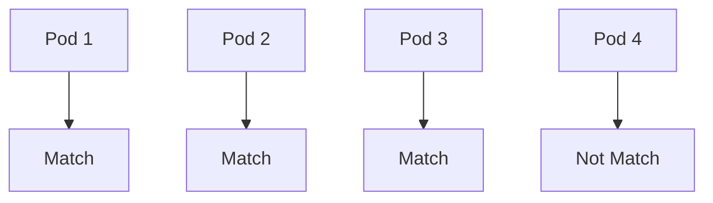

فتكون:

```text
Matching Pods = 3
```

---

### II. Diagram

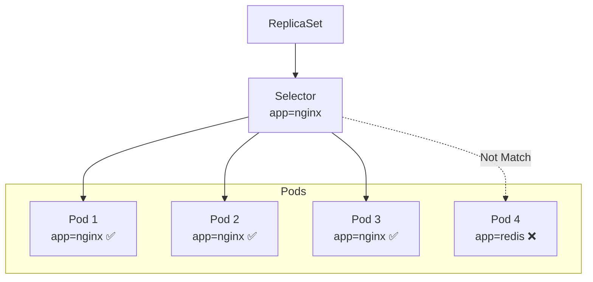

وده سبب إن **Labels وSelectors** مهمين جدًا في Kubernetes.

---

العلاقة ممكن تتشاف كده:

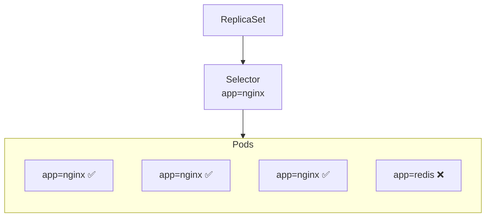

فالـReplicaSet مش بيعد كل الـPods الموجودة في الـNamespace بشكل عشوائي.

هو بيحسب الـPods اللي **match الـSelector** بتاعه.

---

## 9. Self-Healing

واحدة من أهم فوائد ReplicaSet هي **Self-Healing**.

يعني لو Pod اختفت لأي سبب، الـReplicaSet يقدر يعمل replacement.

مثال:

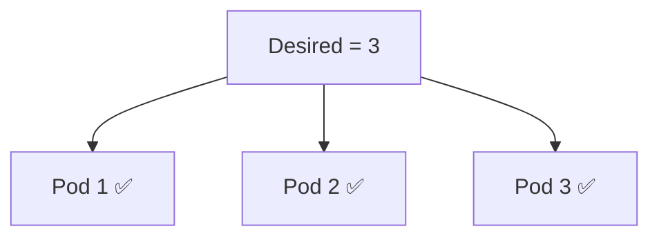

حد عمل:

```bash
kubectl delete pod pod-2
```

دلوقتي:

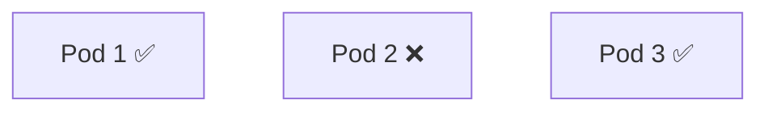

أصبح:

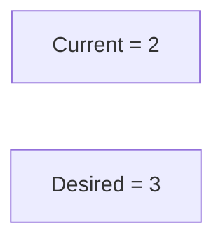

الـReplicaSet يلاحظ الفرق ويعمل Pod جديدة:

```mermaid
flowchart TB
    
    P1["Pod 1 ✅"]
    P2["Pod 2 ✅"]
    P3["Pod 3 ✅"]
```

فالـnumber رجع:

```text
Current = 3
```

---

## Self-Healing Flow

```mermaid
flowchart LR
    A["ReplicaSet<br/>Desired = 3"] --> B["Pod 1"]
    A --> C["Pod 2"]
    A --> D["Pod 3"]

    C --> E["Pod deleted"]
    E --> F["Current = 2"]

    F --> A
    A --> G["Create replacement Pod"]
    G --> H["Current = 3"]
```

المهم هنا إن الـReplicaSet مش محتاج منك تعمل:

```bash
kubectl run ...
```

كل مرة Pod تقع.

هو بيحاول يحافظ على الـDesired State automatically.

---

## 10. ReplicaSet Does Not Guarantee Application Health

خلي بالك من الفرق ده.

ReplicaSet مسؤول عن **عدد الـPods**.

مش مسؤول عن التأكد إن الـApplication داخل الـPod شغالة بشكل صحيح من ناحية الـapplication logic.

مثلاً:

```mermaid
flowchart TB
    R["ReplicaSet<br/>Desired = 3"]

    R --> P1["Pod 1 → Running"]
    R --> P2["Pod 2 → Running"]
    R --> P3["Pod 3 → Running"]
```

الـReplicaSet ممكن يعتبر الوضع مناسب.

لكن ده لا يعني بالضرورة إن الـApplication بتخدم requests بشكل صحيح.

علشان كده Kubernetes عنده مفاهيم تانية زي:

- `livenessProbe`
- `readinessProbe`
- `startupProbe`

واللي اتكلمنا عنها في **Pod Lifecycle & Troubleshooting**.

فالـReplicaSet أساسًا بيهتم بالـ**replica count** والـPods اللي بتطابق الـselector.

---

## 11. Scaling

ReplicaSet يقدر يحافظ على عدد معين من الـPods.

مثلاً:

```text
replicas = 3
```

يعني:

```mermaid
flowchart TB
    P1["Pod 1"]
    P2["Pod 2"]
    P3["Pod 3"]
```

ولو الـDesired State أصبح:

```text
replicas = 5
```

فالـReplicaSet يحاول يوصل لـ:

```mermaid
flowchart TB
    P1["Pod 1"]
    P2["Pod 2"]
    P3["Pod 3"]
    P4["Pod 4"]
    P5["Pod 5"]

```

ولو أصبح:

```text
replicas = 2
```

فالـReplicaSet يقلل العدد إلى:

```mermaid
flowchart TB
    P1["Pod 1"]
    P2["Pod 2"]
```

فمفهوم الـScaling هنا ببساطة:

```mermaid
flowchart TB
    A["Desired Replicas"]
    B["ReplicaSet"]
    C["Matching Pods"]

    A --> B
    B --> C
```

---

## 12. ReplicaSet Does Not Choose the Node

مهم جدًا نفرق بين الـReplicaSet والـScheduler.

الـReplicaSet يقول:

```text
"I need 3 Pods."
```

لكن مين يقرر الـPods دي تشتغل على أنهي Node؟

الـ**kube-scheduler**.

الصورة الكاملة:

```mermaid
flowchart TB
    R["ReplicaSet"]
    P["Pods"]
    S["kube-scheduler"]
    N["Worker Node"]

    R -->|"Create / maintain Pods"| P
    P -->|"Need a Node"| S
    S --> N
```

يعني:

> **ReplicaSet manages the number of Pods.**

> **Scheduler decides where those Pods run.**

---

## 13. ReplicaSet and Deployment

دي نقطة مهمة جدًا لأننا هنحتاجها بعد كده.

في Kubernetes غالبًا مش بنتعامل مع ReplicaSet بشكل مباشر في الـproduction applications.

الـ**Deployment** بيستخدم ReplicaSet تحت الـhood.

العلاقة الأساسية:

```mermaid
flowchart TB
    D["Deployment"]
    R["ReplicaSet"]
    P["Pods"]

    D --> R
    R --> P
```

مثلاً:

```mermaid
flowchart TB
    D["Deployment"] --> R["ReplicaSet"]

    R --> P1["Pod"]
    R --> P2["Pod"]
    R --> P3["Pod"]
```

الـDeployment بيدينا features أعلى مستوى زي:

- Rolling Updates
- Rollbacks
- Revision management

بينما الـReplicaSet دوره الأساسي:

> **Maintain the desired number of Pods.**

هنفصل العلاقة بين Deployment وReplicaSet بشكل أكبر لما نوصل للـDeployment.

---

## 14. ReplicaSet Architecture

الصورة النهائية للعلاقة:

```mermaid
 flowchart TB
    CP["Control Plane"]
    API["API Server"]
    C["Controllers"]
    RS["ReplicaSet"]
    SL["Selector / Labels"]

    CP --> API
    API --> C
    C --> RS
    RS --> SL

    SL --> P1["Pod 1"]
    SL --> P2["Pod 2"]
    SL --> P3["Pod 3"]

    P1 --> C1["Container"]
    P2 --> C2["Container"]
    P3 --> C3["Container"]
```

ولو الـPod اختفت:

```mermaid
 flowchart TB
    RS["ReplicaSet"]

    RS --> P1["Pod 1"]
    RS --> P2["Pod 2"]
    RS --> P3["Pod 3 ❌"]

    P3 --> C["Current = 2"]
    C --> R["Reconciliation"]
    R --> CP["Create Pod"]
    CP --> P4["Pod 4"]
```

---

## 15. ReplicaSet Control Loop

ممكن نلخص الـbehavior كله في الـflow ده:

```mermaid
flowchart TD
    A["Desired State<br/>Replicas = 3"] --> B["ReplicaSet Controller"]
    B --> C["Find Pods matching Selector"]
    C --> D["Count Matching Pods"]
    D --> E{"Desired = Current?"}

    E -->|Yes| F["Nothing to change"]
    F --> B

    E -->|Current < Desired| G["Create replacement / additional Pods"]
    G --> B

    E -->|Current > Desired| H["Remove excess Pods"]
    H --> B
```

دي أهم صورة ذهنية للـReplicaSet.

---

## 16.Complete Example

افترض إن عندنا:

```mermaid
flowchart TB
    R["ReplicaSet"]

    R --> D["Desired Replicas = 3"]
    R --> S["Selector = app=nginx"]
```

والـCluster فيه:

```mermaid
flowchart TB
    C["Cluster"]

    C --> A["Pod A<br/>app=nginx"]
    C --> B["Pod B<br/>app=nginx"]
    C --> D["Pod C<br/>app=redis"]
```

الـReplicaSet يشوف:

```mermaid
flowchart TB
    RS["ReplicaSet Selector<br/>app=nginx"]

    RS --> A["Pod A<br/>Match ✅"]
    RS --> B["Pod B<br/>Match ✅"]
    RS --> C["Pod C<br/>Not Match ❌"]
```

إذن:

```mermaid
flowchart LR
    D["Desired = 3"] --> C["Current = 2"]
```

فيعمل Pod جديدة:

```mermaid
flowchart TB
    RS["ReplicaSet"]

    RS --> A["Pod A<br/>app=nginx ✅"]
    RS --> B["Pod B<br/>app=nginx ✅"]
    RS --> C["Pod C<br/>app=redis ❌"]
    RS --> D["Pod D<br/>app=nginx ✅"]
```

دلوقتي:

```text
flowchart LR
    D["Desired = 3"] --> C["Current = 3"]
    C --> M["Match ✅"]
```

الـReplicaSet وصل للـDesired State.

---

## 17. ReplicaSet Mental Model

```mermaid
flowchart TB
    R["ReplicaSet"]

    R --> A["Maintains desired number of Pods"]
    R --> B["Uses Selectors to identify Pods"]
    R --> C["Creates replacement Pods when needed"]
    R --> D["Removes excess Pods when needed"]
    R --> E["Continuously reconciles<br/>Desired vs Current State"]
```

وبالتالي:

```mermaid
flowchart TB
    A["Desired Replicas"] --> B["ReplicaSet"]
    B --> C["Matching Pods"]
    C --> D["Actual Workloads"]
```

## Summary

> **ReplicaSet هو Controller في Kubernetes مسؤول عن الحفاظ على عدد محدد من الـPods اللي بتطابق الـSelector. بيقارن باستمرار بين الـDesired State والـCurrent State، ولو في difference بيتصرف علشان يرجع الـCluster للـDesired State.**

وأهم العلاقات اللي لازم تكون ثابتة :
```mermaid
flowchart TB
    A["Deployment"] --> B["ReplicaSet"]
    B --> C["Pods"]
    C --> D["Containers"]
```

و:

```mermaid
flowchart TB
    RS["ReplicaSet"] --> Pods["Pods"]
    Pods --> Containers["Containers"]

    RS -->|"Selector"| Labels["Labels"]
```

و:

```mermaid
flowchart LR
    RS["ReplicaSet"] --> R1["Maintains Pod count"]
    S["Scheduler"] --> R2["Chooses Node"]
    K["kubelet"] --> R3["Manages Pods on Node"]
    RT["Runtime"] --> R4["Runs Containers"]
```

