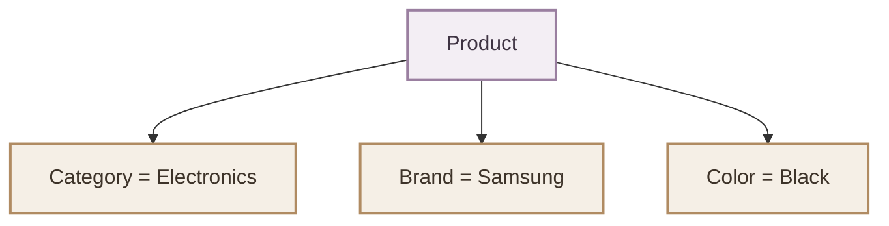
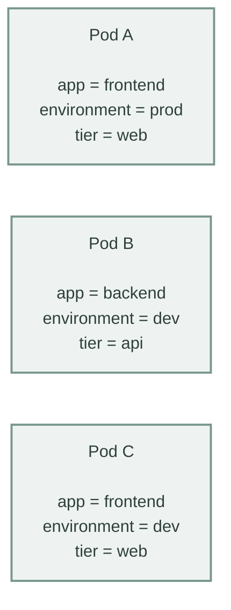
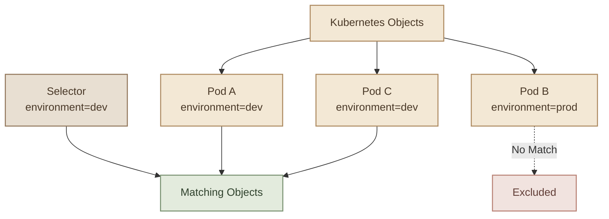
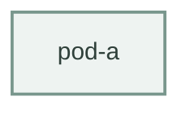
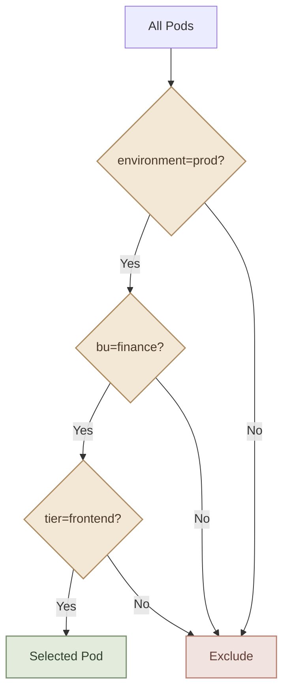
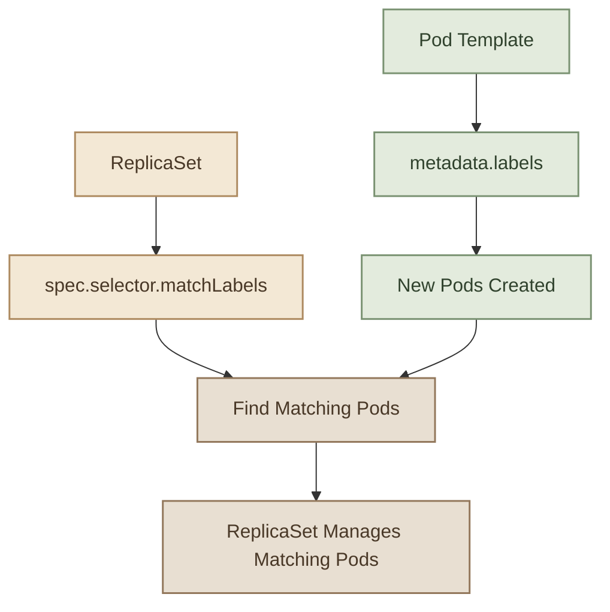
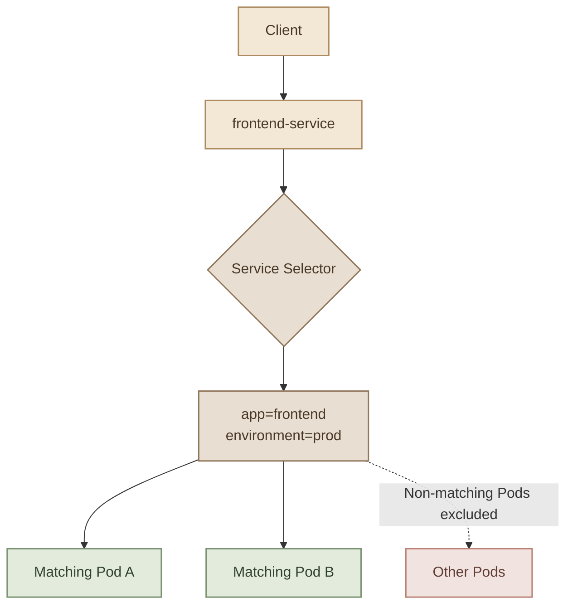

## Introduction

تخيل إن عندك Kubernetes Cluster فيها مئات الـ Pods والـ Services والـ ReplicaSets.

إزاي تقدر تحدد الـ Pods اللي شغالة في `production` بس؟ أو تعرف أنهي Pods تابعة للـ `frontend`؟ أو تخلي ReplicaSet تدير مجموعة معينة من الـ Pods؟

هنا بييجي دور مفهومين مهمين جدًا:

- الاول **Labels:** معلومات بنضيفها للـ Kubernetes objects علشان نصنفها.
- التانى **Selectors:** شروط بنستخدمها علشان نختار الـ objects اللي بتطابق Labels معينة.

ببساطة:

> ف **Labels تصنّف الـ objects، والـ Selectors تختار الـ objects بناءً على التصنيف ده.**

---

## 1. What Are Labels?

الـ **Label** عبارة عن `key-value pair` بنضيفه للـ Kubernetes object، زي Pod أو Node أو Service.

مثلًا، عندنا Pod خاصة بتطبيق اسمه `frontend`، وعايزين نحدد إنها تابعة لبيئة التطوير.

ممكن نضيف Labels بالشكل ده:

```yaml
metadata:
  labels:
    app: frontend
    environment: dev
    tier: web
```

هنا عندنا 3 Labels:

| Key | Value | Meaning |
|---|---|---|
| `app` | `frontend` | التطبيق اللي الـ Pod تابعة له |
| `environment` | `dev` | البيئة اللي بتشتغل فيها |
| `tier` | `web` | طبقة التطبيق |

الـ Labels بتساعدنا نصنّف الـ resources من أكتر من ناحية، والـ object ممكن يكون عليها Labels كتير في نفس الوقت.

### I. Real-World Analogy

تخيل متجر إلكتروني فيه منتجات مختلفة.

كل منتج ممكن يكون له:



لو عايز تعرض كل المنتجات اللي لونها أسود، بتفلتر باستخدام `color=black`.

ولو عايز تعرض أجهزة Samsung السوداء، بتستخدم شرطين مع بعض.

نفس الفكرة في Kubernetes:



باستخدام Labels وSelectors، نقدر نختار المجموعة اللي محتاجينها من غير ما نعتمد على أسماء الـ Pods.

---

## 2. Adding Labels to a Pod

خلينا نعمل Pod عليها Labels واضحة.

```yaml
apiVersion: v1
kind: Pod
metadata:
  name: frontend-pod
  labels:
    app: frontend
    environment: dev
    tier: web
spec:
  containers:
    - name: nginx
      image: nginx:alpine
```

لاحظ مكان الـ Labels:

```yaml
metadata:
  labels:
    app: frontend
    environment: dev
```

الـ Labels موجودة تحت `metadata`، مش تحت `spec`.

### I. Create the Pod

احفظ الملف باسم `frontend-pod.yaml`، ثم نفّذ:

```bash
kubectl apply -f frontend-pod.yaml
```

اعرض الـ Pod والـ Labels بتاعتها:

```bash
kubectl get pods --show-labels
```

مثال للنتيجة:

```text
NAME           READY   STATUS    LABELS
frontend-pod   1/1     Running   app=frontend,environment=dev,tier=web
```

تقدر كمان تعرض Label معينة كعمود مستقل:

```bash
kubectl get pods -L app,environment,tier
```

ده مفيد لما يكون عندك عدد كبير من الـ Pods وعايز تشوف التصنيفات بسرعة.

### II. Add or Update a Label

تقدر تضيف Label لPod موجودة باستخدام:

```bash
kubectl label pod frontend-pod version=v1
```

ولو الـ Label موجودة بالفعل وعايز تغيّر قيمتها:

```bash
kubectl label pod frontend-pod version=v2 --overwrite
```

ولحذف Label:

```bash
kubectl label pod frontend-pod version-
```

دي أوامر مفيدة لما تكون بتشتغل على الـ Cluster مباشرةً. لكن لو بتستخدم Declarative Configuration، الأفضل كمان تحدّث ملف الـ YAML علشان يفضل هو المصدر الصحيح لتعريف الـ resource.

---

## 3. What Are Selectors?

الـ **Selector** هو شرط بنستخدمه علشان نختار Kubernetes objects اللي بتطابق Labels معينة.

مثلًا، لو عايز كل الـ Pods اللي عندها:

```text
environment = dev
```

تقدر تستخدم:

```bash
kubectl get pods -l environment=dev
```

والاختصار `-l` معناه `--selector`.

مثال للنتيجة:

```text
NAME           READY   STATUS
frontend-pod   1/1     Running
worker-pod     1/1     Running
api-pod        1/1     Running
```

الأسماء والعدد هنا للتوضيح؛ النتيجة الفعلية تعتمد على الـ Labels الموجودة في الـ Cluster عندك.

الـ Selector مش محتاج يعرف أسماء الـ Pods. هو بيختار أي Pod تطابق الشرط، حتى لو اتعملت بعدين.

### I. How Labels and Selectors Work Together



الـ Selector هنا بيختار Pod A وPod C، لأن الاتنين عندهم `environment=dev`.

---

## 4. Selecting with Multiple Labels

دي نقطة مهمة جدًا، وهنستخدمها في الـ lab.

تقدر تحدد أكتر من شرط في نفس الـ Selector، وتفصل الشروط بفاصلة.

مثلًا:

```bash
kubectl get pods -l environment=prod,tier=frontend
```

معنى الأمر:

```text
environment = prod
AND
tier = frontend
```

يعني الـ Pod لازم تحقق **كل الشروط** علشان تظهر في النتيجة.

### I. Example

تخيل إن عندنا الـ Pods دي:

| Pod | environment | bu | tier |
|---|---|---|---|
| `pod-a` | prod | finance | frontend |
| `pod-b` | prod | finance | backend |
| `pod-c` | prod | sales | frontend |
| `pod-d` | dev | finance | frontend |

لو نفّذنا:

```bash
kubectl get pods -l environment=prod,bu=finance,tier=frontend
```

النتيجة هتكون:



ليه؟

لأن `pod-a` بس هي اللي حققت الشروط التلاتة مع بعض.



---

## 5. Useful Selector Operations

الـ Equality-based selectors مش النوع الوحيد؛ Kubernetes بتدعم كمان **Set-based selectors**، ودي بتسمح بشروط أكتر مرونة.

### I. Equality-based Selectors

| Operator | Meaning | Example |
|---|---|---|
| `=` | يساوي | `environment=prod` |
| `==` | يساوي | `environment==prod` |
| `!=` | لا يساوي | `environment!=dev` |

أمثلة:

```bash
kubectl get pods -l environment=prod
kubectl get pods -l 'environment!=dev'
```

ملحوظة: الشرط `environment!=dev` بيختار كمان الـ objects اللي ماعندهاش الـ Label دي؛ لأنها مش مطابقة للقيمة `dev`.

### II. Set-based Selectors

| Operator | Meaning | Example |
|---|---|---|
| `in` | القيمة ضمن مجموعة | `environment in (dev,staging)` |
| `notin` | القيمة مش ضمن مجموعة | `environment notin (dev,test)` |
| `exists` | الـ Label موجودة | `environment` |
| `does not exist` | الـ Label مش موجودة | `!environment` |

أمثلة:

```bash
kubectl get pods -l 'environment in (dev,staging)'
```

```bash
kubectl get pods -l 'environment notin (dev,test)'
```

```bash
kubectl get pods -l environment
```

```bash
kubectl get pods -l '!environment'
```

الـ `in` و`notin` بتساعدك تختار بناءً على مجموعة قيم، بدل قيمة واحدة.

---

## 6. Labels and Selectors in ReplicaSets

لحد دلوقتي استخدمنا الـ Selectors علشان نفلتر الـ Pods باستخدام `kubectl`.

لكن أهم استخدام ليها في Kubernetes هو إن الـ Controllers تقدر تحدد الـ objects اللي مسؤولة عنها.

خلينا نبدأ بـ **ReplicaSet**.

الـ ReplicaSet مسؤولة عن الحفاظ على عدد معين من الـ Pod replicas. علشان تعرف أنهي Pods تدخل ضمن المجموعة اللي بتديرها، بتستخدم `spec.selector`.

### I. Example: ReplicaSet Configuration

```yaml
apiVersion: apps/v1
kind: ReplicaSet
metadata:
  name: frontend-rs
  labels:
    app: frontend
    environment: dev
spec:
  replicas: 3

  selector:
    matchLabels:
      app: frontend
      environment: dev

  template:
    metadata:
      labels:
        app: frontend
        environment: dev

    spec:
      containers:
        - name: nginx
          image: nginx:alpine
```

في المثال ده فيه 3 أماكن مهمة:

### A. `metadata.labels`

```yaml
metadata:
  labels:
    app: frontend
    environment: dev
```

دي Labels الخاصة بالـ **ReplicaSet نفسها**.

### B. `spec.selector.matchLabels`

```yaml
selector:
  matchLabels:
    app: frontend
    environment: dev
```

دي الشروط اللي الـ ReplicaSet بتستخدمها علشان تحدد الـ Pods اللي هتديرها.

### C. `spec.template.metadata.labels`

```yaml
template:
  metadata:
    labels:
      app: frontend
      environment: dev
```

دي Labels اللي هتتحط على كل Pod جديدة الـ ReplicaSet تنشئها.

**أهم قاعدة:** الـ Selector بتاع الـ ReplicaSet لازم يطابق Labels الموجودة في الـ Pod template.

لو الـ Selector بيبحث عن:

```text
app=frontend
environment=dev
```

لكن الـ Pod template بتنتج Pods عليها:

```text
app=backend
environment=dev
```

فالتعريف هيكون غير صالح؛ لأن الـ Selector مش بيطابق الـ Template labels.

### II. How the ReplicaSet Finds Pods



الـ ReplicaSet مش بتعتمد على اسم الـ Pod علشان تلاقيها؛ بتعتمد على الـ Selector.

وده بيسمح لها إنها تكتشف الـ Pods المطابقة، وتحافظ على العدد المطلوب منها.

### III. Create and Verify the ReplicaSet

احفظ المثال في `frontend-rs.yaml`:

```bash
kubectl apply -f frontend-rs.yaml
```

اعرض الـ ReplicaSet والـ Pods:

```bash
kubectl get rs
kubectl get pods --show-labels
```

ولعرض الـ Pods المطابقة للـ Labels:

```bash
kubectl get pods -l app=frontend,environment=dev
```

**ملحوظة:** لو فيه Pods موجودة بالفعل وعليها نفس الـ Labels، ممكن الـ ReplicaSet تتعامل معاها كـ matching Pods، مش بس الـ Pods اللي أنشأتها بنفسها. علشان كده اختيار Labels مميزة لكل مجموعة مهم لتجنب تداخل الـ Controllers.

---

## 7. Labels and Selectors in Services

الـ Service بتستخدم Selector علشان تحدد الـ Pods اللي هتوجّه لها الـ traffic.

مثلًا، عندك Pods خاصة بالـ frontend:

```yaml
metadata:
  labels:
    app: frontend
    environment: prod
```

تقدر تعمل Service بالشكل ده:

```yaml
apiVersion: v1
kind: Service
metadata:
  name: frontend-service
spec:
  selector:
    app: frontend
    environment: prod

  ports:
    - port: 80
      targetPort: 80
```

الـ Service هنا بتختار الـ Pods اللي عندها:

```text
app=frontend
environment=prod
```

وبتستخدم الـ endpoints الناتجة عن الـ matching علشان توجّه الـ traffic للـ Pods المناسبة.



خلي بالك: الـ Service والـ ReplicaSet بيستخدموا الـ Selectors لأغراض مختلفة:

- الـ ReplicaSet تستخدم الـ Selector علشان تكتشف الـ Pods وتدير عددها.
- الـ Service تستخدم الـ Selector علشان تحدد الـ Pods اللي هتوجّه لها الـ traffic.

---

## 8. Labels vs Selectors vs Annotations

في نفس الدرس، اتكلمنا عن **Annotations**. لازم نفرّق بينها وبين Labels.

| Feature | Labels | Selectors | Annotations |
|---|---|---|---|
| Purpose | تصنيف الـ objects | اختيار objects مطابقة | تخزين metadata إضافية |
| Key-value pairs | نعم | شروط على Labels | نعم |
| Used for filtering | نعم، عن طريق Selector | نعم | لا، مش آلية الاختيار المعتادة |
| Example | `app: frontend` | `app=frontend` | `description: Frontend API` |

### I. What Are Annotations?

الـ **Annotations** بتخزن معلومات إضافية عن الـ Kubernetes object، زي:

- وصف التطبيق.
- رقم الـ build أو الـ release.
- معلومات خاصة بأداة deployment.
- روابط أو بيانات تساعد في الـ integration.

مثال:

```yaml
apiVersion: v1
kind: Pod
metadata:
  name: frontend-pod

  labels:
    app: frontend
    environment: dev

  annotations:
    description: "Frontend application pod"
    version: "1.0.0"
    owner: "platform-team"

spec:
  containers:
    - name: nginx
      image: nginx:alpine
```

هنا:

- `app` و`environment` هما Labels للتصنيف والاختيار.
- `description` و`version` و`owner` هي Annotations لمعلومات إضافية.

تقدر تعرض الـ Annotations باستخدام:

```bash
kubectl describe pod frontend-pod
```

أو:

```bash
kubectl get pod frontend-pod -o yaml
```

الـ Annotations ممكن تكون مفيدة للأدوات والـ automation، لكنها مش بديل عن Labels لما تحتاج تختار مجموعة من الـ objects باستخدام Label Selectors.

---

## 9. Practical Lab: Filtering Pods

هنطبق نفس نوع الأسئلة اللي ظهرت في KodeKloud.

في الـ lab، كان فيه مجموعة Pods عليها Labels زي:

```text
tier
env
bu
```

ومطلوب نجاوب عن أسئلة باستخدام Selectors.

### I. Task 1: Count Pods in the Dev Environment

اعرض الـ Pods:

```bash
kubectl get pods
```

بعدها اختار الـ Pods اللي عندها:

```text
env=dev
```

الأمر:

```bash
kubectl get pods -l env=dev
```

في الـ lab الأصلي، كانت النتيجة 7 Pods.

علشان تعدّها من غير ما تحسب الـ header:

```bash
kubectl get pods -l env=dev --no-headers | wc -l
```

الناتج المتوقع في نفس بيئة الدرس:

```text
7
```

`--no-headers` بيمنع ظهور أسماء الأعمدة، و`wc -l` بيحسب عدد الأسطر الناتجة.

### II. Task 2: Count Pods in the Finance Business Unit

الـ Label المستخدمة هنا:

```text
bu=finance
```

نفّذ:

```bash
kubectl get pods -l bu=finance
```

ولحساب العدد:

```bash
kubectl get pods -l bu=finance --no-headers | wc -l
```

في الـ lab الأصلي، كانت النتيجة 6 Pods.

### III. Task 3: Count All Objects in the Production Environment

المطلوب هنا مش الـ Pods بس، لكن الـ resources اللي بيعرضها `kubectl get all`.

```bash
kubectl get all -l env=prod
```

ولحساب عدد الـ objects المعروضة:

```bash
kubectl get all -l env=prod --no-headers | wc -l
```

في الـ lab الأصلي، كانت النتيجة 7 objects.

**نقطة مهمة:** `kubectl get all` مش معناها كل أنواع Kubernetes resources الموجودة في الـ Cluster؛ هي مجموعة من الـ resource types الشائعة اللي بيعرضها الأمر. كمان الأمر ده بيشتغل على الـ namespace الحالية لو ماحددتش namespace تانية.

### IV. Task 4: Find the Production Finance Frontend Pod

المطلوب Pod تحقق 3 شروط:

```text
env=prod
bu=finance
tier=frontend
```

نفّذ:

```bash
kubectl get pods -l 'env=prod,bu=finance,tier=frontend'
```

الـ commas هنا معناها إن كل الشروط لازم تتحقق مع بعض.

في الـ lab الأصلي، ظهر Pod واحدة مطابقة، وكان اسمها بيبدأ بـ `zzxdf`.

---

## 10. Practical Lab: Fix a ReplicaSet Selector

آخر سؤال في الـ lab كان فيه ReplicaSet manifest غير صالح.

رسالة الخطأ كانت بتقول إن الـ Selector مش مطابق للـ Template labels.

خلينا نفهم المشكلة.

### I. Incorrect Configuration

تخيل إن الملف بالشكل ده:

```yaml
apiVersion: apps/v1
kind: ReplicaSet
metadata:
  name: frontend-rs
spec:
  replicas: 3

  selector:
    matchLabels:
      app: frontend

  template:
    metadata:
      labels:
        app: backend

    spec:
      containers:
        - name: nginx
          image: nginx:alpine
```

المشكلة:

```text
Selector:
app=frontend

Template:
app=backend
```

الـ ReplicaSet بتطلب إن الـ Pods اللي هتديرها تكون عليها `app=frontend`، لكنها هتنشئ Pods عليها `app=backend`.

علشان كده الـ API Server بيرفض التعريف.

### II. Correct Configuration

لازم نخلّي الـ Selector يطابق الـ Template labels:

```yaml
apiVersion: apps/v1
kind: ReplicaSet
metadata:
  name: frontend-rs

spec:
  replicas: 3

  selector:
    matchLabels:
      app: frontend

  template:
    metadata:
      labels:
        app: frontend

    spec:
      containers:
        - name: nginx
          image: nginx:alpine
```

لاحظ إننا وحّدنا القيمة في المكانين:

```yaml
selector:
  matchLabels:
    app: frontend
```

و:

```yaml
template:
  metadata:
    labels:
      app: frontend
```

احفظ الملف في `replicaset.yaml`، ثم جرّب:

```bash
kubectl apply -f replicaset.yaml
```

اتأكد من النتيجة:

```bash
kubectl get rs
kubectl get pods --show-labels
```

### III. The Rule to Remember

> **ReplicaSet selector must match the Pod template labels.**

دي قاعدة أساسية لازم تفضل فاكرها وإنت بتكتب أو بتراجع ReplicaSet manifests.

---

## 11. Common Mistakes

### I. Mistake 1: Putting Labels in the Wrong Place

الـ Labels الخاصة بالـ Pod لازم تكون تحت:

```yaml
metadata:
  labels:
    app: frontend
```

مش تحت `spec.labels`.

### II. Mistake 2: Confusing ReplicaSet Labels with Pod Labels

في ReplicaSet manifest، فيه فرق بين:

```yaml
metadata:
  labels:
```

وبين:

```yaml
spec:
  template:
    metadata:
      labels:
```

الأولى تخص الـ ReplicaSet نفسها، والتانية تخص الـ Pods اللي هتتعمل من الـ Template.

أما:

```yaml
spec:
  selector:
    matchLabels:
```

فدي بتحدد الـ Pods اللي الـ ReplicaSet هتديرها.

### III. Mistake 3: Using the Wrong Label Key

لو الـ Pod عليها:

```yaml
labels:
  env: prod
```

فالأمر:

```bash
kubectl get pods -l environment=prod
```

مش هيختارها؛ لأن `env` و`environment` مفتاحين مختلفين.

### IV. Mistake 4: Assuming Every Object Has the Same Labels

الـ Selector مش بيختار الـ objects بناءً على اسمها أو نوعها؛ هو بيختارها بناءً على Labels الموجودة عليها.

### V. Mistake 5: Using Overlapping Selectors

لو عندك ReplicaSets مختلفة بتستخدم Selectors متداخلة، ممكن يحصل تداخل غير مقصود في إدارة الـ Pods.

اختار Labels واضحة ومميزة، وتأكد إن الـ Controllers اللي بتدير الـ Pods عندها Selectors مناسبة وغير متداخلة بشكل يسبب تعارض.

---

## 12. Key Takeaways

- **Labels** هي `key-value pairs` بنستخدمها لتصنيف Kubernetes objects.
- **Selectors** بتختار الـ objects اللي بتطابق Labels معينة.
- تقدر تستخدم أكتر من شرط في Selector واحد، والشروط المفصولة بفواصل لازم تتحقق كلها.
- `kubectl get pods -l env=dev` بيعرض الـ Pods المطابقة للـ Label.
- `--show-labels` بيعرض Labels، و`-L` بيعرض Keys معينة كأعمدة.
- الـ ReplicaSet بتستخدم `spec.selector.matchLabels` علشان تحدد الـ Pods اللي هتديرها.
- الـ Pod template labels لازم تطابق الـ ReplicaSet selector.
- الـ Services بتستخدم Selectors علشان تحدد الـ Pods المستهدفة بالـ traffic.
- **Annotations** بتخزن معلومات إضافية، لكنها مش بديل عن Labels في الاختيار المعتاد.
- اختيار Labels بشكل صحيح مهم جدًا لتجنب التداخل بين الـ Controllers.

---