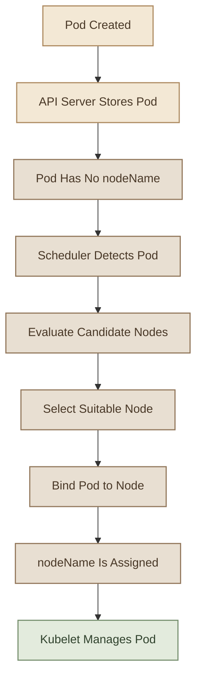
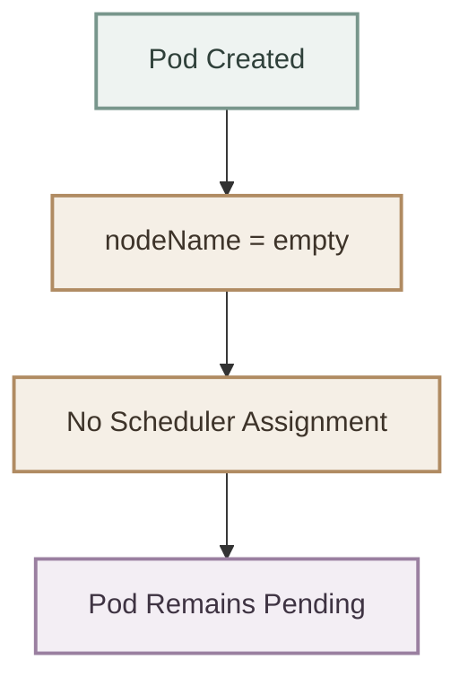
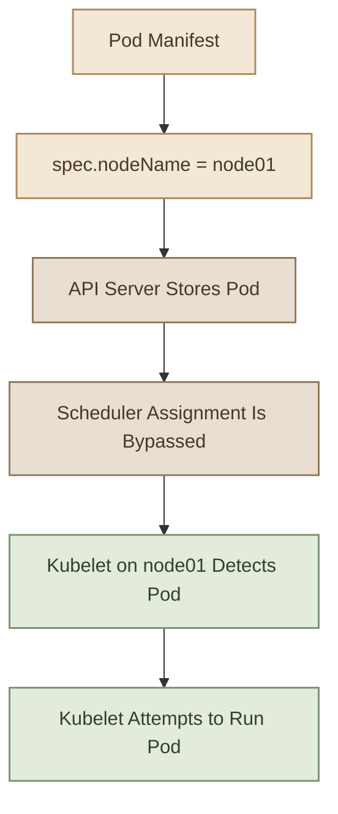
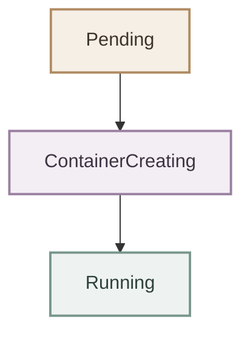
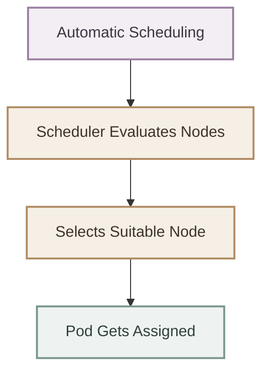
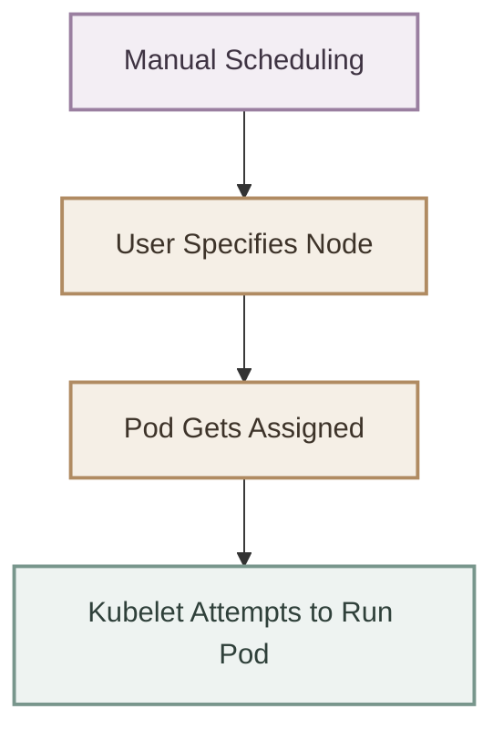

## Introduction

في Kubernetes، الطبيعي إنك تعمل Pod وتسيب الـ **Scheduler** يختار الـ Node المناسبة لتشغيله.

لكن إيه اللي يحصل لو الـ Scheduler مش موجود أصلًا؟ أو لو عايز تفهم إزاي Kubernetes بيربط الـ Pod بـ Node معينة؟

هنا بييجي دور **Manual Scheduling**.

الفكرة ببساطة إنك بتحدد بنفسك الـ Node اللي الـ Pod هيتخصص لها، بدل ما تعتمد على الـ Scheduler في اتخاذ القرار.

في الملف ده هنتعلم:

- إزاي الـ Scheduler بيتعامل مع الـ Pods اللي لسه متعملهاش Scheduling.
- إزاي تستخدم `spec.nodeName` لتحديد الـ Node.
- إزاي تعمل Scheduling لـ Pod موجود بالفعل باستخدام `Binding`.
- إزاي تطبق الكلام ده عمليًا باستخدام `kubectl`.
- إيه الفرق بين Manual Scheduling وAutomatic Scheduling.

---

## 1. How Kubernetes Scheduling Works

قبل ما نعمل Manual Scheduling، لازم نفهم الـ mechanism الطبيعي.

كل Pod عنده field اسمه:

```yaml
spec:
  nodeName: ""
```

الـ `nodeName` بيحدد اسم الـ Node اللي الـ Pod اتخصص لها.

في الـ normal workflow، إحنا عادةً مش بنكتب الحقل ده في الـ manifest؛ بنسيبه للـ Kubernetes Scheduler علشان يحدد الـ Node المناسبة.

### I. The Scheduling Process

الـ Scheduler بيراقب الـ Pods اللي لسه مش متخصصة لأي Node، ويختار Node مناسبة بناءً على الـ scheduling rules والـ resources المتاحة.

بعد اختيار الـ Node، بيسجل القرار عن طريق عملية اسمها **Binding**.



**نقطة مهمة:** الـ Scheduler مش بيشغّل الـ Container؛ هو بيحدد مكان تشغيل الـ Pod. بعد كده الـ Kubelet على الـ Node المختارة بيتولى إدارة الـ Pod.

---

## 2. What Happens Without a Scheduler?

تخيل إن عندك Kubernetes Cluster فيها Node اسمها `node01` وNode تانية اسمها `controlplane`، لكن مفيش Scheduler شغال.

لو أنشأت Pod بالشكل الطبيعي:

```yaml
apiVersion: v1
kind: Pod
metadata:
  name: nginx
spec:
  containers:
    - name: nginx
      image: nginx:alpine
```

إنت هنا معملتش تحديد للـ Node.

وبالتالي، لو مفيش مكوّن تاني بيعمل Scheduling للـ Pod، هتفضل غير متخصصة لأي Node، وغالبًا هتفضل في حالة `Pending`.



ممكن نتأكد باستخدام:

```bash
kubectl get pods
```

ونشوف تفاصيل الـ Pod باستخدام:

```bash
kubectl describe pod nginx
```

ولو عايزين نعرف هل الـ Pod اتخصصت لأي Node:

```bash
kubectl get pod nginx -o wide
```

لو مفيش Node متخصصة لها، عمود `NODE` هيكون `<none>`.

### I. Why Is the Pod Pending?

حالة `Pending` معناها إن الـ Pod لسه مش جاهزة للتشغيل؛ ممكن تكون مستنية Scheduling أو تجهيزات تانية.

في السيناريو ده تحديدًا، السبب هو إن مفيش Scheduler بيعمل Assignment للـ Pod.

لكن  ف نقطه مهمه : مش كل Pod في حالة `Pending` معناها إن الـ Scheduler مش شغال. ممكن يكون فيه أسباب تانية، زي نقص الموارد أو قيود الـ Scheduling.

---

## 3. Method One: Using `spec.nodeName`

دي أبسط طريقة لعمل Manual Scheduling عند إنشاء Pod جديدة.

بدل ما تسيب الـ Scheduler يختار الـ Node، بتحدد اسمها مباشرةً داخل الـ Pod specification.

### I. Example: Schedule a Pod on `node01`

```yaml
apiVersion: v1
kind: Pod
metadata:
  name: nginx
spec:
  nodeName: node01
  containers:
    - name: nginx
      image: nginx:alpine
```

السطر المهم هنا:

```yaml
nodeName: node01
```

معناه إننا بنحدد الـ Node اللي الـ Pod هتتخصص لها.

### II. Create the Pod

بنحفظ الـ manifest في ملف اسمه `nginx.yaml`، وبعدها ننفّذ:

```bash
kubectl apply -f nginx.yaml
```

نتأكد إن الـ Pod اتخصصت للـ Node المطلوبة:

```bash
kubectl get pods -o wide
```

مثال للنتيجة المتوقعة بعد نجاح التشغيل:

```text
NAME    READY   STATUS    NODE
nginx   1/1     Running   node01
```

النتيجة الفعلية ممكن تختلف حسب حالة الـ Cluster والـ image والموارد المتاحة.

### III. What Happens Behind the Scenes?



لما تحدد `nodeName`، إنت بتتجاوز قرار الـ Scheduler بالنسبة للـ Pod دي.

**تحذير مهم:** تحديد `nodeName` مش معناه إن الـ Node مناسبة فعلًا لتشغيل الـ Pod. إنت بتتجاوز فحوصات الـ Scheduler، لكن الـ Kubelet والـ Cluster مش هيضمنوا نجاح التشغيل. لو فيه مشكلة في الـ image أو الموارد أو حالة الـ Node، ممكن الـ Pod تفشل أو تفضل غير جاهزة.

---

## 4. Method Two: Binding an Existing Pod

طيب، لو الـ Pod اتعملت بالفعل من غير `nodeName`، وعايز تخصصها لـ Node معينة، نعمل إيه؟

في الـ normal workflow، مش هتقدر ببساطة تعدّل `spec.nodeName` للـ Pod الموجودة؛ الحقل ده مش قابل للتغيير بالطريقة المعتادة.

لكن فيه طريقة تانية: استخدام **Binding API**.

الـ Scheduler نفسه بيسجل الـ Node المختارة من خلال Binding، وإحنا نقدر نقلّد العملية دي عن طريق إرسال Binding request للـ API Server.

### I. What Is a Binding Object?

الـ `Binding` هو Kubernetes API object بيحدد الـ Node المستهدفة لربط Pod موجودة بها.

مثال:

```yaml
apiVersion: v1
kind: Binding
metadata:
  name: nginx
target:
  apiVersion: v1
  kind: Node
  name: node01
```

خلينا نفهم الحقول:

| Field | Meaning |
|---|---|
| `apiVersion: v1` | إصدار الـ Kubernetes API |
| `kind: Binding` | نوع الـ object |
| `metadata.name` | اسم الـ Pod المراد ربطها |
| `target.kind: Node` | نوع الـ resource المستهدفة |
| `target.name` | اسم الـ Node المستهدفة |

الـ Binding ده معناه إننا عايزين نربط الـ Pod المسماة `nginx` بالـ Node المسماة `node01`.

### II. Important: The Binding API Endpoint

لو الـ Pod موجودة بالفعل في namespace اسمها `default`، فالـ endpoint الخاص بعمل Binding هو:

```text
POST /api/v1/namespaces/default/pods/nginx/binding
```

والـ request body لازم يكون بصيغة JSON.

مثال للـ JSON المكافئ:

```json
{
  "apiVersion": "v1",
  "kind": "Binding",
  "metadata": {
    "name": "nginx"
  },
  "target": {
    "apiVersion": "v1",
    "kind": "Node",
    "name": "node01"
  }
}
```

### III. Send the Binding Request

في بيئة تدريبية، بعد التأكد إن الـ Pod موجودة فعلًا وإن الـ API credentials والـ permissions مناسبة، تقدر تستخدم `kubectl proxy` لفتح proxy محلي للـ API Server.

في Terminal أول:

```bash
kubectl proxy --port=8001
```

احفظ الـ JSON السابق في ملف اسمه `binding.json`، وبعدها في Terminal تاني نفّذ:

```bash
curl -X POST \
  http://127.0.0.1:8001/api/v1/namespaces/default/pods/nginx/binding \
  -H "Content-Type: application/json" \
  -d @binding.json
```

في الحالة دي، الـ request بيتم باستخدام الـ local proxy. لو بتستخدم طريقة تانية للوصول للـ API Server، لازم تتأكد من الـ authentication والـ authorization.

**ملحوظة:** ده مثال تعليمي لشرح الـ Binding API، مش أسلوب الإدارة المعتاد للـ Pods في Production. كمان الـ API request مش مجرد تغيير عادي لحقل في الـ Pod؛ هو عملية Binding مخصصة للـ API.

---

## 5. Lab: Manual Scheduling

دلوقتي نطبّق : 

### I. Step 1: Inspect the Cluster

اعرض الـ Nodes الموجودة:

```bash
kubectl get nodes
```

**مهم:** أسماء الـ Nodes بتختلف حسب البيئة. استخدم الأسماء الفعلية اللي بتظهر عندك.

### II. Step 2: Create a Normal Pod

هنعمل ملف `nginx.yaml`:

```yaml
apiVersion: v1
kind: Pod
metadata:
  name: nginx
spec:
  containers:
    - name: nginx
      image: nginx:alpine
```

هننشئ الـ Pod:

```bash
kubectl apply -f nginx.yaml
```

نتابع حالتها:

```bash
kubectl get pod nginx -o wide
```

### III. Step 3: Inspect the Scheduler

اعرض الـ Pods الموجودة في `kube-system`:

```bash
kubectl get pods -n kube-system
```

في البيئة التدريبية، كان فيه Control Plane components زي الـ API Server والـ Controller Manager و`etcd`، لكن مفيش `kube-scheduler`.

خلي بالك إن طريقة تشغيل الـ Scheduler ممكن تختلف حسب نوع الـ Cluster؛ في بعض البيئات بيكون Static Pod، وفي بيئات تانية ممكن يكون مُدار بطريقة مختلفة.

### IV. Step 4: Assign the Pod to `node01`

عدّل `nginx.yaml` وخليه:

```yaml
apiVersion: v1
kind: Pod
metadata:
  name: nginx
spec:
  nodeName: node01
  containers:
    - name: nginx
      image: nginx:alpine
```

لو الـ Pod موجودة بالفعل، لازم تحذفها وتعيد إنشاءها؛ تعديل الـ manifest وحده مش هيغيّر الـ Pod الموجودة.

للتدريب، تقدر تنفّذ:

```bash
kubectl delete pod nginx
kubectl apply -f nginx.yaml
```

وبعدها تابع:

```bash
kubectl get pods -o wide
```

المفروض تشوف إن الـ Pod اتخصصت لـ `node01`. حالة التشغيل النهائية تعتمد على جاهزية الـ Node والـ image والموارد المتاحة.

### V. Step 5: Watch the Pod Status

بدل ما تنفّذ `kubectl get pods` كل شوية، استخدم:

```bash
kubectl get pods -o wide --watch
```

ده بيخليك تتابع تغيّر حالة الـ Pod بشكل مستمر.

ممكن تشوف مراحل زي:



مش شرط كل مرحلة تظهر في كل مرة؛ أحيانًا الانتقال بيكون سريع جدًا.

للخروج من الـ watch استخدم `Ctrl+C`.

---

## 6. Can We Move a Running Pod Between Nodes?

تخيل إن عندك Pod شغالة على `node01`، وعايز تنقلها إلى `controlplane`.

مينفعش ببساطة تعدّل `nodeName` في ملف YAML وتتوقع إن الـ Pod تنتقل للـ Node الجديدة.

الـ Pod اللي اتعمل لها Scheduling بالفعل مرتبطة بالـ Node اللي بتشتغل عليها، ومش بننقلها وهي شغالة كما هي من Node للتانية.

الطريقة المعتادة هي:

1. حذف الـ Pod القديمة.
2. إعادة إنشائها باستخدام الـ manifest المعدّل.

### I. Example

غيّر:

```yaml
spec:
  nodeName: node01
```

إلى:

```yaml
spec:
  nodeName: controlplane
```

وبعدها احذف الـ Pod وأعد إنشاءها:

```bash
kubectl delete pod nginx
kubectl apply -f nginx.yaml
```

وتأكد من الـ Node الجديدة:

```bash
kubectl get pods -o wide
```

ولو عايزين نعمل الخطوتين ع مره واحده بنستخدم :
```bash
kubectl replace --force -f nginx.yaml
```

في سياق الـ lab، الأمر ده بيحذف الـ object الموجودة ويعيد إنشاءها من الملف. لكن لازم تفهم إنه **Delete and Recreate**، مش نقل حي للـ Pod. وللتدريب الأساسي، أوامر `delete` ثم `apply` أوضح في إظهار اللي بيحصل.

### II. What About the Application Data?

حذف الـ Pod وإعادة إنشائها ممكن يؤدي لفقدان البيانات الموجودة في الـ writable container filesystem.

لو التطبيق بيستخدم Persistent Volumes، فالبيانات المستمرة ممكن تفضل موجودة وفقًا لطريقة إعداد الـ storage، لكن ده مش معناه إن كل البيانات أو حالة التطبيق هتنتقل تلقائيًا.

علشان كده، في التطبيقات الحقيقية بنعتمد غالبًا على Controllers زي **Deployments** علشان تدير إعادة إنشاء الـ Pods، مع إعداد الـ storage المناسب لو التطبيق محتاج بيانات مستمرة.

---

## 7. Manual Scheduling vs Automatic Scheduling

| Feature | Automatic Scheduling | Manual Scheduling |
|---|---|---|
| اختيار الـ Node | الـ Scheduler يختار | المستخدم يحدد |
| الأسلوب المعتاد | Pod بدون `nodeName` | `nodeName` أو Binding API |
| فحص الـ scheduling constraints | الـ Scheduler يقيّمها | تحديد `nodeName` يتجاوز قرار الـ Scheduler |
| المرونة | يعتمد على قواعد الـ Scheduling | تحكم مباشر في الـ Node |
| الاستخدام | الـ workflow المعتاد | التدريب أو حالات خاصة |

### I. The Mental Model



مقابل:



في الـ Production، مش بنلجأ عادةً إلى `nodeName` لكل Pod؛ لأننا بنحتاج الـ Scheduler يراعي الموارد والـ constraints. لما نحتاج نتحكم في الـ placement، بنستخدم آليات زي `nodeSelector` وNode Affinity وTaints & Tolerations، وهنشرح كل واحدة بالتفصيل في الملفات الجاية.

---

## 8. Troubleshooting

### I. Problem 1: Pod Stays Pending

ابدأ بالأوامر دي:

```bash
kubectl get pods -o wide
kubectl describe pod nginx
kubectl get pods -n kube-system
```

راجع:

- هل فيه Scheduler شغال؟
- هل الـ Pod عندها `nodeName`؟
- هل فيه Events بتوضح سبب عدم الـ Scheduling؟
- هل الـ Node موجودة وجاهزة؟

متفترضش إن غياب الـ Scheduler هو السبب الوحيد؛ افحص الـ Events والـ Cluster قبل ما تستنتج.

### II. Problem 2: The Pod Is Assigned but Not Running

لو `nodeName` اتحدد لكن الـ Pod مش شغالة، راجع:

```bash
kubectl describe pod nginx
kubectl get nodes
kubectl describe node node01
```

ممكن يكون السبب متعلقًا بالـ image أو الـ container runtime أو الـ resources أو حالة الـ Node.

تحديد الـ Node لا يضمن إن الـ Pod هتشتغل بنجاح.

### III. Problem 3: Cannot Change `nodeName`

لو حاولت تغيّر `spec.nodeName` في Pod موجودة باستخدام `kubectl apply` أو `kubectl edit`، ممكن العملية تترفض لأن الحقل غير قابل للتغيير بالطريقة المعتادة.

لو محتاج تغيّر مكان الـ Pod، راجع هل الأفضل إعادة إنشائها أو تعديل الـ controller المسؤول عنها، بدل محاولة تعديل الحقل مباشرةً.

---

## 9. Key Takeaways

- الـ `nodeName` بيحدد الـ Node المخصصة للـ Pod.
- في الـ normal workflow، الـ Scheduler هو اللي بيختار الـ Node.
- الـ Pods اللي لسه مش متخصصة لأي Node ممكن تفضل `Pending` لو مفيش Scheduler أو آلية Scheduling بديلة.
- تحديد `spec.nodeName` عند إنشاء Pod هو أبسط طريقة لعمل Manual Scheduling.
- `Binding API` تسمح بربط Pod موجودة بـ Node عن طريق عملية Binding.
- تحديد `nodeName` مباشرةً بيتجاوز قرار الـ Scheduler وفحوصاته الخاصة بالـ placement.
- مش بننقل Pod شغالة بين Nodes كما هي؛ عادةً بنحذفها ونعيد إنشائها أو نخلي الـ Controller يدير العملية.
- `kubectl get pods -o wide` و`kubectl describe pod`  من أهم أوامر الفحص .
---