## Scheduling Overview

في Kubernetes، إنشاء الـ Pod مش معناه إن الـ Pod هيشتغل على أي Node بشكل عشوائي.

لازم Kubernetes يحدد:

> **Where should this Pod run?**

وهنا بييجي دور الـ **Kubernetes Scheduler**.

 الـ Scheduler هو المسؤول عن اختيار الـ **Node** المناسبة للـ Pod بناءً على الـ resources والـ constraints والـ placement rules الموجودة في الـ Cluster.

---

## 1. What is Kubernetes Scheduling?

> ف الـ **Scheduling**:  هي عملية اختيار الـ Node المناسبة لتشغيل الـ Pod.

لما تعمل Pod جديد، الـ API Server بيخزن الـ Pod في الـ cluster، لكن لو مفيش `nodeName` محدد، فالـ Pod في البداية بيكون:

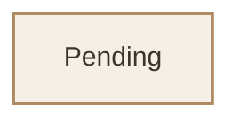

بعد كده الـ **Scheduler** يراقب الـ Pods اللي لسه مفيش Node متخصصة ليها، ويقرر أنهي Node مناسبة.

بشكل مبسط:

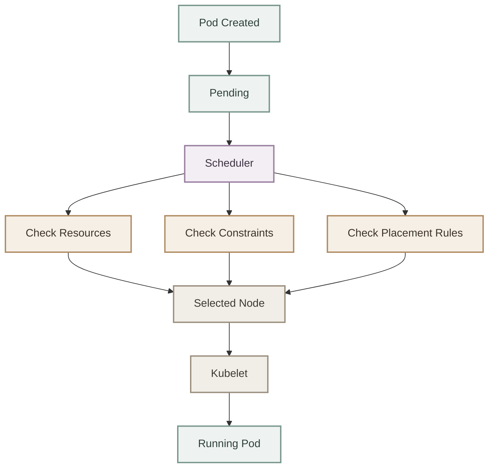

---

## 2. The Kubernetes Scheduler

الـ **kube-scheduler** واحد من مكونات الـ **Control Plane** في Kubernetes.

وظيفته الأساسية:

> **Assign Pods to Nodes.**

يعني هو بيقرر:

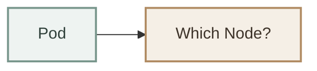

لكن مهم جدًا نفهم إن الـ Scheduler **مش هو اللي بيشغل الـ Pod**.

هو فقط بيعمل قرار الـ placement.

بعد ما يختار الـ Node، الـ **Kubelet** الموجود على الـ Node دي هو اللي يتولى تشغيل وإدارة الـ Pod.

---

## 3. Scheduler vs Kubelet vs Container Runtime

لازم نفرق بين التلاتة:

| Component | Responsibility |
|---|---|
| **Scheduler** | يقرر الـ Pod يشتغل على أنهي Node |
| **Kubelet** | يدير الـ Pod على الـ Node |
| **Container Runtime** | يشغل الـ Containers فعليًا |

ممكن نتخيلها  بالشكل ده:

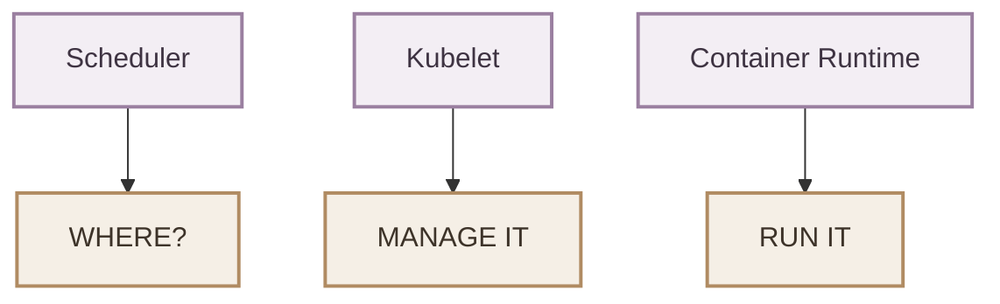

---

## 4.Scheduling Flow

خلينا نمشي مع الـ Pod من لحظة إنشائه لحد ما يشتغل.

### I. Create a Pod

مثلًا عندنا:

```yaml
apiVersion: v1
kind: Pod
metadata:
  name: nginx
spec:
  containers:
    - name: nginx
      image: nginx:alpine
```

إحنا هنا **محددناش Node**.

يعني مفيش:

```yaml
nodeName: node01
```

فالـ Scheduler هو اللي المفروض يقرر.

---

### II. Pod Becomes Pending

بعد إنشاء الـ Pod:

```bash
kubectl apply -f nginx.yaml
```

ممكن تشوف:

```bash
kubectl get pods
```

والنتيجة في البداية ممكن تكون:

```text
NAME    READY   STATUS    RESTARTS   AGE
nginx   0/1     Pending   0          2s
```

ليه `Pending`؟

لأن الـ Pod لسه مستني قرار الـ Scheduler.

---

### III. Scheduler Finds the Pod

الـ Scheduler بيراقب الـ Pods اللي لسه مش متعمل لها scheduling.

بشكل مبسط:

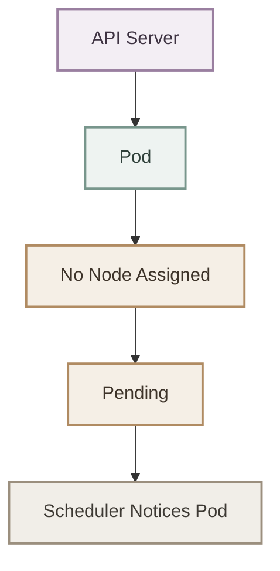

---

### VI. Scheduler Evaluates Nodes

الـ Scheduler مش بيختار أول Node وخلاص.

بيشوف هل الـ Node مناسبة للـ Pod ولا لأ.

من الحاجات اللي ممكن تدخل في القرار:

- Available CPU
- Available Memory
- Node Labels
- `nodeSelector`
- Node Affinity
- Taints
- Tolerations
- Pod placement constraints
- Resource Requests
- وغيرها من scheduling rules

مثلاً:

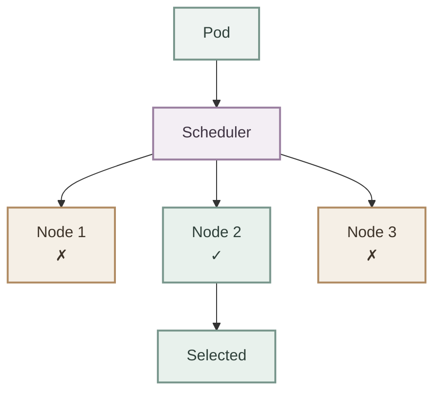

---

## 5. Filtering and Selecting Nodes

بشكل conceptual، الـ Scheduler بيعمل حاجتين مهمين:

### I. Filtering

يستبعد الـ Nodes اللي مينفعش الـ Pod يشتغل عليها.

مثلاً:

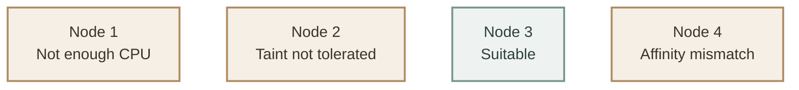

فممكن يبقى:

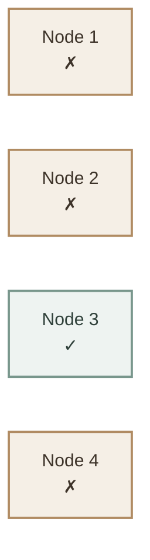

### II. Selecting

لو فيه أكتر من Node مناسبة، الـ Scheduler يحدد أنهي Node أفضل بناءً على قواعد الـ scheduling والـ scoring.

بالتالي:

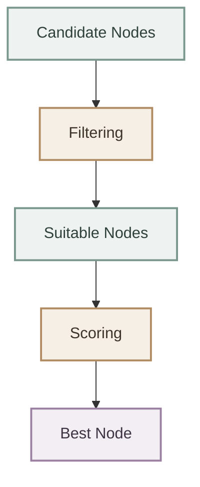
---

## 6. Binding the Pod to a Node

بعد ما الـ Scheduler يحدد الـ Node، بيتم تسجيل القرار بحيث يبقى الـ Pod مرتبط بالـ Node دي.

مفهوميًا:

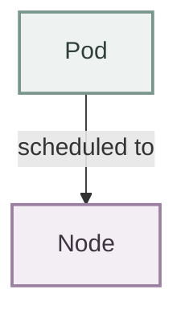

مثلاً:

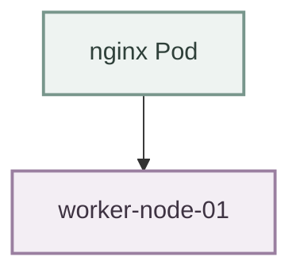

وبعدها الـ Kubelet على `worker-node-01` يلاحظ إن عنده Pod جديد لازم يديره.

---

## 7. From Scheduler to Kubelet

بعد اختيار الـ Node:

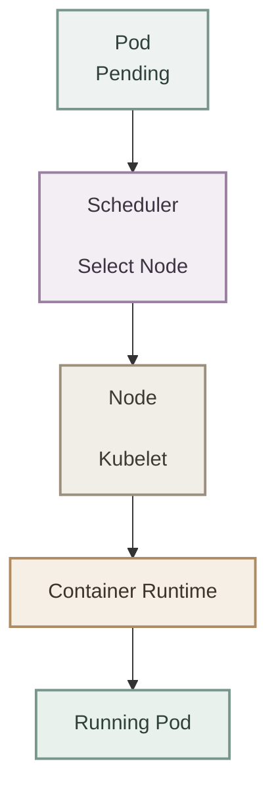

وهنا لازم تفرق:

**ان الـ Scheduler لا يشغل الـ container.**

هو فقط يحدد:


أما تشغيل الـ Pod فعليًا بيحصل على الـ Node عن طريق الـ Kubelet والـ Container Runtime.

---

## 8. What Determines Pod Placement?

الـ Scheduler ممكن يعتمد على مجموعة كبيرة من المعلومات علشان يقرر مكان الـ Pod.

أهم الحاجات اللي هندرسها في Scheduling:

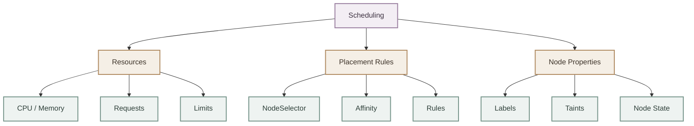

والـ concepts الأساسية اللي هنشتغل عليها:

- Manual Scheduling
- Labels and Selectors
- Taints and Tolerations
- Node Selectors
- Node Affinity
- Resource Scheduling
- DaemonSets
- Static Pods
- Multiple Schedulers
- Scheduler Profiles

---

## 9. Resource Availability

الـ Scheduler لازم ياخد في اعتباره الـ resources المطلوبة من الـ Pod.

مثلاً:

```yaml
apiVersion: v1
kind: Pod
metadata:
  name: resource-demo
spec:
  containers:
    - name: nginx
      image: nginx:alpine
      resources:
        requests:
          cpu: "500m"
          memory: "256Mi"
```

هنا الـ Pod بيطلب:

```text
CPU:    500m
Memory: 256Mi
```

لو الـ Node مفيهاش resources كفاية، ممكن الـ Scheduler يستبعدها.

مثلاً:

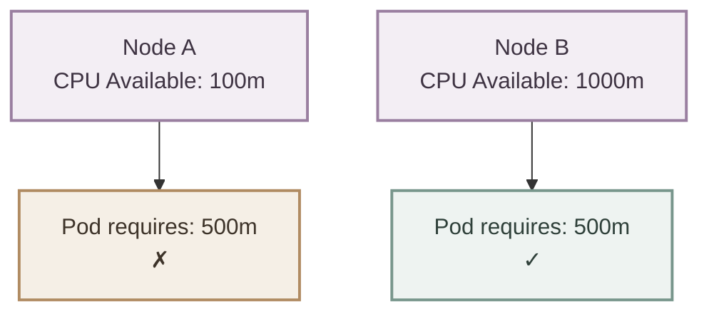

وبالتالي:

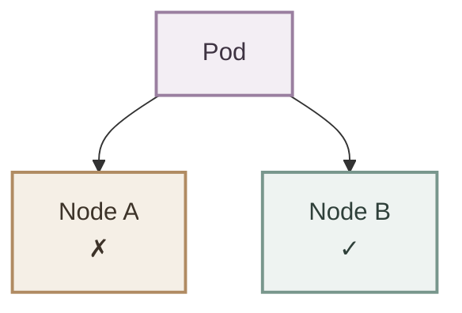

---

## 10. Scheduling Constraints

ممكن كمان تقول لـ Kubernetes:

> "أنا عايز الـ Pod ده يشتغل على Nodes معينة."

وده ممكن يتعمل باستخدام mechanisms مختلفة.

مثلاً باستخدام `nodeSelector`:

```yaml
apiVersion: v1
kind: Pod
metadata:
  name: nginx
spec:
  nodeSelector:
    environment: production

  containers:
    - name: nginx
      image: nginx:alpine
```

الـ Pod هنا مش هيشتغل على أي Node.

لازم الـ Node يكون عندها:

```text
environment=production
```

وده مثال على **constraint** بيأثر على الـ scheduling decision.

---

## 11. Manual Scheduling

في بعض الحالات ممكن تحدد الـ Node بنفسك باستخدام:

```yaml
spec:
  nodeName: node01
```

مثال:

```yaml
apiVersion: v1
kind: Pod
metadata:
  name: nginx
spec:
  nodeName: node01

  containers:
    - name: nginx
      image: nginx:alpine
```

هنا أنت بتقول بشكل مباشر:

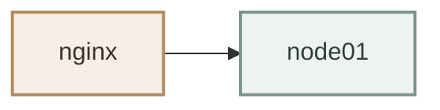

وده اسمه:

> **Manual Scheduling**

لكن في الـ normal Kubernetes workflow، إحنا غالبًا بنسيب الـ Scheduler يعمل القرار ونستخدم scheduling mechanisms للتحكم في الـ placement بدل ما نحدد Node بشكل مباشر.

---

### I. What If No Node Is Suitable?

دي نقطة مهمة جدًا.

ممكن يكون عندك Pod لكن مفيش Node مناسبة ليه.

مثلاً:

```text
Pod requires:
CPU = 2 CPU
```

لكن الـ Nodes عندك:

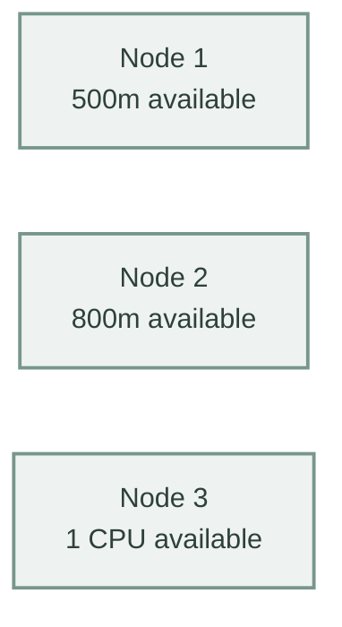

مفيش واحدة فيهم مناسبة.

فالـ Pod مش هيشتغل.

هيفضل:


ممكن تشوف:

```bash
kubectl get pods
```

```text
NAME    READY   STATUS    RESTARTS   AGE
nginx   0/1     Pending   0          20s
```

ولمعرفة السبب:

```bash
kubectl describe pod nginx
```

وغالبًا هتلاقي Events بتوضح سبب فشل الـ scheduling.

مثلاً ممكن تشوف شيء متعلق بـ:

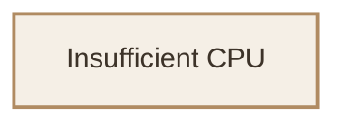

وده معناه إن الـ Scheduler مش لاقي Node فيها CPU كفاية للـ Pod.

---

## 12. Scheduler Mental Model

أهم mental model في الـ module كله:

```mermaid
flowchart TB
    P["Pod"] --> Q["Where should<br/>I run?"]
    Q --> S["Scheduler"]

    S --> R["Resources"]
    S --> C["Constraints"]
    S --> N["Node Rules"]

    R --> B["Best Node"]
    C --> B
    N --> B

    B --> K["Kubelet"]
    K --> RP["Running Pod"]

    classDef pod fill:#eef3f1,stroke:#78968c,stroke-width:2px,color:#2f403a;
    classDef question fill:#f5efe6,stroke:#b08b62,stroke-width:2px,color:#3d3329;
    classDef scheduler fill:#f3eef4,stroke:#9a7fa0,stroke-width:2px,color:#3e3342;
    classDef criteria fill:#f1eee8,stroke:#9b8f7e,stroke-width:2px,color:#3d3933;
    classDef best fill:#e8f1ec,stroke:#78968c,stroke-width:2px,color:#2f403a;

    class P pod;
    class Q question;
    class S scheduler;
    class R,C,N criteria;
    class B,K,RP best;
```

هنفكر فيها بالشكل ده:

> **Scheduler = Placement Decision**

مش:

> **Scheduler = Container Runner**

---

## 13. Automatic vs Manual Scheduling

في Kubernetes عندنا بشكل عام:

```mermaid
flowchart TB
    S["Scheduling"]

    S --> A["Automatic Scheduling"]
    A --> AS["Kubernetes Scheduler"]

    S --> M["Manual Scheduling"]
    M --> MA["Explicit Node Assignment"]

    classDef root fill:#f3eef4,stroke:#9a7fa0,stroke-width:2px,color:#3e3342;
    classDef category fill:#f5efe6,stroke:#b08b62,stroke-width:2px,color:#3d3329;
    classDef detail fill:#eef3f1,stroke:#78968c,stroke-width:2px,color:#2f403a;

    class S root;
    class A,M category;
    class AS,MA detail;
```

### I. Automatic Scheduling

بنعمل:

```yaml
apiVersion: v1
kind: Pod
metadata:
  name: nginx
spec:
  containers:
    - name: nginx
      image: nginx:alpine
```

والـ Scheduler يقرر.

### II. Manual Scheduling

بنحدد:

```yaml
spec:
  nodeName: node01
```

وبالتالي:

```mermaid
flowchart LR
    P["Pod"] -------> N["node01"]

    classDef pod fill:#eef3f1,stroke:#78968c,stroke-width:2px,color:#2f403a;
    classDef node fill:#f3eef4,stroke:#9a7fa0,stroke-width:2px,color:#3e3342;

    class P pod;
    class N node;
```

---

## 14. Scheduling Architecture

الصورة الكبيرة داخل Kubernetes:

```mermaid
flowchart TD
    U["User / kubectl"] --> API["kube-apiserver"]

    API --> POD["Pod<br/>Pending"]

    POD --> S["kube-scheduler"]

    S --> F["Filter Nodes"]
    F --> R["Check Resources"]
    F --> C["Check Constraints"]
    F --> P["Check Placement Rules"]

    R --> SCORE["Select Best Node"]
    C --> SCORE
    P --> SCORE

    SCORE --> NODE["Selected Node"]

    NODE --> K["Kubelet"]

    K --> CR["Container Runtime"]

    CR --> RUN["Running Pod"]

    classDef control fill:#f4ead8,stroke:#9b7653,color:#3f3025,stroke-width:1.5px;
    classDef workload fill:#eee4d4,stroke:#8c7358,color:#3f3025,stroke-width:1.5px;
    classDef process fill:#e8dfd2,stroke:#766451,color:#3f3025,stroke-width:1.5px;

    class API,S control;
    class POD,NODE,RUN workload;
    class F,R,C,P,SCORE,K,CR process;
```

---

## 15. Scheduling Concepts Map

الموديول ده هنقسمه لمجموعة Concepts مترابطة:

```mermaid
flowchart TB
    A["Scheduling Overview"]

    A --> B["Manual Scheduling"]
    B --> C["Labels & Selectors"]
    C --> D["Taints & Tolerations"]

    D --> E["Node Selectors"]
    E --> F["Node Affinity"]
    F --> G["Resources"]

    G --> H["DaemonSets"]
    H --> I["Static Pods"]

    I --> J["Multiple Schedulers"]
    J --> K["Scheduler Profiles"]

    classDef overview fill:#f3eef4,stroke:#9a7fa0,color:#3e3342,stroke-width:2px;
    classDef core fill:#f5efe6,stroke:#b08b62,color:#3d3329,stroke-width:2px;
    classDef advanced fill:#eef3f1,stroke:#78968c,color:#2f403a,stroke-width:2px;

    class A overview;
    class B,C,D,E,F,G core;
    class H,I,J,K advanced;
```

---

## 16. Important Commands

أثناء دراسة Scheduling، الأوامر دي هتكون مهمة جدًا:

### I. Check Pods

```bash
kubectl get pods
```

### II. Show Which Node Runs a Pod

```bash
kubectl get pods -o wide
```

### III. Inspect Pod Scheduling Events

```bash
kubectl describe pod <pod-name>
```

### IV. Check Nodes

```bash
kubectl get nodes
```

### V. Show Node Labels

```bash
kubectl get nodes --show-labels
```

### VI. Inspect a Specific Node

```bash
kubectl describe node <node-name>
```

---

## 17. Key Takeaways

- عندنا الـ **Scheduling** هو تحديد الـ Node اللي الـ Pod هيشتغل عليها.
- **kube-scheduler** هو المسؤول عن اختيار الـ Node.
- الـ Scheduler جزء من **Control Plane**.
- الـ Scheduler لا يشغل الـ Containers.
- الـ **Kubelet** هو اللي يدير الـ Pod على الـ Node.
- الـ **Container Runtime** هو اللي يشغل الـ Containers.
- الـ Scheduler بياخد في اعتباره الـ resources والـ constraints والـ placement rules.
- لو مفيش Node مناسبة، الـ Pod ممكن يفضل في حالة `Pending`.
- `nodeName` يسمح بعمل **Manual Scheduling**.
- في الـ normal workflow، الأفضل نفهم ونستخدم Kubernetes scheduling mechanisms بدل الاعتماد على `nodeName` بشكل مباشر.
