> **A Service configuration defines how Kubernetes exposes a group of Pods and how traffic is mapped to them.**

---

## 1. Service YAML Structure

الـ Service هو Kubernetes object، وبالتالي الـ YAML بتاعه بيستخدم الـ structure المعتاد:

```yaml id="w7s9kq"
apiVersion: v1
kind: Service
metadata:
  name: nginx-service

spec:
  selector:
    app: nginx

  ports:
    - port: 80
      targetPort: 80
```

الـ structure الأساسي:

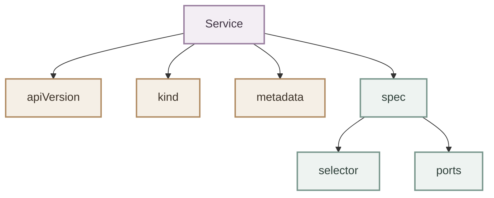

---

## 2. `apiVersion`

```yaml id="v6b7tb"
apiVersion: v1
```

الـ Service من الـ Kubernetes core API، لذلك بيستخدم:

```text
v1
```

مش:

```text
apps/v1
```

زي Deployment.

يعني:

```yaml
apiVersion: v1
kind: Service
```

---

## 3. `kind`

```yaml id="qf3jhf"
kind: Service
```

ده بيقول لـ Kubernetes:

> الـ object اللي أنا بعمله ده من نوع Service.

---

## 4. `metadata`

مثال:

```yaml id="kq9j7s"
metadata:
  name: nginx-service
  labels:
    app: nginx
```

أهم حاجة هنا:

```yaml
name: nginx-service
```

وده اسم الـ Service اللي هنستخدمه بعد كده.

مثلاً:

```bash
kubectl get svc nginx-service
```

والـ name بيشارك كمان في الـ DNS name الخاص بالـ Service.

---

## 5. `spec`

الـ `spec` هو الجزء اللي بنحدد فيه:

> Service المفروض يعمل إيه؟

مثلاً:

```yaml id="6as8hw"
spec:
  selector:
    app: nginx

  ports:
    - port: 80
      targetPort: 80
```

أهم أجزاء الـ Service configuration:

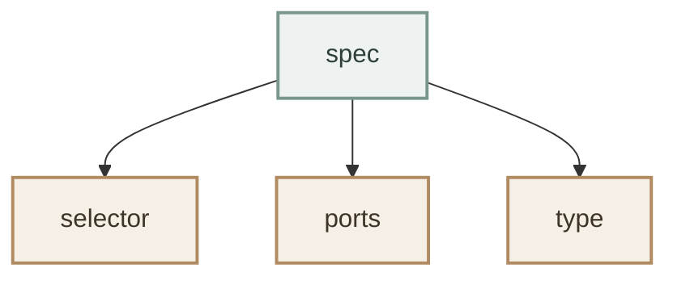

---

## 6. `selector`

الـ selector هو اللي بيربط الـ Service بالـ Pods.

مثال:

```yaml id="u0k8y5"
selector:
  app: nginx
```

معناه:

> اختار الـ Pods اللي عندها `app=nginx`.

لو عندنا:

```yaml id="xknc3u"
metadata:
  labels:
    app: nginx
```

فالـ Pod matching.

---

### I. Selector Matching

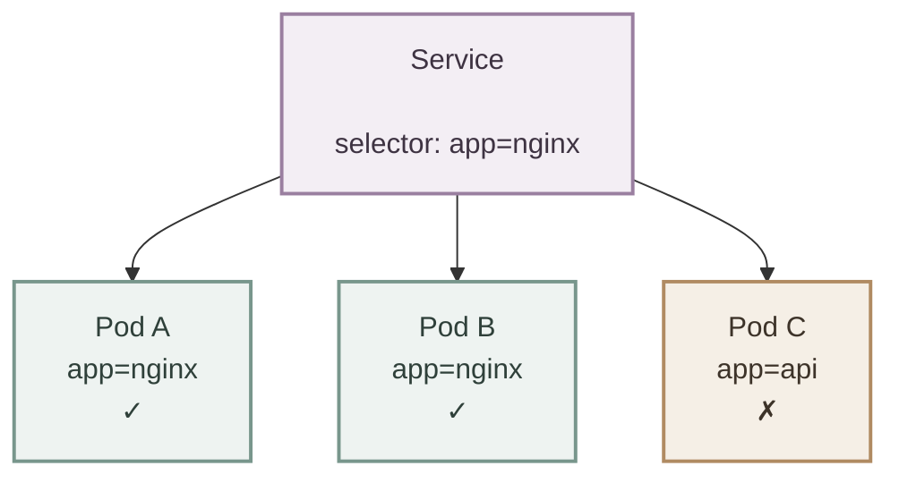

فالـ Service هيخدم:

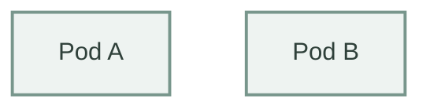

ومش هيخدم:

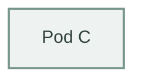

---

## 7. `ports`

الـ `ports` section بيحدد الـ ports اللي الـ Service بيقدمها.

مثال:

```yaml id="1c9d4w"
ports:
  - port: 80
    targetPort: 80
```

لاحظ إن `ports` عبارة عن **list**.

يعني ممكن Service واحد يعرّف أكتر من port:

```yaml id="o6v5cz"
ports:
  - name: http
    port: 80
    targetPort: 8080

  - name: https
    port: 443
    targetPort: 8443
```

---

## 8. `port`

```yaml id="ax1rj2"
port: 80
```

ده الـ port اللي الـ **Service itself** بيستقبل عليه traffic.

يعني:

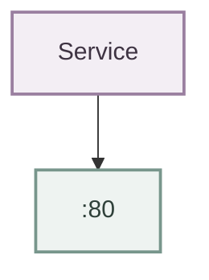

لو عندك:

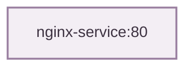

فالـ `80` هنا هو:

```yaml
port: 80
```

---

## 9. `targetPort`

```yaml id="3i7wph"
targetPort: 80
```

ده الـ port اللي الـ Service هيوجه له traffic على الـ backend Pod.

يعني:

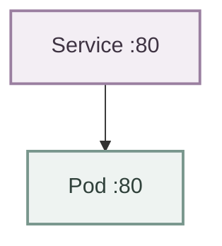

لكن مش لازم يكون نفس الرقم.

مثلاً:

```yaml id="0n8a6k"
ports:
  - port: 8080
    targetPort: 80
```

يبقى:

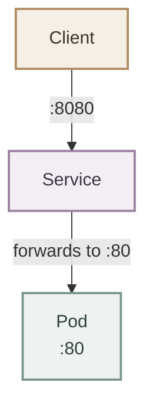

وده مهم جدًا.

---

## 10. `port` vs `targetPort`

دي من أهم النقاط في Service configuration.

| Field | Meaning |
|---|---|
| `port` | Port exposed by the Service |
| `targetPort` | Port on the backend Pod |

مثال:

```yaml id="5ub5yy"
ports:
  - port: 8080
    targetPort: 80
```

معناه:

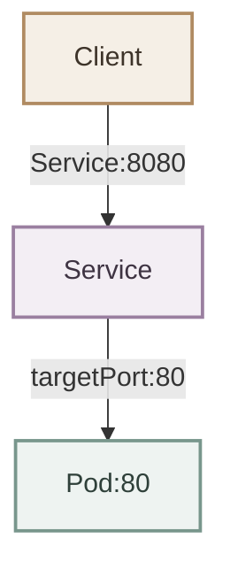

---

## 11. `targetPort` Does Not Mean Container Port

هنا لازم ناخد بالنا من نقطة مهمة.

ممكن يكون عندك في الـ Pod:

```yaml id="x8fh3s"
containers:
  - name: nginx
    image: nginx:alpine
    ports:
      - containerPort: 80
```

والـ Service:

```yaml id="8ox7qt"
ports:
  - port: 8080
    targetPort: 80
```

الـ Service بيستهدف:

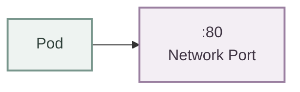

والـ `containerPort` field نفسه مش هو اللي بيعمل networking.

يعني:

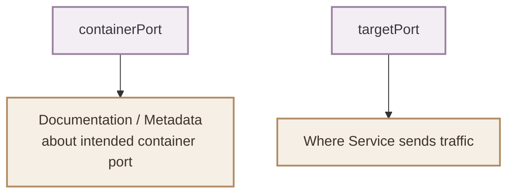

دي نقطة مهمة عشان ما نخلطش الاتنين.

---

## 12. Named `targetPort`

ممكن بدل ما تستخدم رقم، تستخدم named port.

مثلاً في الـ Pod:

```yaml id="i0zv9e"
containers:
  - name: backend
    image: my-backend:1.0
    ports:
      - name: http
        containerPort: 8080
```

وفي الـ Service:

```yaml id="q8cbt6"
ports:
  - port: 80
    targetPort: http
```

هنا:

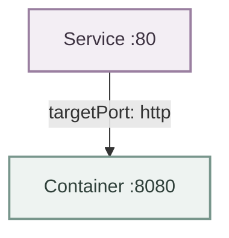

الميزة هنا إن الـ Service بيستخدم اسم الـ port بدل الرقم مباشرة.

---

## 13. `protocol`

الـ Service port configuration ممكن تحدد:

```yaml id="4r6t7a"
protocol: TCP
```

الـ default protocol هو:

```text
TCP
```

مثال:

```yaml id="7krm0u"
ports:
  - port: 80
    targetPort: 80
    protocol: TCP
```

وفي حالات معينة ممكن تستخدم:

```yaml
protocol: UDP
```

أو:

```yaml
protocol: SCTP
```

لكن في أغلب الـ HTTP/HTTPS applications اللي هنشتغل عليها، هتتعامل غالبًا مع:

```text
TCP
```

---

## 14. `name`

لو عندك أكثر من port، الأفضل تسمي الـ ports.

مثلاً:

```yaml id="x6m3j7"
ports:
  - name: http
    port: 80
    targetPort: 8080

  - name: https
    port: 443
    targetPort: 8443
```

الـ names بتساعد في تعريف الـ ports وتمييزها.

مثلاً:

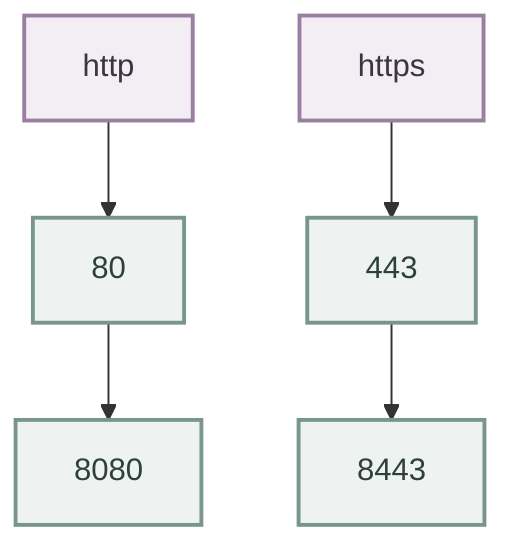

---

## 15. `type`

الـ Service عنده أنواع مختلفة حسب طريقة الـ exposure المطلوبة.

أهم الأنواع:

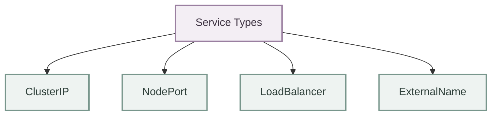

الـ default هو:

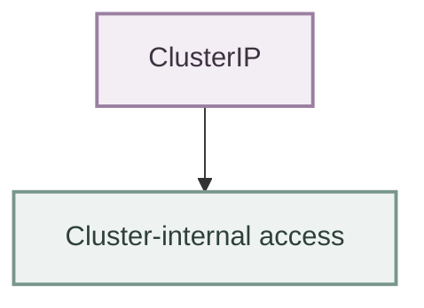

---

## 16. `ClusterIP`

ده الـ default Service type.

مثال:

```yaml id="ax7xdp"
apiVersion: v1
kind: Service

metadata:
  name: nginx-service

spec:
  type: ClusterIP

  selector:
    app: nginx

  ports:
    - port: 80
      targetPort: 80
```

وممكن أصلًا تشيل:

```yaml
type: ClusterIP
```

لأنها default.

---

### I.ClusterIP Architecture

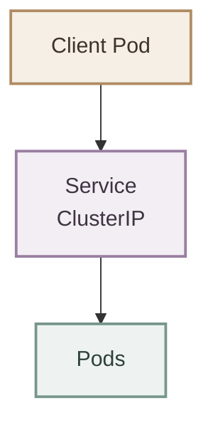

الـ Service بيكون accessible داخل الـ cluster.

---

## 17. `clusterIP`

ممكن تشوف:

```bash id="zpkf6m"
kubectl get svc
```

مثلاً:

```text
NAME            TYPE        CLUSTER-IP
nginx-service   ClusterIP   10.96.17.249
```

الـ:

```text
10.96.17.249
```

هو الـ ClusterIP.

في العادة Kubernetes بيختار الـ ClusterIP تلقائيًا.

---

## 18. `NodePort`

لو عايز Service يكون accessible من خلال الـ Nodes، تستخدم:

```yaml id="s1k6o0"
type: NodePort
```

مثال:

```yaml id="t7c4dq"
apiVersion: v1
kind: Service

metadata:
  name: nginx-nodeport

spec:
  type: NodePort

  selector:
    app: nginx

  ports:
    - port: 80
      targetPort: 80
      nodePort: 30080
```

الـ flow:

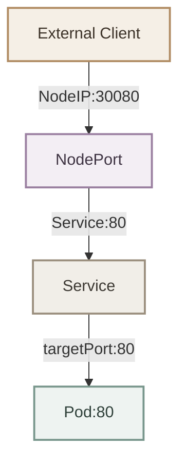

---

## 19. `nodePort`

الـ `nodePort` هو port على الـ Node.

مثلاً:

```yaml id="9r3n4e"
nodePort: 30080
```

فالـ external client يقدر يستخدم:

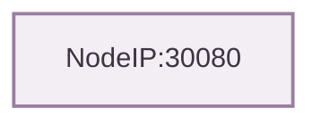

---

### I. NodePort Range

Kubernetes عادةً بيستخدم default range:

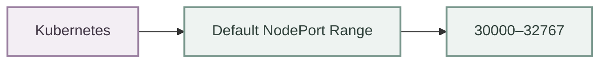

لـ NodePort values.

مثال:

```mermaid
flowchart LR
    P["30080"] --> V["✓ Valid NodePort"]

    classDef port fill:#eef3f1,stroke:#78968c,stroke-width:2px,color:#2f403a;
    classDef valid fill:#f3eef4,stroke:#9a7fa0,stroke-width:2px,color:#3e3342;

    class P port;
    class V valid;
```

لكن:

```mermaid
flowchart LR
    P["8080"]

    classDef port fill:#eef3f1,stroke:#78968c,stroke-width:2px,color:#2f403a;

    class P port;
```

مش NodePort عادي ضمن الـ default range.

---

## 20. `LoadBalancer`

النوع الثالث المهم:

```yaml id="a4m7jp"
type: LoadBalancer
```

مثال:

```yaml id="z1c8c0"
apiVersion: v1
kind: Service

metadata:
  name: nginx-loadbalancer

spec:
  type: LoadBalancer

  selector:
    app: nginx

  ports:
    - port: 80
      targetPort: 80
```

في cloud environment، Kubernetes/cloud integration ممكن توفر external Load Balancer.

الصورة:

```mermaid
flowchart TB
    I["Internet"] --> L["External Load Balancer"]
    L --> S["Service"]
    S --> P["Pods"]

    classDef external fill:#f5efe6,stroke:#b08b62,stroke-width:2px,color:#3d3329;
    classDef lb fill:#f3eef4,stroke:#9a7fa0,stroke-width:2px,color:#3e3342;
    classDef service fill:#f1eee8,stroke:#9b8f7e,stroke-width:2px,color:#3d3933;
    classDef pod fill:#eef3f1,stroke:#78968c,stroke-width:2px,color:#2f403a;

    class I external;
    class L lb;
    class S service;
    class P pod;
```

---

## 21. Service Type Comparison

| Type | Main Purpose |
|---|---|
| `ClusterIP` | Internal cluster access |
| `NodePort` | Expose through Node port |
| `LoadBalancer` | External load balancer |
| `ExternalName` | DNS alias to an external service |

الأنواع اللي لازم تكون automatic عندك حاليًا:

```mermaid
flowchart TB
    S["Service Types"] --> C["ClusterIP"]
    S --> N["NodePort"]
    S --> L["LoadBalancer"]

    classDef service fill:#f3eef4,stroke:#9a7fa0,stroke-width:2px,color:#3e3342;
    classDef type fill:#eef3f1,stroke:#78968c,stroke-width:2px,color:#2f403a;

    class S service;
    class C,N,L type;
```

---

## 22. Complete ClusterIP Example

ده Service configuration بسيط وصحيح:

```yaml id="qg2v2c"
apiVersion: v1
kind: Service

metadata:
  name: nginx-service

spec:
  type: ClusterIP

  selector:
    app: nginx

  ports:
    - name: http
      protocol: TCP
      port: 80
      targetPort: 80
```

الـ flow:

```mermaid
flowchart TB
    C["Client"] -->|":80"| S["nginx-service"]
    S -->|"selector: app=nginx"| P["Pod :80"]

    classDef client fill:#f5efe6,stroke:#b08b62,stroke-width:2px,color:#3d3329;
    classDef service fill:#f3eef4,stroke:#9a7fa0,stroke-width:2px,color:#3e3342;
    classDef pod fill:#eef3f1,stroke:#78968c,stroke-width:2px,color:#2f403a;

    class C client;
    class S service;
    class P pod;
```

---

## 23. Different `port` and `targetPort`

مثال عملي أكثر:

```yaml id="n8qq74"
apiVersion: v1
kind: Service

metadata:
  name: backend-service

spec:
  selector:
    app: backend

  ports:
    - name: http
      port: 8080
      targetPort: 3000
```

هنا:

```mermaid
flowchart TB
    C["Client"] -->|"backend-service:8080"| S["Service"]
    S -->|"targetPort:3000"| P["Backend Pod<br/>:3000"]

    classDef client fill:#f5efe6,stroke:#b08b62,stroke-width:2px,color:#3d3329;
    classDef service fill:#f3eef4,stroke:#9a7fa0,stroke-width:2px,color:#3e3342;
    classDef pod fill:#eef3f1,stroke:#78968c,stroke-width:2px,color:#2f403a;

    class C client;
    class S service;
    class P pod;
```

يعني:

```mermaid
flowchart LR
    S["Service Port<br/>8080"] --> P["Pod Port<br/>3000"]

    classDef service fill:#f3eef4,stroke:#9a7fa0,stroke-width:2px,color:#3e3342;
    classDef pod fill:#eef3f1,stroke:#78968c,stroke-width:2px,color:#2f403a;

    class S service;
    class P pod;
```

---

## 24. Multiple Ports

Service ممكن expose أكثر من port.

مثال:

```yaml id="f2t3zq"
apiVersion: v1
kind: Service

metadata:
  name: backend-service

spec:
  selector:
    app: backend

  ports:
    - name: http
      port: 80
      targetPort: 8080

    - name: metrics
      port: 9090
      targetPort: 9090
```

الصورة:

```mermaid
 flowchart TB
    S["Service"]

    S -->|"80"| H["Pod:8080<br/>HTTP"]
    S -->|"9090"| M["Pod:9090<br/>Metrics"]

    classDef service fill:#f3eef4,stroke:#9a7fa0,stroke-width:2px,color:#3e3342;
    classDef pod fill:#eef3f1,stroke:#78968c,stroke-width:2px,color:#2f403a;

    class S service;
    class H,M pod;
```

---

## 25. Service Port Mapping

```mermaid id="d5a6xy"
flowchart LR
    Client[Client]

    Service[Service<br/>backend-service]

    ServicePort[Service Port<br/>8080]

    TargetPort[Target Port<br/>3000]

    Pod[Backend Pod<br/>Port 3000]

    Client --> Service
    Service --> ServicePort
    ServicePort --> TargetPort
    TargetPort --> Pod
```

## 27. Service Configuration Flow

لما نكتب Service YAML، نفكر بالشكل ده:

```mermaid
flowchart TB
    S["Service Configuration"]

    S --> W["Who am I?"]
    W --> W1["metadata.name"]

    S --> P["Which Pods?"]
    P --> P1["selector"]

    S --> SP["Which Service ports?"]
    SP --> SP1["port"]

    S --> T["Where should traffic go?"]
    T --> T1["targetPort"]

    S --> E["How should it be exposed?"]
    E --> E1["type"]

    classDef root fill:#f3eef4,stroke:#9a7fa0,stroke-width:2px,color:#3e3342;
    classDef question fill:#f5efe6,stroke:#b08b62,stroke-width:2px,color:#3d3329;
    classDef config fill:#eef3f1,stroke:#78968c,stroke-width:2px,color:#2f403a;

    class S root;
    class W,P,SP,T,E question;
    class W1,P1,SP1,T1,E1 config;

```

دي طريقة تفكير أحسن من حفظ الـ YAML.

---

## 28. Common Configuration Mistakes

### I. Wrong Selector

Service:

```yaml id="7g6l3p"
selector:
  app: backend
```

Pods:

```yaml id="9p7jvx"
labels:
  app: nginx
```

النتيجة:

```mermaid
flowchart LR
    P["No matching Pods"]

    classDef warning fill:#f5efe6,stroke:#b08b62,stroke-width:2px,color:#3d3329;

    class P warning;
```

---

### II. Wrong `targetPort`

Pod application بتسمع على:

```text
8080
```

لكن Service:

```yaml id="2h7o0y"
targetPort: 80
```

فالـ Service بيحاول يوصل:

```text
Pod:80
```

بينما التطبيق على:

```text
Pod:8080
```

يبقى traffic هيفشل.

---

### III. Confusing `port` with `targetPort`

```yaml
port: 8080
targetPort: 3000
```

مش معناها إن التطبيق لازم يسمع على `8080`.

معناها:

```mermaid
flowchart LR
    S["Service → 8080"]
    P["Pod → 3000"]

    classDef service fill:#f3eef4,stroke:#9a7fa0,stroke-width:2px,color:#3e3342;
    classDef pod fill:#eef3f1,stroke:#78968c,stroke-width:2px,color:#2f403a;

    class S service;
    class P pod;
```

---

### IV. Wrong `nodePort`

مثلاً:

```yaml
nodePort: 8080
```

مع default NodePort range، ده invalid.

استخدم port مناسب ضمن الـ configured range.

---

## 29. Configuration Mental Model

قبل ما نكتب أي Service، نسأل نفسنا 4 أسئلة:

### I. Which Pods?

```yaml
selector:
  app: nginx
```

### II. Which Service port?

```yaml
port: 80
```

### III. Which Pod port?

```yaml
targetPort: 80
```

### IV. How should the Service be exposed?

```yaml
type: ClusterIP
```

أو:

```yaml
type: NodePort
```

أو:

```yaml
type: LoadBalancer
```

---

## 30. Final Service Configuration Example

مثال كامل يجمع الأساسيات:

```yaml id="9x7qf4"
apiVersion: v1
kind: Service

metadata:
  name: nginx-service
  labels:
    app: nginx

spec:
  type: ClusterIP

  selector:
    app: nginx

  ports:
    - name: http
      protocol: TCP
      port: 80
      targetPort: 80
```

نقدر نقراه كده:

```mermaid
flowchart TB
    S["Service"]

    S --> N["Name"]
    N --> N1["nginx-service"]

    S --> T["Type"]
    T --> T1["ClusterIP"]

    S --> SEL["Selector"]
    SEL --> SEL1["app=nginx"]

    S --> PM["Port Mapping"]
    PM --> P["Service Port = 80"]
    PM --> TP["Target Port = 80"]
    PM --> PR["Protocol = TCP"]

    classDef root fill:#f3eef4,stroke:#9a7fa0,stroke-width:2px,color:#3e3342;
    classDef section fill:#f5efe6,stroke:#b08b62,stroke-width:2px,color:#3d3329;
    classDef value fill:#eef3f1,stroke:#78968c,stroke-width:2px,color:#2f403a;

    class S root;
    class N,T,SEL,PM section;
    class N1,T1,SEL1,P,TP,PR value;
```

---

## 31. Key Takeaways

- `apiVersion: v1` لأن Service من Kubernetes Core API.
- `kind: Service` يحدد نوع الـ object.
- `metadata.name` هو اسم الـ Service.
- `selector` يحدد الـ Pods اللي الـ Service هيتعامل معاها.
- الـ selector يعتمد على **Labels**.
- `port` هو الـ port الخاص بالـ Service.
- `targetPort` هو الـ port اللي traffic هيتوجه له على الـ backend.
- `port` و `targetPort` ممكن يكونوا مختلفين.
- `protocol` غالبًا `TCP` في تطبيقات HTTP.
- `name` بيساعد في تسمية وتمييز الـ Service ports، خصوصًا مع multiple ports.
- `ClusterIP` هو الـ default Service type.
- `NodePort` بيتيح الوصول من خلال Node port.
- `LoadBalancer` يستخدم external load-balancing integration، خصوصًا في cloud environments.
- `nodePort` عادةً بيكون ضمن `30000-32767` في الـ default configuration.
- `containerPort` و `targetPort` مش نفس الحاجة.
- أهم 4 أسئلة في أي Service configuration:

```mermaid
flowchart TB
    A["Which Pods?"] --> A1["selector"]
    B["Which Service port?"] --> B1["port"]
    C["Which Pod port?"] --> C1["targetPort"]
    D["How exposed?"] --> D1["type"]

    classDef question fill:#f5efe6,stroke:#b08b62,stroke-width:2px,color:#3d3329;
    classDef config fill:#eef3f1,stroke:#78968c,stroke-width:2px,color:#2f403a;

    class A,B,C,D question;
    class A1,B1,C1,D1 config;
```

---

## 32. Final Mental Model

```mermaid id="c2k9wr"
flowchart LR
    Client[Client]

    Service[Service]

    Selector[Selector<br/>app=nginx]

    Port[Service Port<br/>80]

    Target[Target Port<br/>80]

    PodA[Pod A]
    PodB[Pod B]
    PodC[Pod C]

    Client --> Service
    Service --> Selector
    Selector --> Port
    Port --> Target

    Target --> PodA
    Target --> PodB
    Target --> PodC
```

> **Service Configuration = Select the right Pods + expose the right Service port + map traffic to the right target port + choose the appropriate Service type.**