> **A Service provides a stable network endpoint for accessing a group of Pods.**

---

## 1. What is a Service?

في Kubernetes، الـ **Service** هو Kubernetes object بيعمل abstraction فوق مجموعة من الـ Pods، وبيوفرلها **stable network endpoint** تقدر التطبيقات تستخدمه للوصول للـ Pods بدون ما تحتاج تعرف الـ Pod IPs بشكل مباشر.

المشكلة الأساسية إن الـ Pods مش stable.

يعني ممكن يكون عندنا:

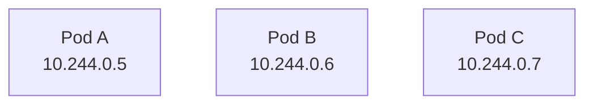

وبعدين Pod تموت ويتعمل replacement:

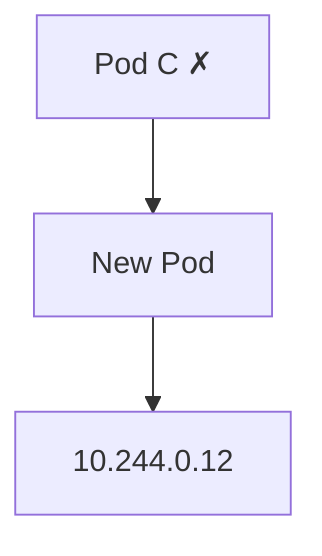

فالـ IP بتاع الـ Pod اتغير.

لو Application كان بيتصل مباشرة بـ:

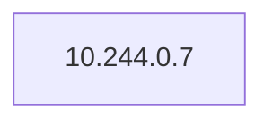

الاتصال هيبوظ بعد ما الـ Pod القديمة تختفي.

هنا بييجي دور الـ Service.

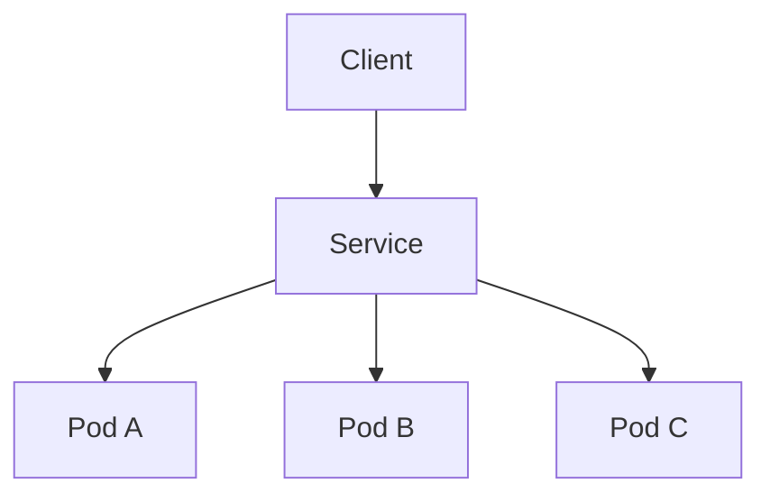

الـ Client بيتعامل مع الـ Service بدل ما يتعامل مباشرة مع Pod معينة.

---

## 2. Why Do We Need Services?

خلينا نبدأ من المشكلة نفسها.

عندنا Deployment عليه 3 Pods:

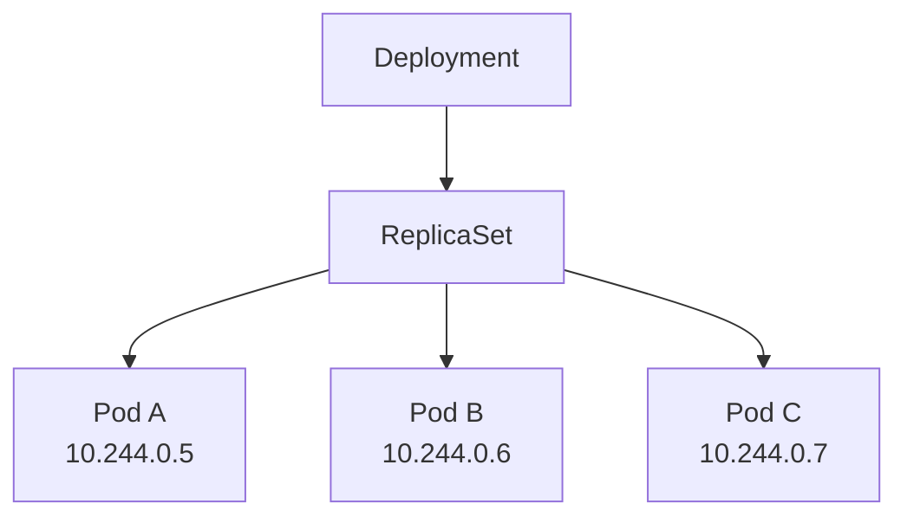

لو عندنا Frontend محتاج يكلم الـ Backend، ممكن نظريًا نخليه يتصل بـ Pod IP.

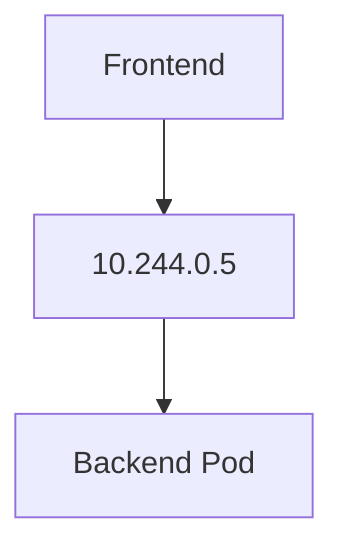

لكن ده تصميم fragile.

ليه؟

لأن Pod IP مش permanent.

لو الـ Pod اتعملها restart/replacement:

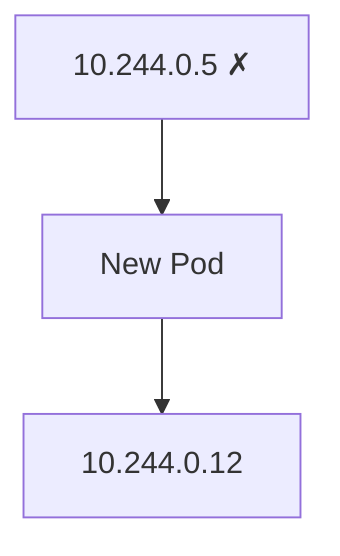

الـ Frontend لسه بيحاول يكلم:

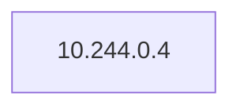

وده بقى عنوان مش موجود.

---

## 3. The Service Abstraction

الـ Service بيحط abstraction layer بين الـ Client والـ Pods.

بدل:

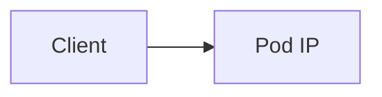

يبقى:

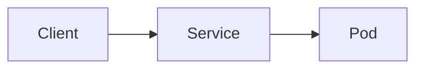

مثال:

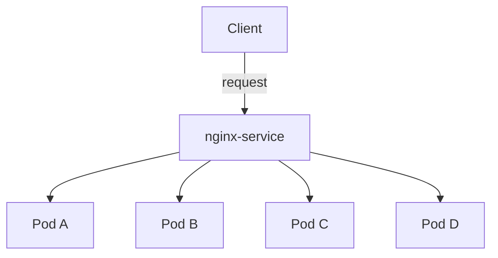

الـ Client مش محتاج يعرف:

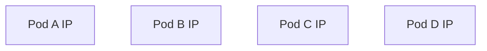

هو محتاج يعرف الـ Service بس.

---

## 4. Pod IP vs Service IP

دي من أهم الحاجات اللي لازم تبقى واضحة.

### I. Pod IP

كل Pod بتحصل على IP خاص بيها.

مثال:

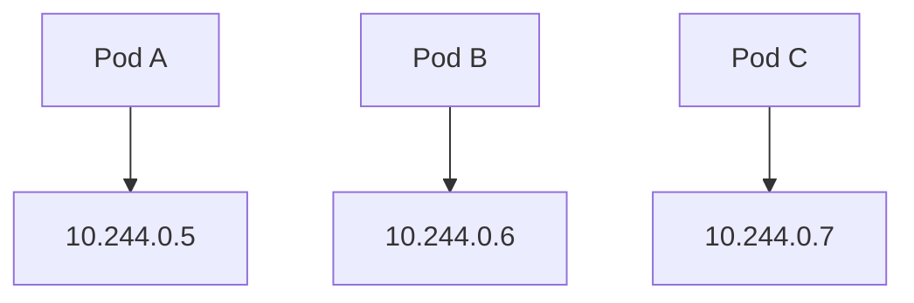

لكن الـ IP ده **ephemeral**.

يعني ممكن يتغير لما الـ Pod تتبدل.

---

### II. Service IP

الـ Service عنده network identity مستقرة داخل الـ cluster.

مثلاً:

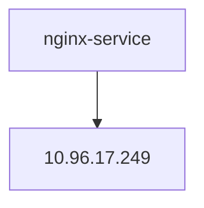

حتى لو الـ Pods نفسها اتغيرت:

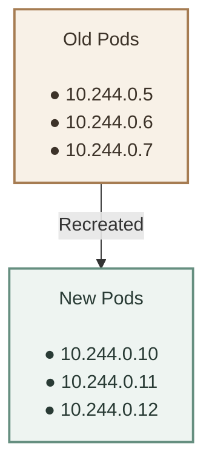

الـ Client لسه بيتعامل مع:

```text
nginx-service
```

مش مع الـ Pod IPs.

---

## 5. Service and Pod Relationship

الـ Service مش بيعمل Pods.

ودي نقطة مهمة.

العلاقة عندنا:

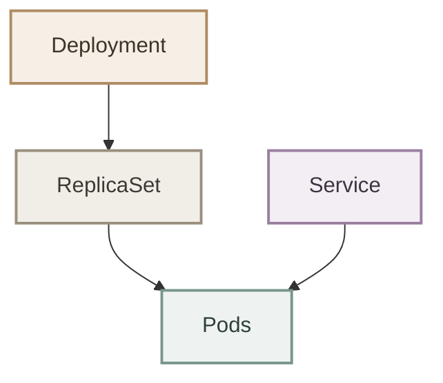

أو بشكل أوضح:

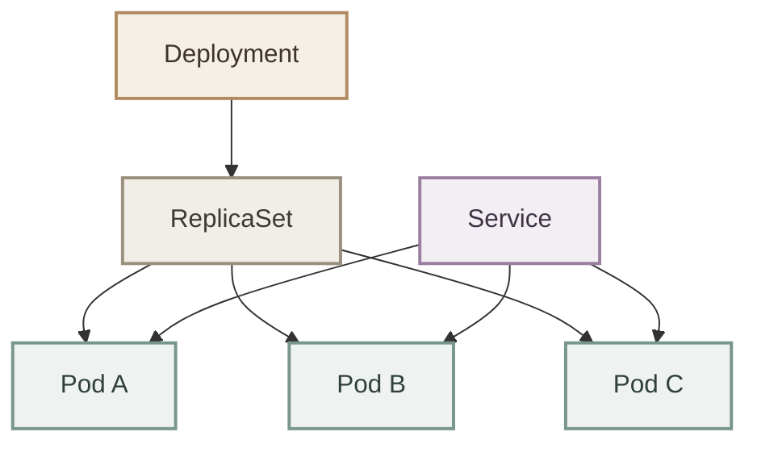

الـ Service وظيفته إنه يوفر **network access** للـ Pods.

لكن:

- Deployment يدير rollout والـ Pods.
- ReplicaSet يحافظ على عدد الـ Pods.
- Service يوفر network endpoint للوصول للـ Pods.

---

## 6. How Does a Service Find Pods?

هنا ندخل على مفهوم مهم جدًا:

### I. Selector

الـ Service محتاج يعرف:

> "أوصل الـ traffic لأنهي Pods؟"

مش بيستخدم أسماء الـ Pods.

يعني مش:

```text
pod-name = nginx-7d8f9
```

لأن أسماء الـ Pods ممكن تتغير.

بدل كده بيستخدم **Labels**.

مثلاً Pods عندها:

```yaml
labels:
  app: nginx
```

والـ Service عنده:

```yaml
selector:
  app: nginx
```

فتبقى العلاقة:

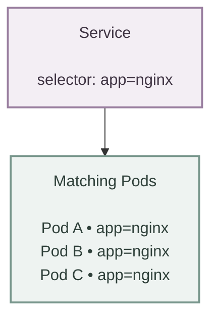

أي Pod عندها:

```text
app=nginx
```

تقدر تدخل في مجموعة الـ Pods اللي الـ Service بيخدمها.

---

## 7. Labels and Selectors

الـ **Label** هو metadata بنحطها على Kubernetes objects عشان نصنفها ونقدر نعمل selection عليها.

مثال:

```yaml
metadata:
  labels:
    app: nginx
    environment: production
```

الـ Service ممكن يستخدم:

```yaml
selector:
  app: nginx
```

معناه:

> هاتلي كل الـ Pods اللي عندها `app=nginx`.

---

### I. Example

عندنا:

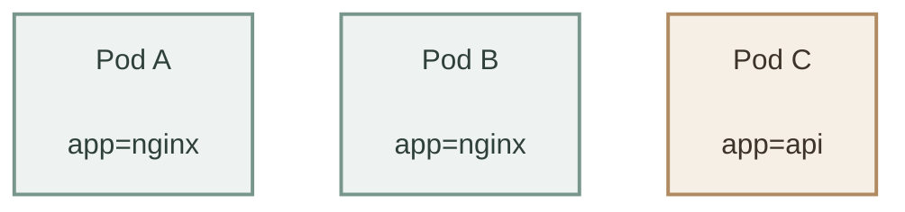

والـ Service:

```text
selector:
app=nginx
```

النتيجة:

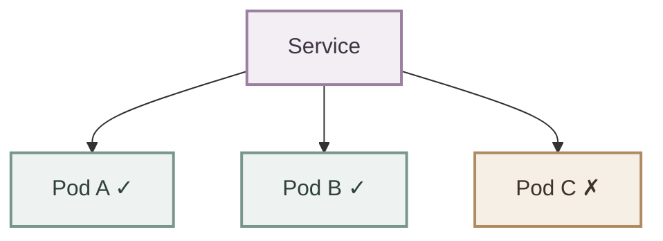

الـ Service مش مهتم باسم Pod.

هو مهتم بالـ **label matching**.

---

## 8. Service Does Not Target Pod Names

دي غلطة شائعة جدًا.

لو عندك:

```mermaid
flowchart TB
    A["nginx-67dc647948-abc12"]
    B["nginx-67dc647948-def34"]
    C["nginx-67dc647948-xyz56"]

    classDef pod fill:#eef3f1,stroke:#78968c,stroke-width:2px,color:#2f403a;

    class A,B,C pod;
```

متعملش Service مبني على أسماء الـ Pods.

لأن الـ Pod names ممكن تتغير.

الـ Service يستخدم:

```mermaid
flowchart TB
    L["Labels"] --> S["Selector"] --> P["Matching Pods"]

    classDef label fill:#f5efe6,stroke:#b08b62,stroke-width:2px,color:#3d3329;
    classDef selector fill:#f3eef4,stroke:#9a7fa0,stroke-width:2px,color:#3e3342;
    classDef pods fill:#eef3f1,stroke:#78968c,stroke-width:2px,color:#2f403a;

    class L label;
    class S selector;
    class P pods;

```

وده يخلي الـ Service dynamic.

---

## 9. Dynamic Pod Membership

دي من أقوى أفكار الـ Service.

افترض:

```text
Service
selector:
app=nginx
```

والـ Pods:

```mermaid
flowchart TB
    A["Pod A<br/><br/>app=nginx ✓"]
    B["Pod B<br/><br/>app=nginx ✓"]
    C["Pod C<br/><br/>app=nginx ✓"]

    classDef pod fill:#eef3f1,stroke:#78968c,stroke-width:2px,color:#2f403a;

    class A,B,C pod;

```

يبقى:

```mermaid
flowchart TB
    S["Service"]

    S --> A["Pod A"]
    S --> B["Pod B"]
    S --> C["Pod C"]

    classDef service fill:#f3eef4,stroke:#9a7fa0,stroke-width:2px,color:#3e3342;
    classDef pod fill:#eef3f1,stroke:#78968c,stroke-width:2px,color:#2f403a;

    class S service;
    class A,B,C pod;
```

دلوقتي Pod B ماتت:

```mermaid
flowchart TB
    B["Pod B ✗"]

    classDef failed fill:#f5efe6,stroke:#b08b62,stroke-width:2px,color:#3d3329;

    class B failed;
```

فالـ Service ماينفعش يفضل يحاول يبعتلها traffic.

لما Kubernetes يحدث الـ endpoint information:

```mermaid
flowchart TB
    S["Service"]

    S --> A["Pod A"]
    S --> C["Pod C"]

    classDef service fill:#f3eef4,stroke:#9a7fa0,stroke-width:2px,color:#3e3342;
    classDef pod fill:#eef3f1,stroke:#78968c,stroke-width:2px,color:#2f403a;

    class S service;
    class A,C pod;

```

ولو الـ ReplicaSet عملت replacement:

```mermaid
flowchart TB
    D["New Pod D<br/><br/>app=nginx"]

    classDef pod fill:#eef3f1,stroke:#78968c,stroke-width:2px,color:#2f403a;

    class D pod;
```

تدخل تلقائيًا في مجموعة الـ Service:

```mermaid
flowchart TB
    S["Service"]

    S --> A["Pod A"]
    S --> C["Pod C"]
    S --> D["Pod D"]

    classDef service fill:#f3eef4,stroke:#9a7fa0,stroke-width:2px,color:#3e3342;
    classDef pod fill:#eef3f1,stroke:#78968c,stroke-width:2px,color:#2f403a;

    class S service;
    class A,C,D pod;

```

يعني الـ Service مش محتاج كل مرة تقول له:

> "يا Service خد الـ Pod الجديدة دي."

الـ label/selector relationship هي اللي بتخلي الموضوع dynamic.

---

## 10. Service Traffic Flow

خلينا نجمع الكلام كله في flow واحد.

عندنا Client Pod عايز يكلم nginx-service
```mermaid
flowchart LR
    C["Client Pod"] --> S["nginx-service"]

    classDef client fill:#f5efe6,stroke:#b08b62,stroke-width:2px,color:#3d3329;
    classDef service fill:#f3eef4,stroke:#9a7fa0,stroke-width:2px,color:#3e3342;

    class C client;
    class S service;
```
الـ request بيمشي في الصورة العامة دي:

```mermaid

flowchart TB
    C["Client"] -->|"request"| S["Service"]
    S -->|"selector"| P["Matching Pods"]

    P --> A["Pod A"]
    P --> B["Pod B"]
    P --> C2["Pod C"]
    P --> D["Pod D"]

    classDef client fill:#f5efe6,stroke:#b08b62,stroke-width:2px,color:#3d3329;
    classDef service fill:#f3eef4,stroke:#9a7fa0,stroke-width:2px,color:#3e3342;
    classDef pods fill:#eef3f1,stroke:#78968c,stroke-width:2px,color:#2f403a;

    class C client;
    class S service;
    class P,A,B,C2,D pods;

```

والـ Service عنده مجموعة من الـ backend endpoints اللي تمثل الـ Pods المناسبة.

---

## 11. Service as a Stable Endpoint

خلينا نقارن الوضعين.

### I. Without Service

```mermaid
flowchart TB
    F["Frontend"] --> IP["10.244.0.5"] --> P["Pod"]

    classDef frontend fill:#f5efe6,stroke:#b08b62,stroke-width:2px,color:#3d3329;
    classDef ip fill:#f3eef4,stroke:#9a7fa0,stroke-width:2px,color:#3e3342;
    classDef pod fill:#eef3f1,stroke:#78968c,stroke-width:2px,color:#2f403a;

    class F frontend;
    class IP ip;
    class P pod;
```

لو الـ Pod ماتت:

```mermaid
flowchart TB
    IP["10.244.0.5 ✗"]

    classDef failed fill:#f5efe6,stroke:#b08b62,stroke-width:2px,color:#3d3329;

    class IP failed;
```

الـ Frontend محتاج يعرف الـ IP الجديدة.

---

### II. With Service

```mermaid
flowchart TB
    F["Frontend"] --> S["nginx-service"] --> P["Pod"]

    classDef frontend fill:#f5efe6,stroke:#b08b62,stroke-width:2px,color:#3d3329;
    classDef service fill:#f3eef4,stroke:#9a7fa0,stroke-width:2px,color:#3e3342;
    classDef pod fill:#eef3f1,stroke:#78968c,stroke-width:2px,color:#2f403a;

    class F frontend;
    class S service;
    class P pod;
```

لو الـ Pod ماتت:

```mermaid
flowchart TB
    S["nginx-service"] --> P["New Pod"]

    classDef service fill:#f3eef4,stroke:#9a7fa0,stroke-width:2px,color:#3e3342;
    classDef pod fill:#eef3f1,stroke:#78968c,stroke-width:2px,color:#2f403a;

    class S service;
    class P pod;
```

الـ Frontend مش محتاج يعرف الـ Pod الجديدة.

وده هو الـ abstraction اللي إحنا بندور عليه.

---

## 12. Service Does Not Create Stability for Pods

لازم نفرق بين:

**-  Pod stability**  
**- Service stability**

الـ Service مش بيخلي الـ Pod نفسها stable.

يعني:

```mermaid
flowchart TB
    P["Pod IP"] --> IP["10.244.0.5"]

    classDef pod fill:#f5efe6,stroke:#b08b62,stroke-width:2px,color:#3d3329;
    classDef ip fill:#eef3f1,stroke:#78968c,stroke-width:2px,color:#2f403a;

    class P pod;
    class IP ip;
```

لسه ممكن تتغير.

اللي Service بيعمله هو إنه يخليك **مش محتاج تعتمد على Pod IP أصلاً**.

```mermaid
flowchart LR
    P["Pod IP"] --> E["Ephemeral"]
    S["Service Endpoint"] --> A["Stable Abstraction"]

    classDef pod fill:#f5efe6,stroke:#b08b62,stroke-width:2px,color:#3d3329;
    classDef service fill:#eef3f1,stroke:#78968c,stroke-width:2px,color:#2f403a;
    classDef property fill:#f3eef4,stroke:#9a7fa0,stroke-width:2px,color:#3e3342;

    class P pod;
    class S service;
    class E,A property;
```

---

## 13. One Service, Multiple Pods

الـ Service مش لازم يخدم Pod واحدة.

وده أساس استخدامه مع:

- Deployments
- ReplicaSets
- Microservices
- Scaled applications

مثلاً:

```mermaid
flowchart TB
    S["Service"]

    S --> A["Pod A"]
    S --> B["Pod B"]
    S --> C["Pod C"]

    classDef service fill:#f3eef4,stroke:#9a7fa0,stroke-width:2px,color:#3e3342;
    classDef pod fill:#eef3f1,stroke:#78968c,stroke-width:2px,color:#2f403a;

    class S service;
    class A,B,C pod;
```

لو عندك:

```yaml
replicas: 3
```

فالـ Service ممكن يوفر access لمجموعة الـ 3 Pods طالما matching للـ selector.

---

## 14. Service and Scaling

دي نقطة مهمة مع الـ Deployment.

افترض:

```mermaid
flowchart TB
    D["Deployment<br/><br/>replicas: 3"]

    classDef deployment fill:#f5efe6,stroke:#b08b62,stroke-width:2px,color:#3d3329;

    class D deployment;
```

عندك:

```mermaid
flowchart TB
    S["Service"]

    S --> A["Pod A"]
    S --> B["Pod B"]
    S --> C["Pod C"]

    classDef service fill:#f3eef4,stroke:#9a7fa0,stroke-width:2px,color:#3e3342;
    classDef pod fill:#eef3f1,stroke:#78968c,stroke-width:2px,color:#2f403a;

    class S service;
    class A,B,C pod;

```

عملنا scale:

```bash
kubectl scale deployment nginx-deployment --replicas=5
```

دلوقتي بقى:

```mermaid
flowchart TB
    S["Service"]

    S --> A["Pod A"]
    S --> B["Pod B"]
    S --> C["Pod C"]
    S --> D["Pod D"]
    S --> E["Pod E"]

    classDef service fill:#f3eef4,stroke:#9a7fa0,stroke-width:2px,color:#3e3342;
    classDef pod fill:#eef3f1,stroke:#78968c,stroke-width:2px,color:#2f403a;

    class S service;
    class A,B,C,D,E pod;
```

طالما الـ Pods الجديدة عندها الـ matching labels، الـ Service يقدر يخدمها.

وده واحد من أسباب إن Service مهم جدًا مع الـ Kubernetes workloads.

---

## 15. Service Architecture

الصورة الكبيرة:

```mermaid
             flowchart TB
    K["Kubernetes Cluster"]

    S["Service<br/>nginx-service<br/><br/>selector: app=nginx"]
    P["Matching Pods"]

    A["Pod A<br/>app=nginx"]
    B["Pod B<br/>app=nginx"]
    C["Pod C<br/>app=nginx"]

    K --> S
    S --> P
    P --> A
    P --> B
    P --> C

    classDef cluster fill:#f7f3ec,stroke:#a8947d,stroke-width:2px,color:#3d3933;
    classDef service fill:#f3eef4,stroke:#9a7fa0,stroke-width:2px,color:#3e3342;
    classDef matching fill:#f1eee8,stroke:#9b8f7e,stroke-width:2px,color:#3d3933;
    classDef pod fill:#eef3f1,stroke:#78968c,stroke-width:2px,color:#2f403a;

    class K cluster;
    class S service;
    class P matching;
    class A,B,C pod;
```

---

## 16. Service vs Pod

| Pod | Service |
|---|---|
| Runs application containers | Provides network access |
| Has Pod IP | Has a stable network identity |
| IP can change | Abstracts Pod IP changes |
| Execution unit | Networking abstraction |
| Can die/restart | Can continue pointing to current Pods |
| Doesn't select other Pods | Uses selectors to find Pods |

ببساطة:

```mermaid
flowchart TB
    P["Pod"] --> PA["أنا بشغل الـ Application"]
    S["Service"] --> SC["أنا بوصل الـ Application بباقي الـ Cluster"]

    classDef pod fill:#eef3f1,stroke:#78968c,stroke-width:2px,color:#2f403a;
    classDef service fill:#f3eef4,stroke:#9a7fa0,stroke-width:2px,color:#3e3342;
    classDef text fill:#f5efe6,stroke:#b08b62,stroke-width:2px,color:#3d3329;

    class P pod;
    class S service;
    class PA,SC text;
```

---

## 17. Service vs Deployment

مهم جدًا ما نخلطش الاتنين.

### I. Deployment

مسؤوليته:

```mermaid
flowchart TB
    D["Desired Pods"] --> R["ReplicaSet"]
    R --> O["Rollout"]
    O --> U["Updates"]
    U --> S["Scaling"]

    classDef desired fill:#f5efe6,stroke:#b08b62,stroke-width:2px,color:#3d3329;
    classDef replica fill:#f1eee8,stroke:#9b8f7e,stroke-width:2px,color:#3d3933;
    classDef rollout fill:#f3eef4,stroke:#9a7fa0,stroke-width:2px,color:#3e3342;
    classDef ops fill:#eef3f1,stroke:#78968c,stroke-width:2px,color:#2f403a;

    class D desired;
    class R replica;
    class O rollout;
    class U,S ops;
```

### II. Service

مسؤوليته:

```mermaid
flowchart TB
    N["Network Access"] --> E["Stable Endpoint"]
    E --> S["Select Matching Pods"]
    S --> R["Route Traffic"]

    classDef network fill:#f5efe6,stroke:#b08b62,stroke-width:2px,color:#3d3329;
    classDef endpoint fill:#f3eef4,stroke:#9a7fa0,stroke-width:2px,color:#3e3342;
    classDef selector fill:#f1eee8,stroke:#9b8f7e,stroke-width:2px,color:#3d3933;
    classDef route fill:#eef3f1,stroke:#78968c,stroke-width:2px,color:#2f403a;

    class N network;
    class E endpoint;
    class S selector;
    class R route;
```

الصورة:

```mermaid
flowchart TB
    D["Deployment"] --> R["ReplicaSet"]

    R --> A["Pod A"]
    R --> B["Pod B"]
    R --> C["Pod C"]

    S["Service"] --> A
    S --> B
    S --> C

    S --> CL["Client"]

    classDef deployment fill:#f5efe6,stroke:#b08b62,stroke-width:2px,color:#3d3329;
    classDef replica fill:#f1eee8,stroke:#9b8f7e,stroke-width:2px,color:#3d3933;
    classDef pod fill:#eef3f1,stroke:#78968c,stroke-width:2px,color:#2f403a;
    classDef service fill:#f3eef4,stroke:#9a7fa0,stroke-width:2px,color:#3e3342;
    classDef client fill:#f1eee8,stroke:#8f8578,stroke-width:2px,color:#38332e;

    class D deployment;
    class R replica;
    class A,B,C pod;
    class S service;
    class CL client;
```

---

## 18. Core Service Mental Model

```mermaid
flowchart TB
    P["Pod"]
    IP["Has an IP"]
    C["IP can change"]
    S["Service"]
    E["Stable Endpoint"]
    SEL["Selector"]
    M["Matching Pods"]

    P --> IP
    IP --> C
    C --> S
    S --> E
    E --> SEL
    SEL --> M

    classDef pod fill:#eef3f1,stroke:#78968c,stroke-width:2px,color:#2f403a;
    classDef ip fill:#f5efe6,stroke:#b08b62,stroke-width:2px,color:#3d3329;
    classDef service fill:#f3eef4,stroke:#9a7fa0,stroke-width:2px,color:#3e3342;
    classDef selector fill:#f1eee8,stroke:#9b8f7e,stroke-width:2px,color:#3d3933;
    classDef match fill:#eef3f1,stroke:#78968c,stroke-width:2px,color:#2f403a;

    class P pod;
    class IP,C ip;
    class S,E service;
    class SEL selector;
    class M match;
```

وبشكل أكبر:

```mermaid
flowchart TB
    C["Client"] --> S["Service"]
    S --> SEL["Selector"]
    SEL --> P["Matching Pods"]

    P --> A["Pod A"]
    P --> B["Pod B"]
    P --> C2["Pod C"]
    P --> D["Pod D"]

    classDef client fill:#f5efe6,stroke:#b08b62,stroke-width:2px,color:#3d3329;
    classDef service fill:#f3eef4,stroke:#9a7fa0,stroke-width:2px,color:#3e3342;
    classDef selector fill:#f1eee8,stroke:#9b8f7e,stroke-width:2px,color:#3d3933;
    classDef pods fill:#eef3f1,stroke:#78968c,stroke-width:2px,color:#2f403a;

    class C client;
    class S service;
    class SEL selector;
    class P,A,B,C2,D pods;
```

---

## 19. Practical Commands

شوية commands أساسية لازم تبقى familiar بيها:

### I. List Services

```bash
kubectl get services
```

أو:

```bash
kubectl get svc
```

---

### II. Get a Specific Service

```bash
kubectl get svc nginx-service
```

---

### III. Detailed Service Information

```bash
kubectl describe svc nginx-service
```

---

### IV. Show Pods Matching a Label

```bash
kubectl get pods -l app=nginx
```

---

### V. Show Service Endpoints

الـ legacy command:

```bash
kubectl get endpoints nginx-service
```

لكن في Kubernetes الحديثة الأفضل تتعامل مع:

```bash
kubectl get endpointslice \
  -l kubernetes.io/service-name=nginx-service
```

---

## 20. Practical Example

عندنا Deployment:

```mermaid
flowchart TB
    D["nginx-deployment"] --> R["ReplicaSet"]

    R --> A["Pod A"]
    R --> B["Pod B"]
    R --> C["Pod C"]

    A --> S["nginx-service"]
    B --> S
    C --> S

    classDef deployment fill:#f5efe6,stroke:#b08b62,stroke-width:2px,color:#3d3329;
    classDef replica fill:#f1eee8,stroke:#9b8f7e,stroke-width:2px,color:#3d3933;
    classDef pod fill:#eef3f1,stroke:#78968c,stroke-width:2px,color:#2f403a;
    classDef service fill:#f3eef4,stroke:#9a7fa0,stroke-width:2px,color:#3e3342;

    class D deployment;
    class R replica;
    class A,B,C pod;
    class S service;
```

الـ Pods:

```yaml
labels:
  app: nginx
```

والـ Service:

```yaml
selector:
  app: nginx
```

إذن:

```mermaid
flowchart TB
    S["nginx-service<br/><br/>selector: app=nginx"] --> P["Pod A<br/>Pod B<br/>Pod C"]

    classDef service fill:#f3eef4,stroke:#9a7fa0,stroke-width:2px,color:#3e3342;
    classDef pods fill:#eef3f1,stroke:#78968c,stroke-width:2px,color:#2f403a;

    class S service;
    class P pods;
```

لو Pod A ماتت:

```mermaid
flowchart TB
    A["Pod A ✗"]

    classDef pod fill:#f5efe6,stroke:#b08b62,stroke-width:2px,color:#3d3329;

    class A pod;
```

الـ ReplicaSet تعمل replacement:

```mermaid
flowchart TB
    D["Pod D<br/>New"]

    classDef pod fill:#eef3f1,stroke:#78968c,stroke-width:2px,color:#2f403a;

    class D pod;
```

ولو Pod D عندها:

```mermaid
flowchart TB
    L["app=nginx"]

    classDef label fill:#eef3f1,stroke:#78968c,stroke-width:2px,color:#2f403a;

    class L label;
```

يبقى الـ Service تقدر تخدم Pod D بدل Pod A.

---

## 21. Pod Replacement

```mermaid
flowchart TD
    Service[Service<br/>selector: app=nginx]

    PodA[Pod A<br/>app=nginx]
    PodB[Pod B<br/>app=nginx]
    PodC[Pod C<br/>app=nginx]

    Replacement[Replacement Pod<br/>app=nginx]

    Service --> PodA
    Service --> PodB
    Service --> PodC

    PodB -. "Pod deleted" .-> Replacement
```

الفكرة هنا إن الـ Service مش مربوط بالـ Pod name.

هو مربوط بالـ **label relationship**.

---

## 22. Key Takeaways

- الـ **Service** هو Kubernetes object بيوفر stable network endpoint للوصول لمجموعة من الـ Pods.
- الـ Pods عندها IPs، لكن الـ Pod IPs **ephemeral** وممكن تتغير.
- الـ Service بيعمل abstraction فوق الـ Pod IPs.
- الـ Client بيتعامل مع الـ Service بدل ما يعتمد مباشرة على Pod IP.
- الـ Service بيستخدم **Selectors** عشان يحدد الـ Pods اللي هيخدمها.
- الـ Selector بيعتمد على **Labels**، مش على Pod names.
- لو Pod اتبدلت وكان عندها matching labels، تقدر تدخل في مجموعة الـ Service.
- الـ Service لا ينشئ Pods ولا يدير lifecycle بتاعها.
- **Deployment** يدير الـ workload والـ rollout.
- **ReplicaSet** يحافظ على عدد الـ Pods.
- **Service** يوفر network access للـ Pods.
- Service واحد ممكن يخدم مجموعة كبيرة من الـ Pods.
- الـ Service abstraction هو اللي بيخلي التطبيقات مش محتاجة تعرف Pod IPs مباشرة.

---

## 23. Final Mental Model

```mermaid
             flowchart TB
    K["Kubernetes"]

    K --> D["Deployment"]
    D --> R["ReplicaSet"]

    R --> A["Pod A<br/>10.244.x.x"]
    R --> B["Pod B<br/>10.244.x.x"]
    R --> C["Pod C<br/>10.244.x.x"]

    S["Service"] --> A
    S --> B
    S --> C

    S --> E["Stable Endpoint"]
    E --> CL["Client"]

    classDef k8s fill:#f3eef4,stroke:#9a7fa0,stroke-width:2px,color:#3e3342;
    classDef deployment fill:#f5efe6,stroke:#b08b62,stroke-width:2px,color:#3d3329;
    classDef replica fill:#f1eee8,stroke:#9b8f7e,stroke-width:2px,color:#3d3933;
    classDef pod fill:#eef3f1,stroke:#78968c,stroke-width:2px,color:#2f403a;
    classDef service fill:#f3eef4,stroke:#9a7fa0,stroke-width:2px,color:#3e3342;
    classDef endpoint fill:#f7f1e8,stroke:#a88b68,stroke-width:2px,color:#44382d;
    classDef client fill:#f1eee8,stroke:#8f8578,stroke-width:2px,color:#38332e;

    class K k8s;
    class D deployment;
    class R replica;
    class A,B,C pod;
    class S service;
    class E endpoint;
    class CL client;
```

### The one sentence to remember

> **A Service provides a stable network abstraction over a dynamic set of Pods selected by labels.**