## Introduction

قبل ما نبدأ نتعامل مع Kubernetes Resources زي:

* Pods
* Deployments
* Services
* ConfigMaps

لازم يكون عندنا **Kubernetes Cluster** نقدر نجرب عليه ونطبق الأوامر ونختبر الـ configurations.

في بيئة الـ Production، الـ Kubernetes Cluster بيكون شغال على مجموعة من الـ Servers أو Cloud Infrastructure.

لكن أثناء التعلم أو التطوير، مش منطقي إننا نعمل Cluster كامل على Cloud أو نحتاج أكثر من جهاز.

عشان كده بنستخدم أدوات زي:

* **kind**
* **minikube**

علشان ننشئ **Local Kubernetes Cluster** على جهازنا.

---

## 1.What is a Kubernetes Cluster?

الـ **Kubernetes Cluster** هو مجموعة من الـ Machines (Nodes) مسؤولة عن تشغيل وإدارة الـ Containerized Applications.

أي Cluster بيتكون بشكل أساسي من:

* **Control Plane**
* **Worker Nodes**

الـ Control Plane مسؤول عن إدارة حالة الـ Cluster واتخاذ القرارات.

والـ Worker Nodes هي الأجهزة اللي بتشغل الـ Applications والـ Containers.

---

## 2.Kubernetes Cluster Architecture

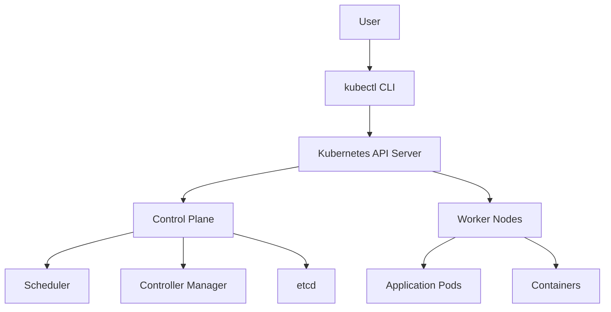

---

## 3.Local Kubernetes Cluster

في الـ Production غالبًا يكون عندنا:

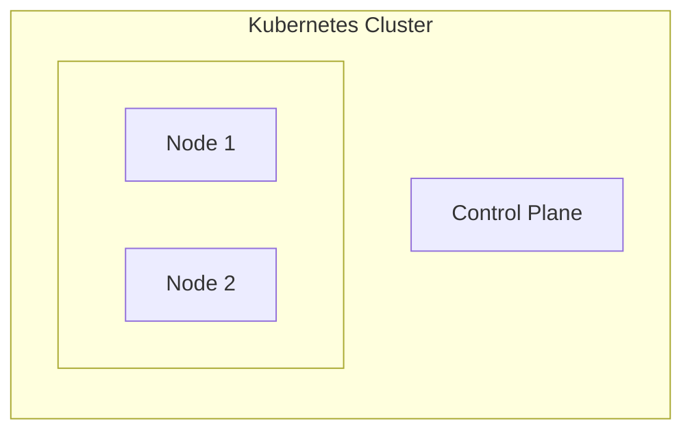

لكن في الـ Local Environment بنشغل Cluster صغير داخل جهازنا.

مثال باستخدام **kind**:

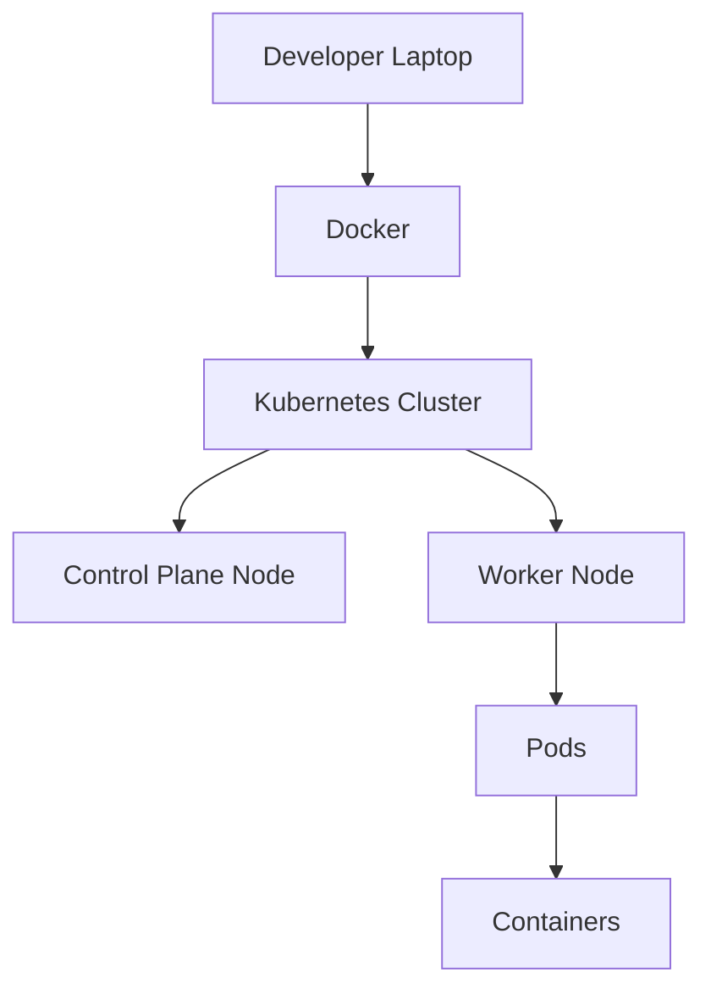

---

## 4.Why Do We Need a Local Kubernetes Cluster?

وجود Local Cluster مهم جدًا أثناء تعلم واستخدام Kubernetes لأنه يسمح لنا بـ:

### I. Testing Kubernetes Manifests

قبل ما نعمل Deploy لأي Application على Production، نقدر نجرب الـ YAML files محليًا.

مثال:

```yaml
deployment.yaml
service.yaml
configmap.yaml
```

ونتأكد إن الـ configuration شغال.

---

### II. Learning Kubernetes Commands

بدل ما نجرب أوامر على Production Cluster، نقدر نتعلم بأمان:

```bash
kubectl get pods

kubectl describe pod nginx

kubectl logs pod-name
```

---

### III. Troubleshooting Practice

Kubernetes بيعتمد بشكل كبير على الـ Troubleshooting.

Local Cluster يسمح لنا نجرب مشاكل مثل:

* Failed Pods
* Wrong Configurations
* Networking Issues
* Resource Limits

---

## 5.Tools For Running Kubernetes Locally

في أكثر من Tool نقدر نستخدمه لإنشاء Kubernetes Cluster محلي.

أشهر الأدوات:

| Tool     | Description                              |
| -------- | ---------------------------------------- |
| kind     | Kubernetes cluster running inside Docker |
| minikube | Kubernetes environment for learning      |
| k3d      | Lightweight Kubernetes using k3s         |

في الـ Documentation دي هنركز على:

* kind
* minikube

---

## 6.kind (Kubernetes IN Docker)

### I.What is kind?

`kind` اختصار لـ:

> Kubernetes IN Docker

وهو Tool يسمح لنا بإنشاء Kubernetes Cluster باستخدام Docker Containers بدل الـ Virtual Machines.

يعني بدل ما نحتاج Machines حقيقية، كل Node في Kubernetes يكون عبارة عن Container.

---

### II.kind Architecture

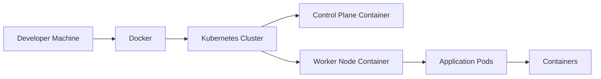

---

### III.Why Use kind?

مميزات kind:

* Lightweight
* سريع في إنشاء Cluster
* يعتمد على Docker
* مناسب للـ Testing
* مناسب للـ CI/CD Pipelines

---

### IV.Installation Guide:

https://kind.sigs.k8s.io/

Official Quick Start:

https://kind.sigs.k8s.io/docs/user/quick-start/

### V.Create a kind Cluster

إنشاء Cluster جديد:

```bash
kind create cluster --name devops-lab
```

بعد التنفيذ، kind يقوم بإنشاء:

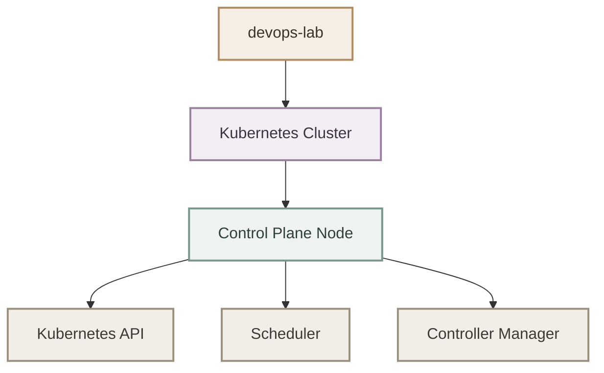

---

### VI.Check Existing Clusters

لعرض الـ Clusters الموجودة:

```bash
kind get clusters
```

Example output:

```text
devops-lab
```

---

### VII.Delete Cluster

لحذف Cluster:

```bash
kind delete cluster --name devops-lab
```

---

## 7.minikube

### I.What is minikube?

`minikube` هو Tool لإنشاء Kubernetes Cluster محلي بهدف التعلم والتجربة.

الفرق الأساسي عن kind:

* minikube يحاكي بيئة Kubernetes كاملة.
* kind يركز على تشغيل Kubernetes داخل Docker.

---

### II.Start minikube

تشغيل Cluster:

```bash
minikube start
```

---

### III.Check Status

```bash
minikube status
```

---

### IV.Stop Cluster

```bash
minikube stop
```

---

## 8.Choosing Between kind and minikube

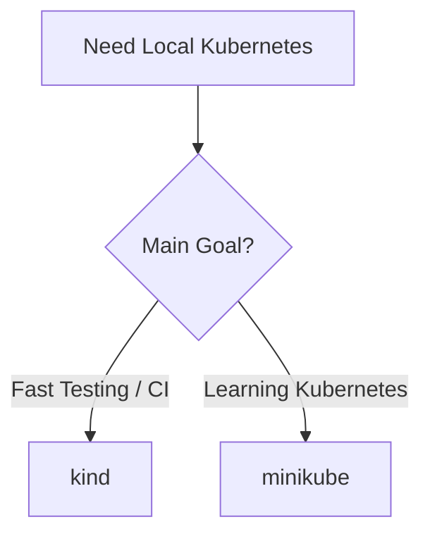

---

## 9.kubectl

### I.What is kubectl?

`kubectl` هو الـ **Command Line Interface (CLI)** الرسمي الخاص بـ Kubernetes.

من خلاله نقدر نتواصل مع الـ Kubernetes Cluster وندير الـ Resources الموجودة بداخله.

بمعنى آخر:

`kubectl` هو الـ Client اللي بيكلم Kubernetes API Server.

---

### II.kubectl Communication Flow

لما تكتب أمر مثل:

```bash
kubectl get pods
```

الطلب يمشي بالشكل التالي:

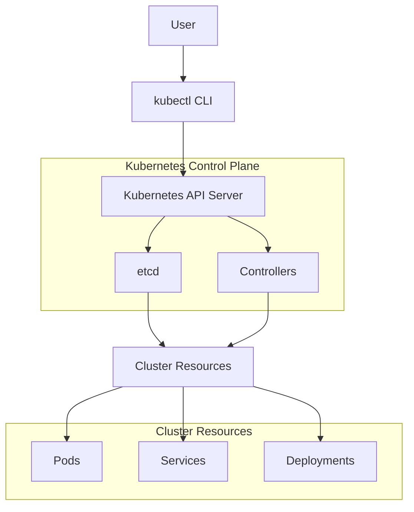

---

## 10.kubectl Common Commands

### I.Check Cluster Nodes

لعرض الـ Nodes الموجودة داخل الـ Cluster:

```bash
kubectl get nodes
```

Example:

```text
NAME                       STATUS
devops-lab-control-plane   Ready
```

---

### II.Get Running Pods

عرض الـ Pods الموجودة:

```bash
kubectl get pods
```

---

### III.Get Cluster Information

لمعرفة معلومات عن الـ Cluster:

```bash
kubectl cluster-info
```

---

### IV.Describe Resources

للحصول على تفاصيل أكثر عن Resource معين:

```bash
kubectl describe pod pod-name
```

---

## 11.kubeconfig

### I.What is kubeconfig?

بعد تثبيت `kubectl`، السؤال هنا:

كيف يعرف kubectl أي Kubernetes Cluster يتصل به؟

الإجابة هي:

**kubeconfig**

وهو ملف Configuration يحتوي على معلومات الاتصال بالـ Kubernetes Clusters.

المكان الافتراضي للملف:

```bash
~/.kube/config
```

---

### II.kubeconfig Components

ملف kubeconfig يحتوي على 3 أجزاء رئيسية:

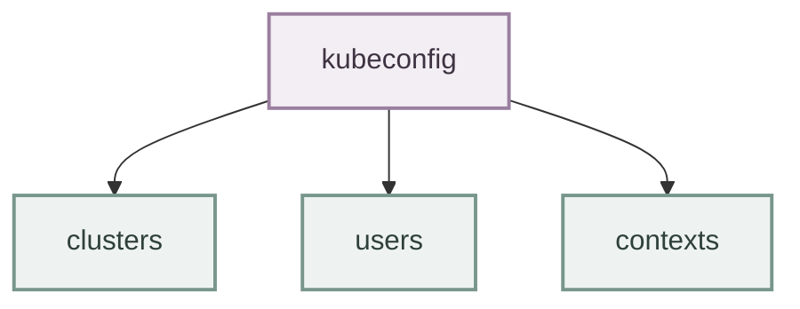

---

### III.Clusters

الـ `clusters` يحتوي على معلومات عن Kubernetes Clusters.

مثال:

```yaml
clusters:
- name: kind-devops-lab
  cluster:
    server: https://127.0.0.1:6443
```

---

### IV.Users

يحتوي على معلومات Authentication.

مثال:

```yaml
users:
- name: kubernetes-admin
```

---

### V.Contexts

الـ Context يربط بين:

- Cluster
- User
- Namespace

مثال:

```yaml
contexts:
- name: dev-context
  context:
    cluster: kind-devops-lab
    user: kubernetes-admin
```

---

## 12.Kubernetes Context

### I.What is Context?

الـ **Context** هو الإعداد الذي يحدد:

"kubectl سوف يتعامل مع أي Cluster وبأي User وفي أي Namespace"

يعني بدل ما كل مرة تقول لـ kubectl:

اتصل بالـ Cluster الفلاني.

يتم حفظ هذا الاختيار داخل Context.

---

### II.Context Structure

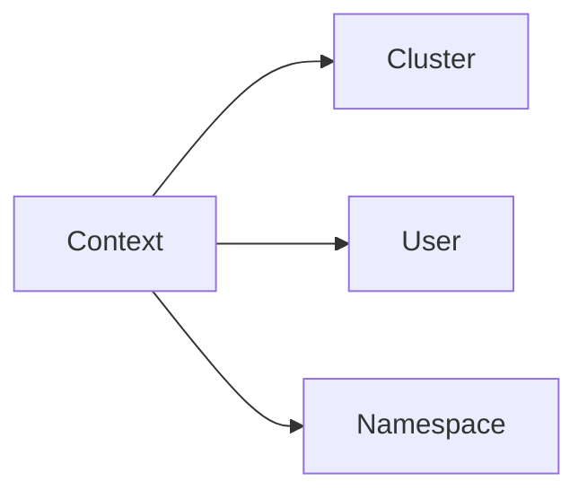

---

### III.Real World Example

في بيئة العمل ممكن يكون عندك:

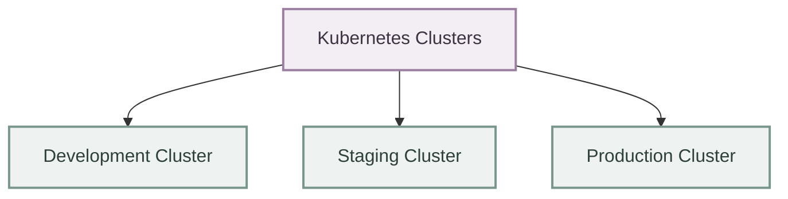

ولا تريد بالخطأ تنفيذ أمر على Production.

لذلك الـ Context مهم جدًا.

---

### IV.View Available Contexts

لعرض الـ Contexts الموجودة:

```bash
kubectl config get-contexts
```

Example:

```text
CURRENT   NAME

*         kind-devops-lab

          production-cluster
```

العلامة `*` تعني أن هذا هو الـ Current Context.

---

### V.Switch Context

تغيير الـ Context:

```bash
kubectl config use-context context-name
```

مثال:

```bash
kubectl config use-context kind-devops-lab
```

---

## 13.kubectx

### I.What is kubectx?

`kubectx` هو Tool يساعدنا على تغيير Kubernetes Contexts بسرعة.

هو لا يقوم بإنشاء Context جديد، لكنه يجعل عملية التنقل أسهل.

---

### II.Without kubectx

الطريقة التقليدية:

```bash
kubectl config get-contexts

kubectl config use-context production-cluster
```

---

### III.With kubectx

نستخدم:

```bash
kubectx production-cluster
```

---

### IV.kubectx Workflow

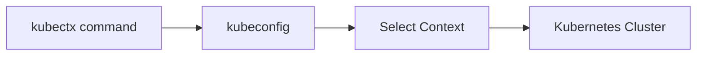

---

### V.List Contexts

```bash
kubectx
```

Example:

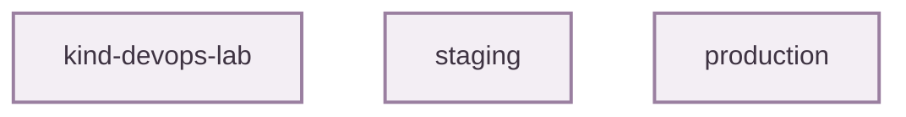

---

### VI.Why kubectx is Important?

في بيئة DevOps الحقيقية غالبًا ستتعامل مع أكثر من Cluster.

مثال:

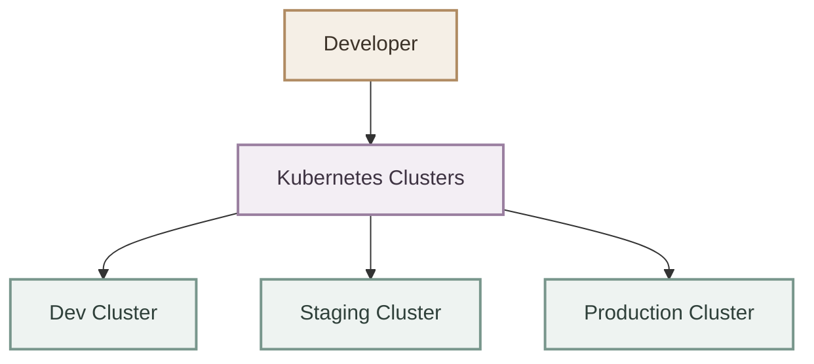

استخدام `kubectx` يقلل:

- كتابة أوامر طويلة.
- أخطاء اختيار الـ Cluster.
- الوقت أثناء التنقل بين البيئات.

---

## 14.kubens

### I.What is kubens?

داخل الـ Kubernetes Cluster يمكن تقسيم الموارد باستخدام:

**Namespaces**

الـ Namespace يعمل كـ Logical Separation داخل الـ Cluster.

مثال:

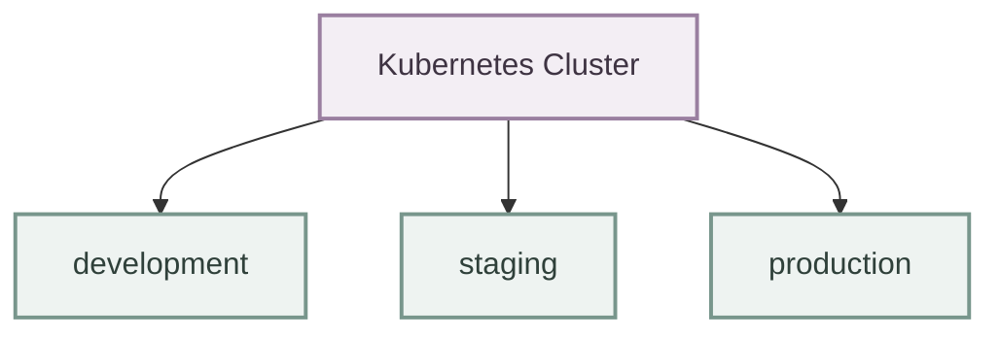

---

### II.Why Namespaces?

بدل أن تكون كل الـ Applications في مكان واحد:

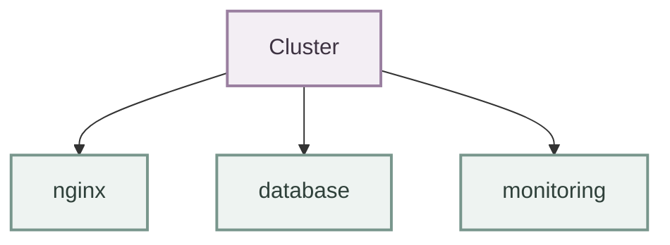

نقسمها:

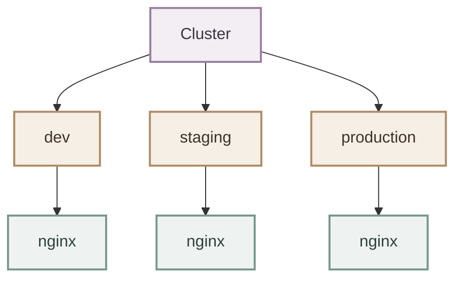

---

### III.kubens Role

`kubens` يجعل تغيير الـ Namespace أسرع.

---

### IV.Without kubens

```bash
kubectl config set-context --current --namespace=development
```

---

### V.With kubens

```bash
kubens development
```

---

### VI.List Namespaces

```bash
kubens
```

---

### VII.kubens Workflow

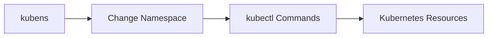

---

## 15.Create Cluster Using kind

### I.Make Cluster

```bash
kind create cluster --name devops-lab
```

---

### II.Verify Cluster

التأكد أن الـ Cluster يعمل:

```bash
kubectl get nodes
```

Expected:

```text
NAME                       STATUS
devops-lab-control-plane   Ready
```

---

### III.Check Current Context

```bash
kubectl config current-context
```

Output:

```text
kind-devops-lab
```

---

### IV.Test Kubernetes API

```bash
kubectl cluster-info
```
---

## 16.Complete Workflow

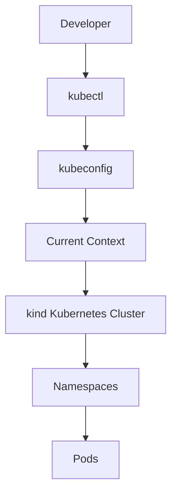
