## Introduction

بعد ما فهمت **What Kubernetes is**، السؤال الطبيعي هو:

> **Why do I need Kubernetes in the first place?**

لو عندي Container واحد أو application صغيرة، ممكن أشغلها وأديرها بسهولة باستخدام Docker أو أي Container Runtime.

لكن مع زيادة حجم الـapplication والـinfrastructure، إدارة الـcontainers manually بتبدأ تبقى complicated جدًا.

عشان كدا Kubernetes ظهر عشان يحل مشكلة أساسية:

> **How can I reliably deploy, scale, manage, and operate many containerized workloads across multiple machines?**

---

## 1. The Problem with Managing Containers Manually

في البداية، ممكن يكون عندي application بسيطة:

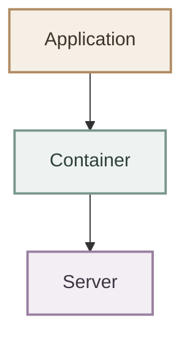

ممكن أشغل الـcontainer وأتابعه manually.

لكن application أكبر ممكن تكون:

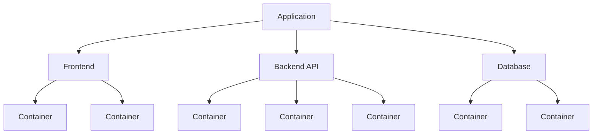

ولو الـapplication شغالة على أكثر من server:

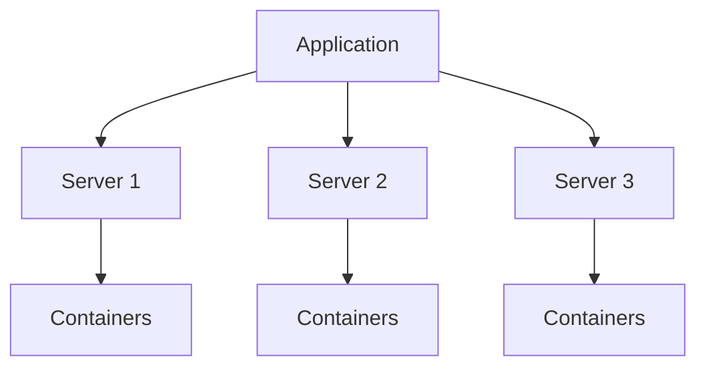

هنا تبدأ تظهر مجموعة كبيرة من المشاكل.

---

## 2. Scaling Becomes Difficult

افترض إن عندي API شغالة في:

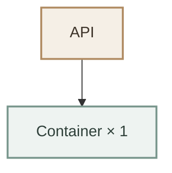

وفجأة الـtraffic زاد.

محتاج:

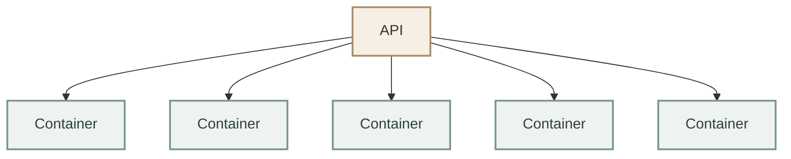

لو أنا بعمل ده manually، لازم أتابع:

* كام instance شغال؟
* أشغل instances جديدة فين؟
* هل الـserver عنده resources كفاية؟
* إمتى أقلل العدد؟
* إزاي أوزع الـtraffic؟

ف Kubernetes بيساعدني في **automated scaling and workload management**.


---

## 3. What Happens When a Container Fails?

دي واحدة من أهم المشاكل.

افترض إن عندي:

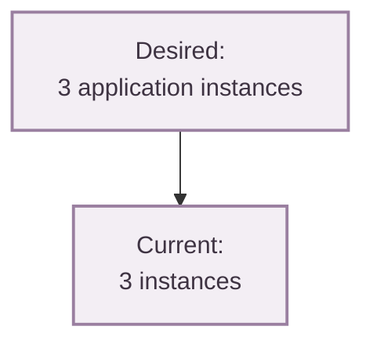

واحد منهم وقع:

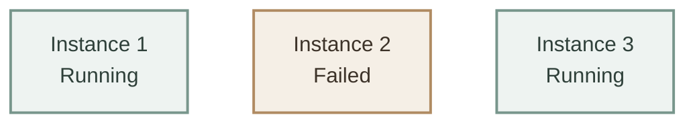

بقى عندي:

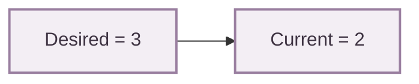

لو أنا مسؤول عن الـsystem manually، لازم أكتشف المشكلة وأعمل recovery.

ف Kubernetes عنده mechanisms للـ**self-healing** تساعد في إعادة الـworkload للحالة المطلوبة.

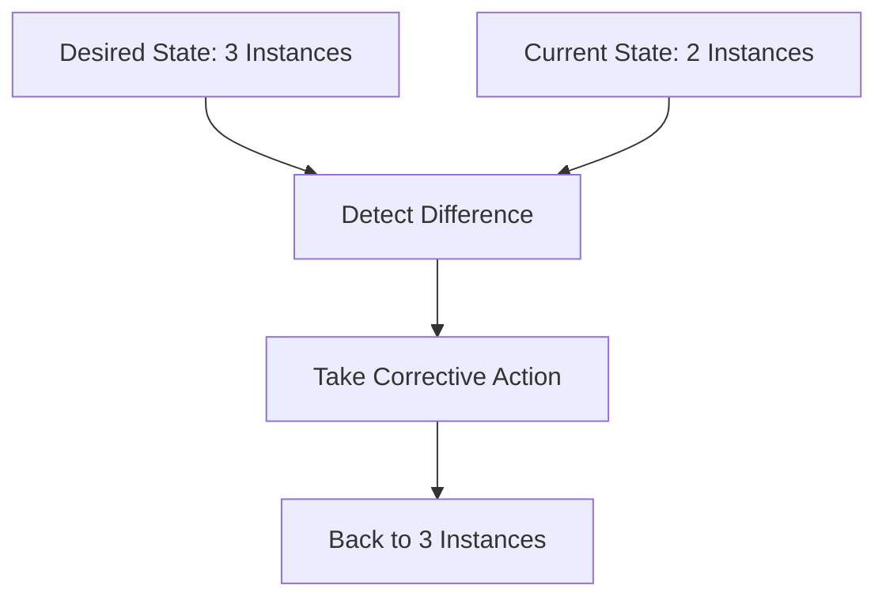

الفكرة هنا:

> Kubernetes continuously works toward the desired state.

---

## 4. Managing Multiple Machines

مع الـsmall applications ممكن server واحدة تكون كفاية.

لكن في environments أكبر، ممكن يكون عندي:

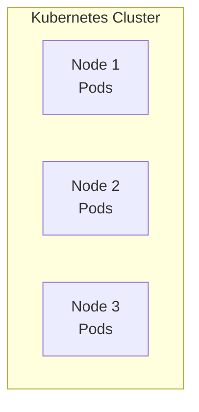

السؤال هنا:

> **Where should each workload run?**

مش كل Node عندها نفس:

* CPU
* Memory
* Availability
* Policies
* Constraints

ف Kubernetes عنده **Scheduling mechanisms** لاختيار الـappropriate Node للـworkload.

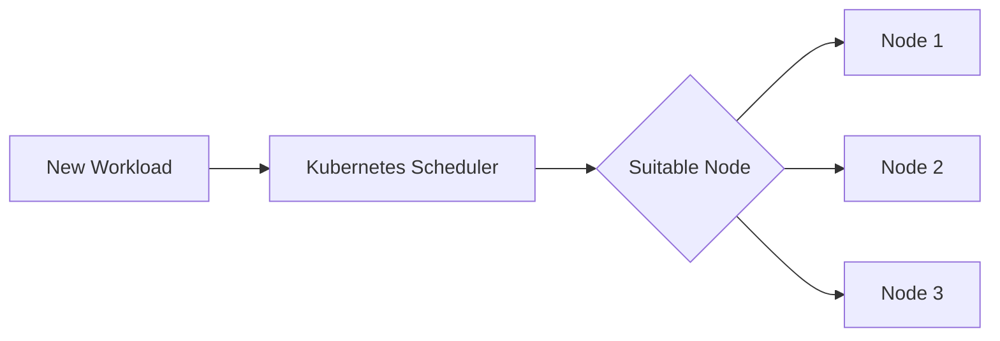

وبكده أنا مش محتاج أقرر مكان كل workload manually في كل مرة.

---

## 5. Networking Between Applications

في الـmodern applications، نادرًا ما يكون عندي Container واحد فقط.

ممكن يكون عندي:

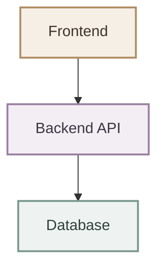

وكل جزء ممكن يكون running في مكان مختلف داخل الـcluster.

فأنا محتاج:

* Service-to-service communication.
* Service discovery.
* Stable endpoints.
* Traffic routing.

Kubernetes provides networking and service discovery mechanisms that help workloads communicate داخل الـcluster.

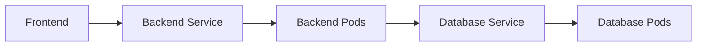

---

## 6. Application Updates

افترض إن عندي application شغالة بـversion:

```text id="2j7k5m"
Version 1.0
```

وعايز أعمل deployment لـ:

```text id="q4v8cx"
Version 2.0
```

لو عندي instances كتير، مش عايز أوقفهم كلهم مرة واحدة.

محتاج update تدريجي:

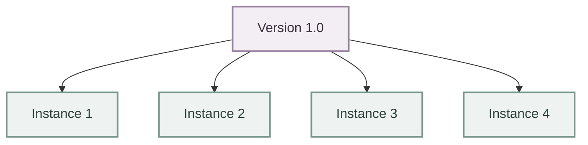

ثم:

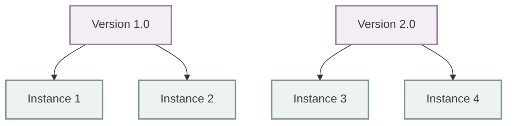

وبعدها:


ف Kubernetes يدعم **Rolling Updates** لمساعدتي في تحديث الـworkloads تدريجيًا.

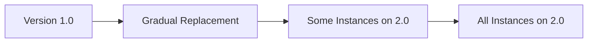

---

## 7. Maintaining the Desired State

دي من أهم الأسباب اللي بتخليني أستخدم Kubernetes.

بدل ما أقول:

> "اعمل commands دي واحدة واحدة."

أنا أقول:

> **This is the state I want.**

مثلاً:

```yaml id="r2x8qv"
replicas: 3
```

أنا هنا بحدد:

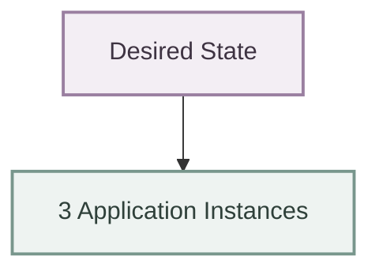

و Kubernetes يقارن الـdesired state بالـcurrent state ويحاول يحافظ على التطابق بينهم.

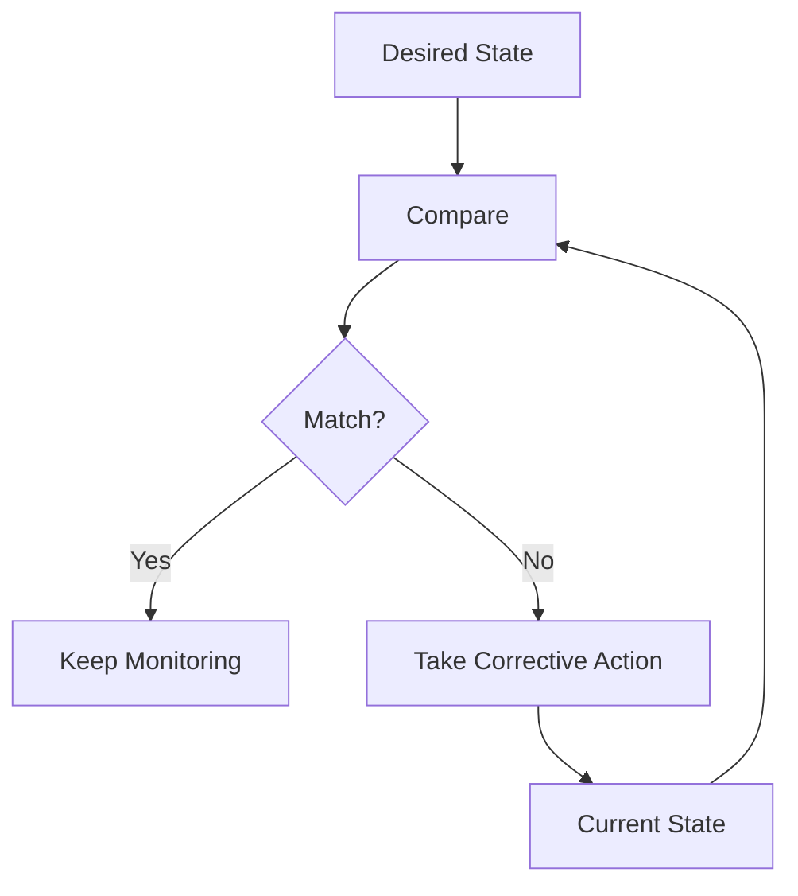

وده بيديني **declarative management model** بدل الاعتماد الكامل على manual procedures.

---

## 8. Resource Management

الـapplications المختلفة بتحتاج resources مختلفة.

مثلاً:

```mermaid
flowchart TB
    A["Application A<br/>CPU: 500m<br/>Memory: 256Mi"]
    B["Application B<br/>CPU: 2 CPU<br/>Memory: 2Gi"]

    classDef app fill:#eef3f1,stroke:#78968c,stroke-width:2px,color:#2f403a;

    class A,B app;
```

لو أنا عندي مجموعة Nodes، لازم Kubernetes يعرف احتياجات الـworkloads عشان يقدر يقرر فين تتشغل.

ممكن أحدد:

* CPU requests.
* Memory requests.
* CPU limits.
* Memory limits.

وبالتالي Kubernetes يقدر يستخدم الـavailable resources بشكل أكثر تنظيمًا.

```mermaid
flowchart TD
    A[Cluster Resources] --> B[Node 1]
    A --> C[Node 2]
    A --> D[Node 3]
    B --> E[Pods]
    C --> F[Pods]
    D --> G[Pods]
```

---

## 9. High Availability

في production، غالبًا مش عايز application تعتمد على:

```mermaid
  flowchart TB
    S["Single Server"] --> A["Application"]

    classDef server fill:#f3eef4,stroke:#9a7fa0,stroke-width:2px,color:#3e3342;
    classDef app fill:#eef3f1,stroke:#78968c,stroke-width:2px,color:#2f403a;

    class S server;
    class A app;
```

لأن لو الـserver وقع، الـapplication ممكن تتأثر.

ف Kubernetes بيسمحلي أشغل workloads على multiple Nodes وmultiple instances، حسب الـarchitecture والـrequirements بتاعة الـapplication.

```mermaid
flowchart TD
    A[Application] --> B[Node 1]
    A --> C[Node 2]
    A --> D[Node 3]
    B --> E[Pod]
    C --> F[Pod]
    D --> G[Pod]
```

وده يساعد في تقليل الـsingle points of failure، لكن **Kubernetes وحده لا يضمن High Availability تلقائيًا**؛ لازم الـapplication والـcluster architecture يكونوا مصممين لتحقيق الـavailability المطلوبة.

---

## 10. From Manual Operations to Automation

ممكن ألخص المشكلة كلها في المقارنة دي:

```mermaid
flowchart TB
    W["Without Orchestration"]

    W --> D["Deploy Manually"]
    D --> S["Scale Manually"]
    S --> M["Monitor Manually"]
    M --> R["Recover Manually"]
    R --> U["Update Manually"]
    U --> N["Manage Networking Manually"]

    classDef root fill:#f3eef4,stroke:#9a7fa0,stroke-width:2px,color:#3e3342;
    classDef manual fill:#f5efe6,stroke:#b08b62,stroke-width:2px,color:#3d3329;

    class W root;
    class D,S,M,R,U,N manual;
```

مع Kubernetes:

```mermaid
flowchart TD
    A[Kubernetes] --> B[Deploy]
    A --> C[Scale]
    A --> D[Recover]
    B --> E[Automate]
    C --> E
    D --> E
```

الفكرة مش إن Kubernetes "يلغي الـoperations"، لكن إنه **يحوّل جزء كبير من الـoperational work إلى automated, declarative processes**.

---

## 11. Why Not Just Use Docker?

سؤال مهم.

عندنا Docker أو أي Container Runtime ممتاز في تشغيل الـcontainers.

لكن تشغيل container مش هو نفس إدارة **large-scale containerized applications**.

### Container Runtime

يهتم بشكل أساسي بـ:

```mermaid
flowchart LR
    R["Run Container"]
    S["Stop Container"]
    M["Manage Container"]

    classDef action fill:#eef3f1,stroke:#78968c,stroke-width:2px,color:#2f403a;

    class R,S,M action;
```

### Kubernetes

يهتم بمستوى أعلى:

```mermaid
flowchart TB
    D["Deploy Workloads"] --> S["Schedule Workloads"]
    S --> SC["Scale"]
    SC --> N["Networking"]
    N --> H["Health / Recovery"]
    H --> U["Updates"]
    U --> DS["Desired State"]

    classDef process fill:#eef3f1,stroke:#78968c,stroke-width:2px,color:#2f403a;
    classDef state fill:#f3eef4,stroke:#9a7fa0,stroke-width:2px,color:#3e3342;

    class D,S,SC,N,H,U process;
    class DS state;

```

فالعلاقة مش:

```text
Docker OR Kubernetes
```

لكن أقرب إلى:

```mermaid
flowchart TB
    K["Kubernetes"] --> R["Container Runtime"]
    R --> C["Containers"]

    classDef k8s fill:#f3eef4,stroke:#9a7fa0,stroke-width:2px,color:#3e3342;
    classDef runtime fill:#f5efe6,stroke:#b08b62,stroke-width:2px,color:#3d3329;
    classDef container fill:#eef3f1,stroke:#78968c,stroke-width:2px,color:#2f403a;

    class K k8s;
    class R runtime;
    class C container;
```

---

## 12. When Does Kubernetes Become Useful?

مش كل application محتاجة Kubernetes.

لو عندي:

```mermaid
flowchart TB
    A["Small Application"] --> S["One Server"]
    S --> C["Few Containers"]

    classDef app fill:#f5efe6,stroke:#b08b62,stroke-width:2px,color:#3d3329;
    classDef server fill:#f3eef4,stroke:#9a7fa0,stroke-width:2px,color:#3e3342;
    classDef container fill:#eef3f1,stroke:#78968c,stroke-width:2px,color:#2f403a;

    class A app;
    class S server;
    class C container;
```

ممكن Kubernetes يكون unnecessary complexity.

لكن كل ما الـenvironment تكبر وتزيد الحاجة إلى:

* Multiple workloads
* Multiple machines
* Scaling
* High availability
* Automated recovery
* Service discovery
* Declarative management
* Rolling deployments
* Resource management

تبدأ قيمة Kubernetes تكون أوضح.

الفكرة الأساسية:

> **Kubernetes is useful when managing the application manually becomes harder than managing the orchestration platform.**

---

## 13. The Bigger Picture

ممكن أشوف التطور كده:

```mermaid
flowchart LR
    A[Single Application] --> B[Multiple Containers]
    B --> C[Multiple Machines]
    C --> D[Scaling and Networking Challenges]
    D --> E[Operational Complexity]
    E --> F[Kubernetes]
    F --> G[Automated Orchestration]
```

كل ما الـsystem يكبر، عدد الـoperational concerns بيزيد:

```mermaid
flowchart TD
    A[More Applications] --> G[More Operational Complexity]
    B[More Containers] --> G
    C[More Nodes] --> G
    D[More Traffic] --> G
    E[More Deployments] --> G
    F[More Failures] --> G
    G --> H[Kubernetes]
```

---

## 14. The Core Benefits

أقدر ألخص أهم المشاكل اللي Kubernetes بيساعد في التعامل معاها في:

| Problem                  | Kubernetes Helps With          |
| ------------------------ | ------------------------------ |
| Manual deployments       | Automated workload management  |
| Scaling                  | Scaling mechanisms             |
| Failed workloads         | Self-healing mechanisms        |
| Multiple machines        | Scheduling                     |
| Service communication    | Service discovery & networking |
| Application updates      | Rolling updates                |
| Resource usage           | Requests & limits              |
| Configuration            | ConfigMaps & Secrets           |
| Desired state management | Declarative model              |
| Operational complexity   | Automation & orchestration     |

---

## 15. The Main Mental Model

لما أسأل نفسي:

> **Why Kubernetes?**

مش عايز أفتكر مجرد list of features.

عايز أفتكر المشكلة الأساسية:

```mermaid
flowchart TD
    A[Containerized Applications] --> B[Environment Grows]
    B --> C[More Containers + Nodes]
    C --> D[More Operational Problems]
    D --> E[Scaling]
    D --> F[Failures]
    D --> G[Networking]
    E --> H[Operational Complexity]
    F --> H
    G --> H
    H --> I[Kubernetes]
    I --> J[Automated Orchestration]
```

---

## 16. Final Summary

**Why Kubernetes?**

لأن تشغيل الـcontainers لوحده مش كفاية لما الـsystem يكبر.

ف Kubernetes بيوفر platform تساعدني في **automating the operational management of containerized workloads**.

بدل ما أفضل أتعامل manually مع:

* Deployment
* Scaling
* Scheduling
* Networking
* Failures
* Updates
* Resources

أقدر أعرّف الـ**desired state** وأخلي Kubernetes يستخدم مجموعة من mechanisms لتحقيق الحالة دي والمحافظة عليها.

أهم فكرة:

> **Kubernetes helps turn container management from a collection of manual operational tasks into an automated, declarative orchestration system.**

وبالتالي:

```mermaid
flowchart TD
    A[Manual Container Management] --> B[Operational Complexity]
    B --> C[Kubernetes]
    C --> D[Automated Orchestration]
    D --> E[Reliable & Scalable Workloads]
```

وده هو السبب الأساسي اللي بيخليني أستخدم Kubernetes.
